# Chainlink CCV

## Getting started

Install [just](https://github.com/casey/just)

List available commands:
```bash
just --list
```

Install pre-commit hooks:
```
just pre-commit
```

Run tests:
```bash
just tests
```

## Local Dev Environment
Follow the [README](./build/devenv/README.md)


### Glossary
- CCV: Cross chain verifier comprising two onchain Verifier components and an offchain Verifier component which exposes VerifierResults (usually containing some form of authentication, like signatures/zkps etc.) from its offchain component to be passed to its onchain component.
    - CCV naming schema: operator | type | component
    - Operators:
        - Chainlink (NOPs)
        - Internal (CLL)
        - Succinct (future example)
        - TokenIssuerX
    - Initial types:
        - Committee means DON based verification
        - USDC means wrapping USDC verification (the attestation API from circle)
        - Lombard means wrapping lombard verification
    - Components:
        - Verifier which comprises all offchain logic and storage required to make VerifierResults available. If multi-node
          this includes some aggregation.
    - Examples:
        - Chainlink's Committee CCV: {CommitteeOnRamp, CommitteeVerifier, CommitteeOffRamp}
            - TokenIssuerX's and the internal Committee CCV would be same contracts but different deployment.
        - Chainlink's OP native interop CCV: {OPOnRamp, OPVerifier, OPOffRamp}
        - Chainlink's USDC CCV: USDCOnRamp, USDCVerifier, USDCOffRamp
        - Succinct's ZK CCV: ZKOnRamp, ZKVerifier, ZKOffRamp

- VerifierResult: Data made available by an offchain CCV verifier which executors pass to that CCV's onchain verifier.
- CCVNodeData: In the context of a committee-based CCV with multiple nodes, CCVNodeData is a given member nodes contribution to the final VerifierResult.


### System Diagram


```mermaid
graph LR 
   subgraph "Source Chain"
        User["User"]
        RouterSrc["Router"]
        OnRamp["OnRamp"]
        
        subgraph "Per CCV Verifiers"
            InternalOnRamp["CommitteeVerifier"]
            ChainlinkOnRamp["CommitteeVerifier"]
            USDCOnRamp["USDCVerifier"]
            ZKOnRamp["ZKVerifier"]
            CustomOnRamp["CustomVerifier"]
        end
        
        
        subgraph "Pools"
            PoolV1Src["PoolV1"]
            PoolV2Src["PoolV2"]
        end
    end


    subgraph "Offchain"
        subgraph "CLL"
            ChainlinkAggregator["Chainlink Committee Aggregator"]
            InternalAggregator["Internal Committee Aggregator"]
            USDCVerifier["Chainlink USDC Verifier"]
            Indexer["Indexer"]
            InternalVerifier["Internal Committee Verifier"]
            InternalExecutor["Internal Executor"]
        end
        subgraph "CL Nops"
            ChainlinkVerifier["Chainlink Committee Verifier"]
            ChainlinkExecutor["Chainlink Executor"]
        end

        subgraph "3rd party Verifiers"
            ZKVerifier["Succinct ZK Verifier"]
            CustomVerifier["Custom Verifier"]
        end
        subgraph "3rd party storage"
            ZKGCP["ZK GCP bucket"] 
            CustomStorage["Custom Storage"]
            CustomService["Custom Service"]
        end

        subgraph "3rd party Executors"
            CustomExecutor["Custom Executor"]
        end
    end
    
    subgraph "Destination Chain"
        RouterDest["Router"]
        OffRamp["OffRamp"]
        Receiver["Receiver"]
        
        subgraph "Per CCV Verifiers"
            ChainlinkOffRamp["Chainlink Committee Verifier s3://chainlinklabs.com/"]
            InternalOffRamp["Internal Committee Verifier s3://chainlinklabs-internal.com"]
            USDCOffRamp["Chainlink USDC Verifier s3://chainlinklabs.com"]
            ZKOffRamp["Succinct ZK Verifier gcp://succinctzkverifier.com"]
            CustomOffRamp["Custom Verifier Http://customverifier.com"]
        end
        
        subgraph "Destination Pools"
            PoolV1Dest["PoolV1"]
            PoolV2Dest["PoolV2"]
        end
    end
    
    %% Source Chain Flow
    User --> RouterSrc
    RouterSrc --> OnRamp

    OnRamp --> ChainlinkOnRamp
    OnRamp --> InternalOnRamp 
    OnRamp --> USDCOnRamp
    OnRamp --> ZKOnRamp
    OnRamp --> CustomOnRamp
    OnRamp --> PoolV1Src
    OnRamp --> PoolV2Src
    
    ChainlinkOnRamp --> ChainlinkVerifier
    InternalOnRamp --> InternalVerifier
    USDCOnRamp --> USDCVerifier
    ZKOnRamp --> ZKVerifier
    CustomOnRamp --> CustomVerifier
    
    
    %% Cross-chain execution
    ChainlinkVerifier --> ChainlinkAggregator 
    InternalVerifier --> InternalAggregator
    ZKVerifier --> ZKGCP 
    CustomVerifier --> CustomStorage
    
    %% Destination Chain Flow

    ZKGCP --> Indexer
    CustomStorage --> CustomService
    CustomService --VerifierResultAPI--> Indexer
    ZKGCP --> CustomExecutor
    CustomExecutor --> OffRamp
    USDCVerifier--VerifierResultAPI--> Indexer
    ChainlinkAggregator--VerifierResultAPI--> Indexer
    InternalAggregator --VerifierResultAPI--> Indexer
    Indexer --IndexerAPI--> InternalExecutor
    InternalExecutor --> OffRamp
    Indexer --IndexerAPI--> ChainlinkExecutor 
    ChainlinkExecutor --> OffRamp

    
    OffRamp --> ChainlinkOffRamp
    OffRamp --> InternalOffRamp 
    OffRamp --> USDCOffRamp
    OffRamp --> ZKOffRamp
    OffRamp --> CustomOffRamp 
    
    OffRamp --> PoolV1Dest
    OffRamp --> PoolV2Dest
    OffRamp --> RouterDest
    
    RouterDest --> Receiver
    
    %% Styling
    classDef usdc fill:#e8f5e9,stroke:#2e7d32,stroke-width:2px
    classDef chainlink fill:#e3f2fd,stroke:#1565c0,stroke-width:2px
    classDef custom fill:#fff3e0,stroke:#ef6c00,stroke-width:2px
    classDef zk fill:#f3e5f5,stroke:#7b1fa2,stroke-width:2px
    classDef internal fill:#e0f2f1,stroke:#00695c,stroke-width:2px
    
    class InternalOnRamp,InternalVerifier,InternalAggregator,InternalOffRamp internal
    class ChainlinkOnRamp,ChainlinkVerifier,ChainlinkAggregator,ChainlinkOffRamp chainlink
    class USDCOnRamp,USDCVerifier,USDCOffRamp usdc
    class ZKOnRamp,ZKVerifier,ZKOffRamp,ZKGCP zk
    class CustomOnRamp,CustomVerifier,CustomOffRamp,CustomStorage,CustomService custom
```

Notes
- The storage locator is stored in the CCV specific verifier and exposed via getStorageLocator() which returns URI(s)
- There is only a small handful of first class storage mechanisms: a standard `VerifierResultAPI`, s3 and gcp.
  The execution API lets you wrap any form of storage as a verifier if the cloud ones are insufficient for a verifier. Each of these storage mechanisms:
    - Has a canonical prefix in the storage pointer so executors/indexers know how to read the data
    - Is supported by the default executor
    - Is optionally supported by 3rd party executors
- The initial verifier set comprises (Chainlink, Internal, USDC, Lombard). Nodes in the chainlink committee verifier are run by the NOPs and has its verifier results aggregated by the chainlink committee aggregator. The Internal verifier is a copy of the chainlink committee verifier except the verifier nodes are run internally specifically for users who wish to avoid trusting the NOPs. For USDC, the verifier simply wraps the CCTP API and can be run internally. For Lombard the exact deployment is still TBD.
- The indexer run by CLL is a centralized convenience which wraps the raw object storage and exposes an `IndexerAPI` to make querying more convenient for the default executor and 3rd party executors who wish to use it. 3rd parties may also write their own indexer (potentially even run our if we open source it).
- 3rd party executors need not use the indexer, in which case they effectively are responsible for their
  own indexing. In principle, they can read new messages directly from the source chain and read the proof directly from a verifier (via message.receiver.getVerifiers() / tokenRegistry.getPool(message.tokens).getVerifiers() -> verifier.getStorageLocator()), such that
  they have no external trust dependencies other than the source/dest chains and the verifier they are executing
  for.
 
