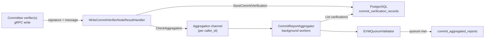

# Aggregator Debugging Guide

This guide helps you trace a single CCIP message through the aggregator’s commit-verification pipeline using structured logs. Committee verifiers push signed results via gRPC (`WriteCommitteeVerifierNodeResult` / `BatchWriteCommitteeVerifierNodeResult`); the aggregator stores per-node verifications, checks quorum asynchronously, and persists an aggregated report when threshold is met.

For how verifiers produce signatures upstream, see the [Verifier debugging guide](../../verifier/docs/debugging.md).

## Pipeline overview



**Stages:**

1. **Write handler** — Validates request, checks message-disablement rules, validates ECDSA signature, derives `aggregationKey`, saves `CommitVerificationRecord`, enqueues aggregation work.
2. **Channel manager** — Fair-schedules aggregation requests from per-client buffers (one buffer per `caller_id` / API client, plus an orphan-recovery channel).
3. **Aggregation worker** — Loads all verifications for `(messageID, aggregationKey)`, checks quorum, maps to exportable proto, calls `SubmitAggregatedReport` (PostgreSQL sink).
4. **Orphan recoverer** (optional) — Periodically re-triggers aggregation for `(message_id, aggregation_key)` pairs that have verifications but no aggregated report.

A message has **reached quorum on the aggregator** when you see **`Report submitted successfully`** with `messageID` in context (and a row exists in `commit_aggregated_reports` for that message and aggregation key).

---

## End-to-end flow (committee verifier → aggregator)

Typical path when using the commit verifier + aggregator writer:

1. Verifier signs message ([verifier commit logs](../../verifier/docs/debugging.md#verifier-implementations)).
2. Verifier storage writer succeeds (`Write succeeded for message`).
3. Aggregator writer issues `BatchWriteCommitteeVerifierNodeResult` (or single write).
4. Aggregator: signature validated → verification saved → aggregation triggered.
5. Background worker: quorum met → aggregated report submitted.

If step 4 succeeds but step 5 shows `Quorum not met`, more committee nodes must write signatures for the same `(messageID, aggregationKey)` before quorum is reached.

---

## Filtering logs for one message

### Structured context fields

The aggregator augments loggers from gRPC context (`aggregator/pkg/scope/scope.go`):

| Field | When present | Meaning |
|-------|----------------|---------|
| `messageID` | After write/read handlers attach scope | Hex string (`0x…`) via `protocol.ByteSlice` |
| `aggregationKey` | After aggregation key derived / worker started | Hex-encoded signable hash grouping verifications |
| `address` | After signer identified on write | Recovered committee signer address |
| `caller_id` | Authenticated write requests | API client / verifier identity |
| `requestID` | All gRPC requests | Per-request UUID |
| `apiName` | All gRPC requests | Full gRPC method (e.g. `/…/WriteCommitteeVerifierNodeResult`) |
| `component` | Subsystems | `aggregator_worker`, `OrphanRecoverer` |

### Grep examples

```bash
# messageID on context (write path, aggregation worker, read paths)
grep 'messageID=0xYOUR_MESSAGE_ID'

# Orphan recoverer uses raw hex without 0x prefix
grep 'messageID=YOUR_MESSAGE_ID_WITHOUT_0x'

# Aggregation key (if you know it)
grep 'aggregationKey=YOUR_AGGREGATION_KEY_HEX'

# Ingress API
grep 'apiName=.*/WriteCommitteeVerifierNodeResult'
grep 'apiName=.*/BatchWriteCommitteeVerifierNodeResult'

# Successful quorum + persist
grep 'Report submitted successfully' | grep 'messageID=0xYOUR_MESSAGE_ID'
```

---

## Happy-path checklist

| Step | What to look for | Location |
|------|------------------|----------|
| 1. gRPC ingress | `Request completed` + write API `apiName` | `LoggingMiddleware` |
| 2. Signature OK | `Signature validated successfully` | `WriteCommitVerifierNodeResultHandler` |
| 3. Saved | `Successfully saved commit verification record` | same (with `address` on logger) |
| 4. Aggregation queued | `Triggered aggregation check` | same |
| 5. Worker started | `Checking aggregation for message` | `CommitReportAggregator` |
| 6. Quorum met | `Quorum met with N unique signer addresses` (Debug) | `EVMQuorumValidator` |
| 7. Report stored | `Report submitted successfully` | `CommitReportAggregator` |

Downstream consumers (indexer / message discovery) poll via `GetMessagesSince`; verifiers or tools may read via `GetVerifierResultsForMessage`.

---

## Stage 1: gRPC ingress (all APIs)

**Source:** `aggregator/pkg/middlewares/logging_middleware.go`, `scoping_middleware.go`

Every unary RPC gets `requestID` and `apiName` on the logger.

| Level | Message | Key fields |
|-------|---------|------------|
| Info | `Request received` | `requestID`, `apiName`, `caller_id` (if auth) |
| Info | `Request completed` | `duration_ms`, `status` |
| Error | `Request failed` | `duration_ms`, `status` |
| Debug | `Request payload received` / `Response sent` | `payload` (verbose) |

**Write path APIs** (committee verifier signatures):

- `…/WriteCommitteeVerifierNodeResult`
- `…/BatchWriteCommitteeVerifierNodeResult`

**Read path APIs** (usually no `messageID` until handler runs):

- `…/ReadCommitteeVerifierNodeResult` — sets `messageID` from request
- `…/GetVerifierResultsForMessage` — per-ID in loop (see below)
- `…/GetMessagesSince` — sequence-based, logs `messageID` at Trace for each report

**Auth failures** (no `messageID`): `HMACAuthMiddleware`, `AnonymousAuthMiddleware`, `RequireAuthMiddleware` — `Authentication failed`, etc.

---

## Stage 2: WriteCommitVerifierNodeResultHandler

**Source:** `aggregator/pkg/handlers/write_commit_verifier_node_result.go`

After proto conversion, `scope.WithMessageID(ctx, record.MessageID)` is applied — subsequent logs for that request include **`messageID`**.

| Level | Message | `messageID` | Notes |
|-------|---------|-------------|-------|
| Warn | `validation error` | no | Before message scoped |
| Error | `Failed to convert proto to domain model` | no | Invalid payload |
| Info | `Rejected write: message matched a disablement rule` | yes | `FailedPrecondition` |
| Error | `signature validation failed` | yes | Invalid / unknown signer |
| Info | `Signature validated successfully` | yes | |
| Error | `failed to derive aggregation key` | yes | |
| Error | `failed to save commit verification record` | yes | Uses `address` in signer context |
| Info | `Successfully saved commit verification record` | yes | `address` field |
| Error | `Aggregation channel is full` | yes | `ResourceExhausted` — backpressure |
| Error | `failed to trigger aggregation` | yes | |
| Info | `Triggered aggregation check` | yes | Request succeeds (`WriteStatus_SUCCESS`) |

**Important:** A successful write response only means the verification row was saved and aggregation was **enqueued**. Quorum and aggregated report creation happen asynchronously.

### Batch write

**Source:** `aggregator/pkg/handlers/batch_write_commit_verifier_node_result.go`

Each sub-request runs `WriteCommitVerifierNodeResultHandler.Handle` in its own goroutine (with the batch request’s context). Per-message logs still get `messageID` from the child handler.

Batch-level errors (no per-message ID on parent context):

| Level | Message |
|-------|---------|
| Error | `unexpected error type` |
| Error | `failed to write commit verification node result` |

---

## Stage 3: Signature validation (write path)

**Source:** `aggregator/pkg/quorum/evm_quorum_validator.go` (`ValidateSignature`, `DeriveAggregationKey`)

Runs during the write handler with `messageID` already on context.

| Level | Message | Typical meaning |
|-------|---------|-----------------|
| Debug | `Validating signature for report` | Start validation |
| Error | `Missing signature in report` | Empty signature |
| Error | `Failed to compute message hash` | Bad message payload |
| Error | `Failed to produce signed hash` | CCV version / committee hash error |
| Error | `Failed to decode single signature` | Malformed signature bytes |
| Error | `Failed to recover address from signature` | ECDSA recovery failed |
| Info | `Recovered address from signature` | Signer matched committee config |
| Debug | `No valid signers found for the provided signature` | Recovered address not in committee |
| Error | `committee config not found` | Missing committee for chain |

---

## Stage 4: Aggregation worker

**Source:** `aggregator/pkg/aggregation/aggregator.go`

Worker context includes **`messageID`** and **`aggregationKey`** (`scope.WithMessageID` / `WithAggregationKey` in `StartBackground`).

| Level | Message | `messageID` | Key fields |
|-------|---------|-------------|------------|
| Info | `Checking aggregation for message` | yes | Start of work item |
| Warn | `No aggregated store available, cannot check existing aggregations` | yes | |
| Warn | `Failed to check for existing aggregated report` | yes | |
| Debug | `No existing aggregated report found, proceeding with aggregation` | yes | |
| Info | `Skipping aggregation: existing report already meets quorum` | yes | `verificationCount` — idempotent skip |
| Info | `Existing report no longer meets quorum, proceeding with new aggregation` | yes | Config change scenario |
| Error | `Failed to list verifications` | yes | DB read failure |
| Debug | `Verifications retrieved` | yes | `count` |
| Debug | `Aggregated report created` | yes | `verificationCount` |
| Error | `Failed to check quorum` | yes | |
| Error | `Cannot map aggregated report for export: committee configuration is missing` | yes | Blocked export |
| Error | `Aggregated report is not exportable` | yes | Mapping / quorum encoding error |
| Error | `Failed to submit report` | yes | `SubmitAggregatedReport` failed |
| **Info** | **`Report submitted successfully`** | yes | **`verifications`, `timeToAggregation`** — **success** |
| Info | `Quorum not met, not submitting report` | yes | `verifications` — need more signatures |
| Error | `Panic during aggregation` | yes | Worker panic |

### Quorum check (during aggregation)

**Source:** `aggregator/pkg/quorum/evm_quorum_validator.go` (`CheckQuorum`)

| Level | Message | Meaning |
|-------|---------|---------|
| Error | `No verifications found` | Empty set |
| Warn | `Source verifier address not in message CCV addresses, skipping aggregation` | Read-path filter parity |
| Debug | `Not enough verifications to meet quorum: have X, need Y` | Below threshold |
| Error | `Failed to validate signature` | Per-verification failure (others may still count) |
| Warn | `No valid signer found. Might be due to a config change` | Signer not in current committee |
| Error | `Hash mismatch detected - possible data tampering` | Inconsistent signable hashes |
| Debug | `Quorum not met: have X unique signer addresses, need Y` | Distinct signers below threshold |
| Debug | `Quorum met with N unique signer addresses` | Quorum satisfied |

### Channel / shutdown (usually no `messageID`)

| Level | Message |
|-------|---------|
| Warn | `aggregation queue full` / `aggregation queue over 80% full` |
| Error | `Drain timed out, dropping in-flight work` |
| Infow | `Channel drained, waiting for in-flight workers` |
| Infow | `Aggregation worker shutdown completed cleanly` |

**Enqueue timeout:** `CheckAggregation` returns `ErrAggregationChannelFull` if the per-`caller_id` buffer is full for `CheckAggregationTimeout` — surfaced on the write handler as `Aggregation channel is full`.

---

## Stage 5: Orphan recovery

**Source:** `aggregator/pkg/orphan_recoverer.go`

Recovers verifications that were saved but never aggregated (e.g. transient aggregation errors). Re-triggers `CheckAggregation` on channel `OrphanRecoveryChannelKey`.

| Level | Message | `messageID` format |
|-------|---------|-------------------|
| Info | `Starting orphan recovery process` | no |
| Info | `Initiating orphan recovery scan` | no |
| Info | `Orphan stats` | no — `nonExpired`, `expired`, `total` |
| Error | `Failed to process orphaned record` | **`%x` hex (no `0x` prefix)** |
| Debug | `Successfully processed orphaned record` | **`%x` hex** |
| Debug | `Successfully triggered re-aggregation check` | **`%x` hex** |
| Info | `Orphan recovery completed` | no — `processed`, `errors` |
| Error | `Reached max orphans per scan` | no |

---

## Read paths

### GetVerifierResultsForMessage

**Source:** `aggregator/pkg/handlers/get_verifier_results_for_message.go`

Batch read of latest aggregated report per message ID (used by verifier HTTP API and tools).

| Level | Message | `messageID` |
|-------|---------|-------------|
| Error | `Failed to retrieve batch CCV data` | no |
| Error | `Quorum config not found for source selector … message ID %s` | in message string |
| Debug | `Source verifier address not in ccvAddresses for message ID %s` | in message string |
| Error | `Failed to map aggregated report to proto` | yes — `messageID` field |

gRPC response uses per-index errors (`NotFound` when no aggregated report).

### GetMessagesSince

**Source:** `aggregator/pkg/handlers/get_messages_since.go`

Message-discovery polling by sequence number.

| Level | Message | `messageID` |
|-------|---------|-------------|
| Trace | `Received GetMessagesSinceRequest, sinceSequence: N` | no |
| Trace | `Report MessageID: %x, Sequence: …` | hex in message |
| Error | `failed to map aggregated report to proto` | yes |
| Error | `missing quorum config for source chain selector` | yes |
| Trace | `Returning N records for GetMessagesSinceRequest` | no |

### ReadCommitVerifierNodeResult

**Source:** `aggregator/pkg/handlers/read_commit_verifier_node_result.go`

| Level | Message | `messageID` |
|-------|---------|-------------|
| Warn | `validation error` | no |
| Error | `failed to get commit verification record` | yes + `address` |
| Error | `failed to convert record to proto` | yes |

---

## Storage layer logs

**Source:** `aggregator/pkg/storage/postgres/database_storage.go`

Generally **no per-message success logs** on write; errors may include `message_id`:

| Level | Message | `message_id` / `messageID` |
|-------|---------|---------------------------|
| Error | `failed to parse message_id hex in aggregated report, skipping` | `message_id` |
| Error | `corrupted verification row, excluding entire report` | `report_key`, `verification_id` |
| Error | `failed to parse message ID` (orphan scan) | no |
| Error | `corrupted verification row in batch report, excluding entire report` | `message_id` |

`SubmitAggregatedReport` does not log on success — confirm via aggregation worker `Report submitted successfully` or DB query.

---

## Database checks (when logs are inconclusive)

```sql
-- Per-node verification (one row per signer per aggregation key)
SELECT message_id, signer_identifier, aggregation_key, created_at
FROM commit_verification_records
WHERE message_id = '0xYOUR_MESSAGE_ID'
ORDER BY created_at;

-- Aggregated report (quorum result)
SELECT message_id, aggregation_key, created_at, seq_num
FROM commit_aggregated_reports
WHERE message_id = '0xYOUR_MESSAGE_ID'
ORDER BY created_at DESC;
```

Orphan backlog: orphan recoverer `Orphan stats` metrics/logs, or storage `ListOrphanedKeys` logic (verifications without matching aggregated report for same `aggregation_key`).

---

## Suggested debug workflows

### Write returns SUCCESS but no aggregated report

1. `Triggered aggregation check` — was aggregation enqueued?
2. `Checking aggregation for message` — did worker pick it up?
3. `Quorum not met, not submitting report` — count `verifications` vs committee threshold; need more node writes.
4. `Skipping aggregation: existing report already meets quorum` — report may already exist (check DB).
5. `Aggregation channel is full` — backpressure; retry write or scale buffers/workers.
6. `Failed to submit report` — DB error on persist.
7. Orphan path: `Successfully triggered re-aggregation check` with your message hex.

### Write fails immediately

1. `validation error` — malformed proto.
2. `signature validation failed` / `No valid signers found` — wrong key or committee config.
3. `Rejected write: message matched a disablement rule` — disablement registry.
4. `Authentication failed` — HMAC / auth middleware (no `messageID` yet).

### Hash / tampering

- `Hash mismatch detected - possible data tampering` during quorum — verifications for same `(messageID, aggregationKey)` disagree on signable hash (CCV version mismatch across nodes).

### CCV version / aggregation key change

- Multiple `aggregation_key` values per `message_id` are expected after CCV version changes.
- Orphan recovery and `ListOrphanedKeys` join on **both** `message_id` and `aggregation_key`.

---

## Quick reference: logs with `messageID` (or equivalent)

| Package / component | Logs |
|---------------------|------|
| `handlers` (write) | Disablement reject, signature/save/aggregation errors, success path Infos |
| `handlers` (read/get) | Get/read failures with `messageID` |
| `aggregation` | Full worker trail including **`Report submitted successfully`** |
| `quorum` | Signature recovery (Info), quorum Debug/Warn/Error |
| `orphan_recoverer` | Process/trigger logs (`%x` message ID) |
| `scope` | All augmented fields on child loggers |

---

## Related documentation

- [End-to-end message debugging](../../docs/end-to-end-debugging.md) — Full pipeline happy path and fallbacks
- [Debugging guides (all pipeline stages)](../../README.md#debugging-guides) — Per-service deep dives
- [Verifier design](../../verifier/docs/verifier.md)
- [Committee verifier](../../verifier/docs/committee_verifier.md)
- [Aggregator README](../README.md)
