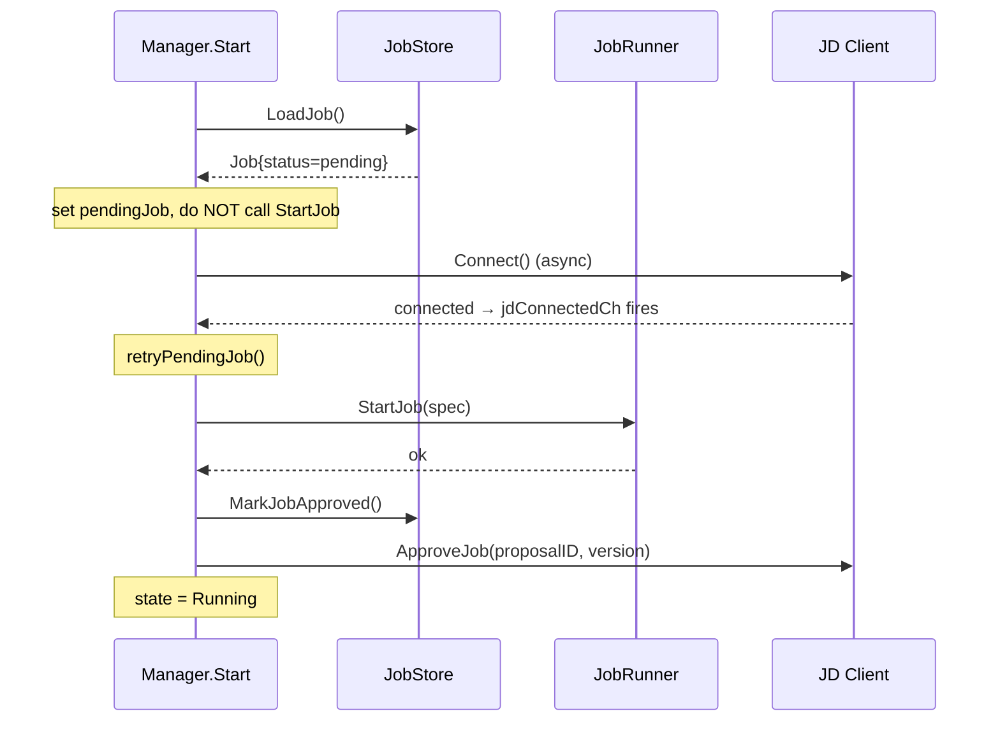

# JD lifecycle manager: proposal recovery after crash

## Summary

The JD lifecycle manager in the standalone committee verifier now persists
job proposals as `pending` before attempting to start them, and promotes the
record to `approved` only after `StartJob` succeeds. A crash in between leaves
a recoverable record — on the next restart the manager defers the retry until
JD reconnects, then calls `StartJob` and `ApproveJob` without requiring a
manual re-proposal from the operator.

---

## Bug fixes

### **`common/jd/lifecycle`**: lost job proposal after crash or `StartJob` failure

**Before:** `SaveJob` was called *after* `StartJob` succeeded. A crash between
receiving the proposal and persisting it left nothing in the store. On restart
the manager saw `ErrNoJob`, entered passive `WaitingForJob` state, and stalled
— JD had already marked the proposal acknowledged and would never re-push it.

**After:** Two-phase write:

1. `SaveJob` writes `status='pending'` before any start attempt.
2. `MarkJobApproved` promotes the record to `status='approved'` after
   `StartJob` returns successfully.

On restart a `pending` record signals an incomplete prior attempt. The manager
sets `pendingJob` in memory and defers `StartJob` until `jdConnectedCh` fires
(JD reconnect), then retries via `retryPendingJob`.



---

## New: `StoreInterface.MarkJobApproved`

A new method is added to `StoreInterface` (and `PostgresStore`):

```go
// MarkJobApproved transitions the stored record from pending to approved.
MarkJobApproved(ctx context.Context) error
```

Any custom implementation of `StoreInterface` must add this method.

---

## Migration required

A Goose migration (`bootstrap/db/migrations/0002_job_store_status.sql`) adds a
`status` column to `job_store`:

```sql
ALTER TABLE job_store
    ADD COLUMN status TEXT NOT NULL DEFAULT 'approved'
        CHECK (status IN ('pending', 'approved'));
```

The `DEFAULT 'approved'` means existing rows (jobs that were running before
this deploy) are treated as approved — no data backfill needed. Migrations run
automatically on startup via `db.RunMigrations`.

---
