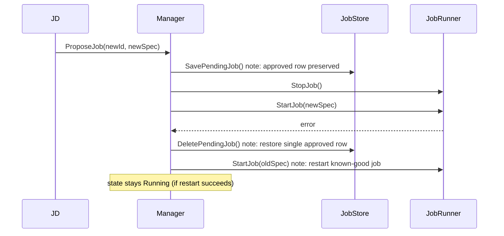

# JD lifecycle manager: fallback to old job on failed replacement

## Summary

When a replacement job proposal fails to start, the lifecycle manager now
restarts the previous job automatically rather than leaving the verifier with
nothing running. The old approved row is preserved in the store throughout the
replacement attempt so that both in-process restart and process-restart recovery
work correctly.

---

## Bug fixes

### **`common/jd/lifecycle`**: verifier stalls after a failed replacement proposal

**Before:** When a replacement proposal arrived, the manager stopped the old
job before calling `StartJob` for the new one. If `StartJob` failed, the old
job was already gone. The manager entered `WaitingForJob` with no persisted
record to recover from. JD would not re-push (proposal already acknowledged),
so the verifier stalled until an operator manually re-proposed.

**After:** The old `approved` row is preserved in the store during a replacement
(see below). On `StartJob` failure, the manager calls `DeletePendingJob` to
remove the new pending row, then restarts the old job from the in-memory
snapshot. If the old job restart also fails, the manager enters `WaitingForJob`
— but the old `approved` row is still in the DB, so the next process restart
boots the known-good job automatically.



---

## New and renamed `StoreInterface` methods

Three methods are added or renamed. Any custom implementation of `StoreInterface`
must be updated.

| Old name | New name | Notes |
|---|---|---|
| `SaveJob` | `SavePendingJob` | Only replaces the pending row; approved row preserved |
| `MarkJobApproved` | `AcceptPendingJob` | Returns `(bool, error)`; `bool` is true if a pending row was promoted |
| `DeleteJob` | `DeleteAllJobs` | Makes "clears everything" semantics explicit |
| *(new)* | `DeletePendingJob` | Removes only the pending row; used to rollback a failed replacement |

```go
SavePendingJob(ctx context.Context, proposalID string, version int64, spec string) error
AcceptPendingJob(ctx context.Context) (bool, error)
DeleteAllJobs(ctx context.Context) error
DeletePendingJob(ctx context.Context) error
```

---

## Behaviour change: `SavePendingJob` no longer deletes the approved row

Previously `SaveJob` deleted all rows before inserting the new pending row.
`SavePendingJob` now only replaces the pending row (via `ON CONFLICT (status) DO UPDATE`),
preserving any existing `approved` row. This is required so a failed replacement
can fall back to the old job.

The `LoadJob` tiebreaker — when both rows exist, the `approved` row is returned
— means a process restart after a failed replacement boots the old job, not the
stuck pending one.

---

## Migration required

Migration `0003` adds a `UNIQUE(status)` constraint to `job_store`:

```sql
ALTER TABLE job_store
    ADD CONSTRAINT job_store_unique_status UNIQUE (status);
```

This enforces at most one `pending` and one `approved` row at a time, preventing
accumulation of pending rows from repeated failed replacements. Applied
automatically on startup via `db.RunMigrations`.
