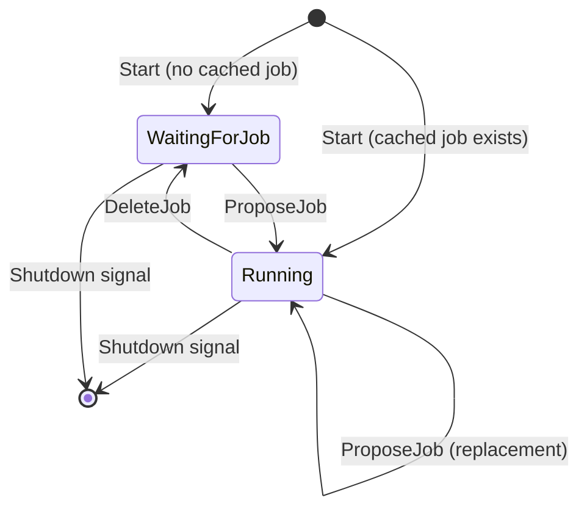

## lifecycle

Package `lifecycle` exports a lifecycle manager for standalone CCVs or executors that have their work submitted via JD.

## Architecture

## Implementing JobRunner

Your service must implement `JobRunner`:

- **StartJob(ctx, spec)** — Start processing the job. `spec` is the raw job spec string from JD; the manager does not interpret it.
- **StopJob(ctx)** — Stop the current job. Must be **idempotent**: safe to call when no job is running (e.g. before starting the first job on a replacement, or during shutdown).

The manager calls `StopJob` before starting a replacement job and when handling a delete or shutdown.

## Single job, replacement, and delete

- The manager tracks **at most one job**. A new proposal is treated as a **replacement**: it stops the current job (if any), then starts the new one, persists it, and approves it with JD.
- **Delete**: only the request whose id matches the current job’s proposal id is applied; others are ignored. After a matching delete, the manager stops the job, clears the store, and goes to `WaitingForJob`.
- **Revoke** requests are received but not acted on (we auto-approve proposals, so revoke is effectively a no-op).
