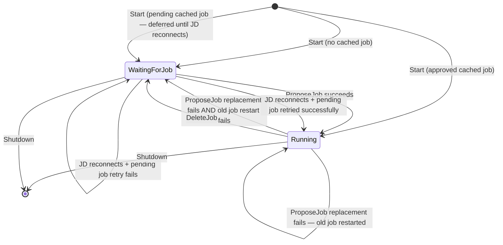
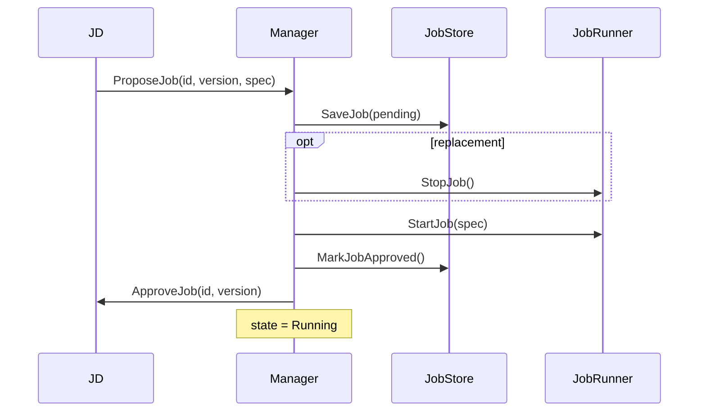
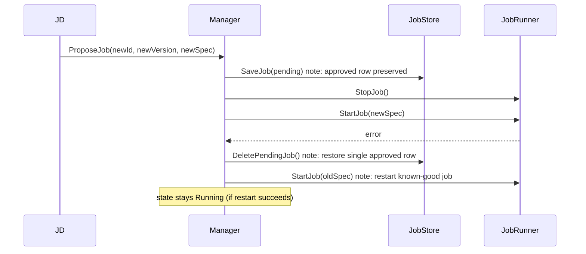
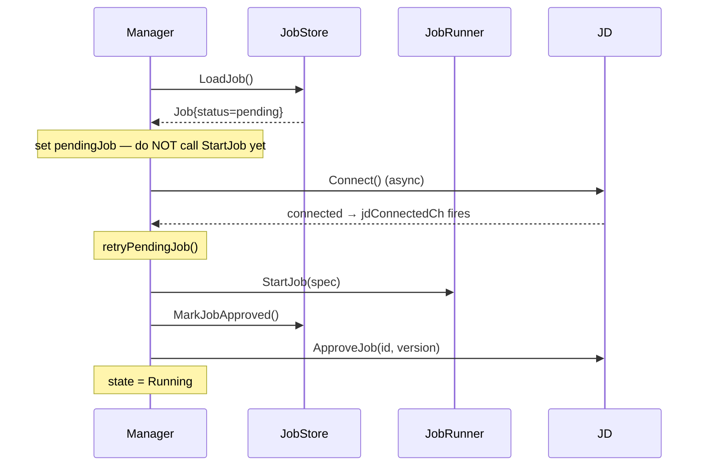
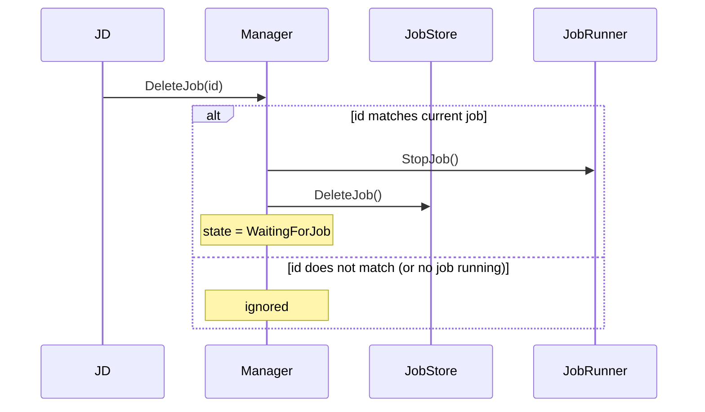

## lifecycle

Package `lifecycle` exports a lifecycle manager for standalone CCVs or executors that have their work submitted via JD.

## Architecture

### States

```mermaid
stateDiagram-v2
    [*] --> WaitingForJob: Start (no cached job)
    [*] --> WaitingForJob: Start (pending cached job — deferred until JD reconnects)
    [*] --> Running: Start (approved cached job)

    WaitingForJob --> Running: ProposeJob succeeds
    WaitingForJob --> WaitingForJob: ProposeJob fails (pending record kept for recovery)

    Running --> Running: ProposeJob replacement succeeds
    Running --> Running: ProposeJob replacement fails — old job restarted
    Running --> WaitingForJob: ProposeJob replacement fails AND old job restart fails
    Running --> WaitingForJob: DeleteJob

    WaitingForJob --> Running: JD reconnects + pending job retried successfully
    WaitingForJob --> WaitingForJob: JD reconnects + pending job retry fails

    Running --> [*]: Shutdown
    WaitingForJob --> [*]: Shutdown
```

### Proposal handling (happy path)

```mermaid
sequenceDiagram
    participant JD
    participant M as Manager
    participant S as JobStore
    participant R as JobRunner

    JD->>M: ProposeJob(id, version, spec)
    M->>S: SaveJob(pending)
    opt replacement
        M->>R: StopJob()
    end
    M->>R: StartJob(spec)
    M->>S: MarkJobApproved()
    M->>JD: ApproveJob(id, version)
    Note over M: state = Running
```

### Replacement failure — fallback to old job

```mermaid
sequenceDiagram
    participant JD
    participant M as Manager
    participant S as JobStore
    participant R as JobRunner

    JD->>M: ProposeJob(newId, newVersion, newSpec)
    M->>S: SaveJob(pending)       note: approved row preserved
    M->>R: StopJob()
    M->>R: StartJob(newSpec)
    R-->>M: error
    M->>S: DeletePendingJob()     note: restore single approved row
    M->>R: StartJob(oldSpec)      note: restart known-good job
    Note over M: state stays Running (if restart succeeds)
```

### Pending job recovery on restart

```mermaid
sequenceDiagram
    participant M as Manager
    participant S as JobStore
    participant R as JobRunner
    participant JD

    M->>S: LoadJob()
    S-->>M: Job{status=pending}
    Note over M: set pendingJob — do NOT call StartJob yet

    M->>JD: Connect() (async)
    JD-->>M: connected → jdConnectedCh fires

    Note over M: retryPendingJob()
    M->>R: StartJob(spec)
    M->>S: MarkJobApproved()
    M->>JD: ApproveJob(id, version)
    Note over M: state = Running
```

### Delete

```mermaid
sequenceDiagram
    participant JD
    participant M as Manager
    participant S as JobStore
    participant R as JobRunner

    JD->>M: DeleteJob(id)
    alt id matches current job
        M->>R: StopJob()
        M->>S: DeleteJob()
        Note over M: state = WaitingForJob
    else id does not match (or no job running)
        Note over M: ignored
    end
```

### Revoke

Revoke requests are received but ignored. The manager auto-approves every
proposal immediately, so by the time a revoke could arrive the job is already
running. No state change occurs.

## Implementing JobRunner

Your service must implement `JobRunner`:

- **StartJob(ctx, spec)** — Start processing the job. `spec` is the raw job spec string from JD; the manager does not interpret it.
- **StopJob(ctx)** — Stop the current job. Must be **idempotent**: safe to call when no job is running (e.g. before starting the first job on a replacement, or during shutdown).

The manager calls `StopJob` before starting a replacement job and when handling a delete or shutdown.

## Single job, replacement, and delete

- The manager tracks **at most one running job**. A new proposal is a **replacement**: it stops the current job (if any), then starts the new one.
- **Crash safety (two-phase write):** the proposal is persisted as `pending` before `StartJob` is called and promoted to `approved` only after `StartJob` succeeds. A crash between the two leaves a `pending` record that drives a retry on the next restart + JD reconnect.
- **Replacement fallback:** if `StartJob` fails for a replacement, the old job is automatically restarted and the `pending` store record is removed, keeping the verifier running on the previous spec. If the old job restart also fails, the manager transitions to `WaitingForJob`.
- **Delete:** only the request whose id matches the current job's proposal id is applied; others are ignored. After a matching delete the manager stops the job, clears the store, and goes to `WaitingForJob`.
- **Revoke** requests are received but not acted on (we auto-approve proposals, so revoke is effectively a no-op).
