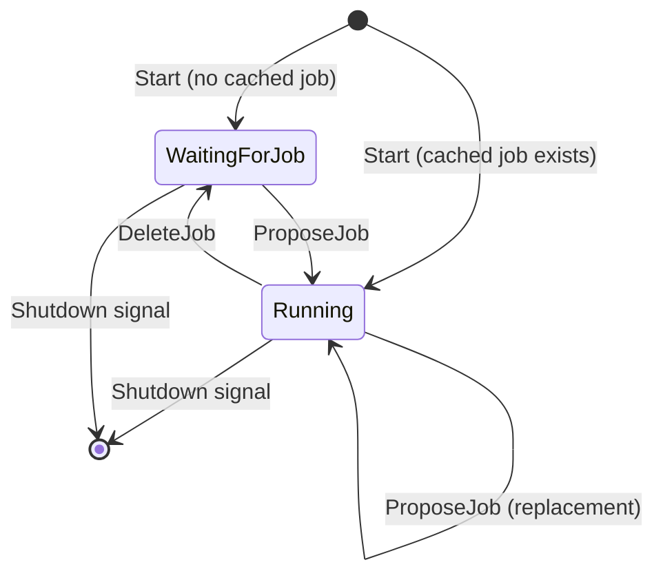

## jdlifecycle

Package `jdlifecycle` exports a lifecycle manager for CCVs (or executors) that
have their work submitted via JD.

## Architecture

```mermaid
stateDiagram-v2
    [*] --> WaitingForJob: Start (no cached job)
    [*] --> Running: Start (cached job exists)
    WaitingForJob --> Running: ProposeJob
    Running --> WaitingForJob: DeleteJob
    Running --> Running: ProposeJob (replacement)
    Running --> [*]: Shutdown signal
    WaitingForJob --> [*]: Shutdown signal
```
