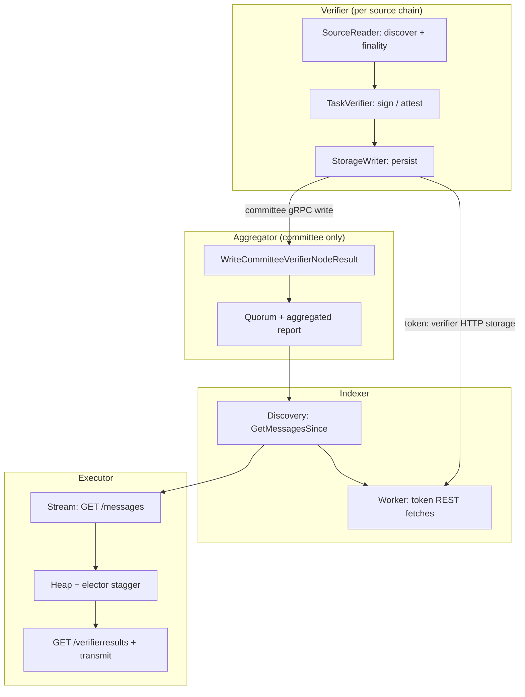

# End-to-End Message Debugging

This guide walks a single `messageID` through the full offchain CCIP pipeline. Use it when you need to answer: *where did this message stop?*

For deep dives on one service, see the [per-service debugging guides](../README.md#debugging-guides). This document focuses on **order**, **happy-path anchors**, and **what to search for when an anchor is missing**.

## Pipeline at a glance



**Two verification shapes:**

| Path | Verifier output goes to | Indexer still discovers message via |
|------|-------------------------|-------------------------------------|
| **Committee** | Aggregator → `GetMessagesSince` | Aggregator (discovery marker + quorum result) |
| **Token** (USDC / Lombard) | Verifier HTTP API (`/verifications`) | Aggregator (`GetMessagesSince` for message shell) |

---

## Before you start

1. Normalize the ID as `0x` + 64 hex chars (most logs use `messageID=0x…`).
2. Filter logs by that ID across services (Datadog, Loki, local files).
3. Identify which verifiers apply (committee, USDC, Lombard) from the message’s CCV addresses / lane config.
4. Work **top to bottom** — do not skip to executor if verifier never persisted.

**Global grep:**

```bash
MSG=0xYOUR_MESSAGE_ID
grep -E "messageID=.*${MSG#0x}|messageID=${MSG}|${MSG}" 
```

---

## Stage 0 — On-chain source (context only)

Offchain debugging assumes the message was emitted on the source chain OnRamp. If nothing appears in verifier logs, confirm the on-chain event exists for this `messageID` on the source chain first (outside this repo’s services).

---

## Stage 1 — Verifier: discovery and enqueue

**Service:** Verifier `SourceReaderService`  
**Detail:** [verifier/docs/debugging.md](../verifier/docs/debugging.md)

### What happens

Events are read from the source chain, filtered, held until finality (and curse/rules checks pass), then published to `ccv_task_verifier_jobs`.

### Happy path

| Order | Log message | Level |
|-------|-------------|-------|
| 1 | `Added message to pending queue` | Info |
| 2 | `Finality check` with `meetsRequirement=true` | Info |
| 3 | `Successfully published and tracked tasks` | Info |

**Anchor:** If you see **#3**, the message entered the verifier task queue.

### If anchor not found — search for

| Symptom | Logs / areas to check |
|---------|------------------------|
| Never discovered | `Message filtered out by filter`; `No events found in range`; `Processed block range` (chain stalled?) |
| ID bad | `Message ID mismatch`; `Failed to compute message ID` |
| Stuck pending | `Finality check` with `meetsRequirement=false`; `Reorg-affected message finality check` |
| Dropped | `Dropping task - lane is cursed`; `Dropping task - message matched a disablement rule` |
| Not published | `Failed to publish tasks to job queue`; `Curse or message rules state unknown` |
| Reorg | `Removing task from pending queue due to reorg` |
| Chain down | `FINALITY VIOLATION`; `Chain is disabled, skipping` |

**Config context:** `component=Service`, `chain=<sourceSelector>` on source-reader logs.

---

## Stage 2 — Verifier: verification

**Service:** Verifier `TaskVerifier` + pluggable verifier  
**Detail:** [verifier/docs/debugging.md#verifier-implementations](../verifier/docs/debugging.md#verifier-implementations)

### What happens

Tasks are consumed from `ccv_task_verifier_jobs`, verified (committee sign, CCTP attestation, Lombard attestation, etc.), and successful results are published to `ccv_storage_writer_jobs`.

### Happy path

| Order | Log message | Verifier type |
|-------|-------------|---------------|
| 1 | *(batch)* `Processing verification tasks batch` | TaskVerifier (Debug) |
| 2a | `Message verification completed successfully` | **Commit** |
| 2b | `VerifierResults: Successfully verified message` | **CCTP / Lombard** |
| 3 | No `Message verification failed` for this `messageID` | TaskVerifier |

**Anchor:** **#2a or #2b** without a matching **#3** failure.

### If anchor not found — search for

| Symptom | Logs / areas to check |
|---------|------------------------|
| Not consumed | Queue empty / job stuck in `processing` — see verifier DB `ccv_task_verifier_jobs`; batch errors without per-ID |
| Committee failed | `Message verification failed` with `retryable`; commit path lacks per-error Info logs — read `error` field |
| CCTP not ready | `Attestation not ready for message` (Debug); `Failed to fetch attestation` |
| Lombard not ready | `Attestation not found for message`; `Attestation not ready for message` |
| Permanent fail | `Message verification failed` with `retryable=false` |
| Mapping bug | `Job ID not found for message` |

**Logger context (token):** `messageID` + `txHash` on all CCTP/Lombard task lines.

---

## Stage 3 — Verifier: offchain persist

**Service:** Verifier `StorageWriter`  
**Detail:** [verifier/docs/debugging.md#stage-3--storagewriter-processor](../verifier/docs/debugging.md)

### What happens

Verifier results are written to configured offchain storage. For **committee**, this typically pushes to the **aggregator** via gRPC. For **token**, data is exposed on the verifier HTTP API for the indexer to pull later.

### Happy path

| Order | Log message | Level |
|-------|-------------|-------|
| 1 | `Write succeeded for message` | Debug |
| 2 | `CCV data batch write completed` with `successful >= 1` | Info |

**Anchor:** **`Write succeeded for message`** with your `messageID`.

### If anchor not found — search for

| Symptom | Logs / areas to check |
|---------|------------------------|
| Prior stage failed | Return to Stage 2 |
| Write failed | `Write failed for message (retryable)` / `(non-retryable)` |
| Batch catastrophe | `Failed to write CCV data batch to storage with no results` |
| Queue stuck | `Failed to publish verification results to queue` (TaskVerifier — result never reached storage writer) |
| Committee → agg | Aggregator: `Signature validated successfully` → `Triggered aggregation check` (Stage 4) |

---

## Stage 4 — Aggregator: committee quorum (committee path only)

**Service:** Aggregator  
**Detail:** [aggregator/docs/debugging.md](../aggregator/docs/debugging.md)

Skip this stage for pure token lanes that never write committee signatures to the aggregator.

### What happens

Each committee node writes `WriteCommitteeVerifierNodeResult`. The aggregator stores per-node verifications, checks quorum asynchronously, and persists `commit_aggregated_reports`.

### Happy path

| Order | Log message | Level |
|-------|-------------|-------|
| 1 | `Signature validated successfully` | Info |
| 2 | `Successfully saved commit verification record` | Info |
| 3 | `Triggered aggregation check` | Info |
| 4 | `Checking aggregation for message` | Info |
| 5 | `Report submitted successfully` | Info |

**Anchor:** **`Report submitted successfully`** with `messageID` in context.

### If anchor not found — search for

| Symptom | Logs / areas to check |
|---------|------------------------|
| Write never arrived | Verifier Stage 3 + aggregator ingress `Request failed`; auth/HMAC errors (no `messageID`) |
| Write rejected | `validation error`; `signature validation failed`; `Rejected write: message matched a disablement rule` |
| Backpressure | `Aggregation channel is full` |
| Quorum not yet met | `Quorum not met, not submitting report` — need more node writes |
| Already done | `Skipping aggregation: existing report already meets quorum` |
| Stuck async | `Failed to list verifications`; `Failed to submit report` |
| Orphan | `Failed to process orphaned record` (orphan recoverer) |

**Note:** `WriteStatus_SUCCESS` only means enqueue to aggregation — not quorum complete.

---

## Stage 5 — Indexer: aggregator discovery

**Service:** Indexer `AggregatorMessageDiscovery`  
**Detail:** [indexer/docs/debugging.md#stage-1--sourcereaderservice](../indexer/docs/debugging.md)

### What happens

Indexer polls aggregator `GetMessagesSince`, persists messages (and non–discovery-only verifications), emits work to the indexer worker channel.

### Happy path

| Order | Log message | Level |
|-------|-------------|-------|
| 1 | `Found Message` | Info |
| 2 | `Discovery batch persisted` | Debug |
| 3 | `Enqueueing new Message` | Info |

**Anchor:** **`Enqueueing new Message`** with your `messageID` (worker pool picked it up).

### If anchor not found — search for

| Symptom | Logs / areas to check |
|---------|------------------------|
| Aggregator has no report | Stage 4 `Report submitted successfully` |
| Poll failing | `Error reading VerificationResult from aggregator`; `Circuit breaker is open` |
| Not persisted | `Unable to persist discovery batch, will retry` |
| Filtered at encode | `Skipping message, cannot encode for insert` |
| Deduped (multi-source) | `messageID already discovered from different source, skipping` |
| Stream never ran | `MessageDiscovery Started` missing / `Error calling Aggregator` |

---

## Stage 6 — Indexer: token / missing verifier fetches

**Service:** Indexer `Task` + `VerifierReader` (REST to token verifiers)  
**Detail:** [indexer/docs/debugging.md#stage-2--taskverifier-processor](../indexer/docs/debugging.md)

### What happens

For each CCV address on the message not yet in DB, the indexer calls verifier HTTP APIs (or aggregator `GetVerifierResultsForMessage` for aggregator-type verifiers).

### Happy path

| Order | Log message | Level |
|-------|-------------|-------|
| 1 | `Attempting to retrieve N verifications for the message` | Info |
| 2 | `Received result from … for MessageID` | Debug |
| 3 | `Collected N new verifications for the message` (N > 0) | Info |
| 4 | No `Message … entered DLQ` | WorkerPool |

**Anchor:** **`Collected N new verifications`** with N > 0, then message eventually `successful` in DB.

### If anchor not found — search for

| Symptom | Logs / areas to check |
|---------|------------------------|
| Stage 5 missing | Return to indexer discovery |
| Unknown verifier | `Detected N unknown verifiers`; `Unknown CCVs` — registry / `issuer_addresses` |
| Token HTTP 404 | `REST reader 404 (no results)` — verifier Stage 2/3 not done for token |
| Token HTTP error | `REST reader HTTP request failed`; `REST reader unexpected status` |
| Already have data | `Attempting to retrieve 0 verifications` — check DB `verifier_results` |
| Gave up | `Message … entered DLQ` |

**Cross-check verifier:** `Write succeeded for message` (committee) or token `Successfully verified message`.

---

## Stage 7 — Executor: message stream

**Service:** Executor `IndexerStorageStreamer`  
**Detail:** [executor/docs/debugging.md#stage-1--indexer-message-stream](../executor/docs/debugging.md)

### What happens

Executor polls indexer `GET /v1/messages` and forwards new messages to the coordinator.

### Happy path

| Order | Log message | Level |
|-------|-------------|-------|
| 1 | `Found net new message from Indexer` | Info |

**Anchor:** **`Found net new message from Indexer`** with your `messageID`.

### If anchor not found — search for

| Symptom | Logs / areas to check |
|---------|------------------------|
| Indexer not ready | Indexer Stage 5–6; message `status` in `indexer.messages` |
| Poll error | `IndexerStorageStreamer read error` |
| Wrong dest chain | `enabled_dest_chains` vs message `dest_chain_selector` |
| Stream down | `failed to start ccv result streamer`; `streamerResults closed` |
| Invalid payload | `dropping message with invalid ID` |

---

## Stage 8 — Executor: schedule and execute

**Service:** Executor `Coordinator` + `ChainlinkExecutor`  
**Detail:** [executor/docs/debugging.md](../executor/docs/debugging.md)

### What happens

Message waits on delayed heap until leader-elector `readyTimestamp`, then workers call `HandleMessage`: curse check, on-chain state, indexer verifier results + off-ramp quorum, honest-attempt check, transmit.

### Happy path

| Order | Log message | Level |
|-------|-------------|-------|
| 1 | `pushing message to delayed heap` | Info |
| 2 | `processing message with ID` | Info |
| 3 | `got ccv info and verifier results` with `verifierResultsLen > 0` | Info |
| 4 | `transmitting aggregated report to chain` | Info |
| 5 | No `message should be retried` / `will retry execution` for same ID | Info/Warn |

**Anchor:** **`transmitting aggregated report to chain`** — offchain pipeline complete for this attempt.

### If anchor not found — search for

| Symptom | Logs / areas to check |
|---------|------------------------|
| Stage 7 missing | Return to executor stream |
| Long wait before #2 | `pushing message to delayed heap` → check `readyTimestamp`; Debug `calculated ready timestamp` |
| Not this executor | `skipping message, executor not in pool for destination chain` |
| Duplicate / skip | `message already in delayed heap`; `message already in flight` |
| Expired | `message has expired` |
| Indexer empty | `delaying execution due to no verifier results`; indexer `CCV data not found` (404) — Stages 5–6 |
| Quorum not met | `message did not meet verifier quorum`; `delaying execution due to failed request for verifier results` |
| Already on-chain | `skipping execution due to already being successfully executed` |
| Someone else executed | `skipping execution due to existing honest attempt` |
| Curse | `delaying execution due to curse` |
| Tx failed | `will retry execution due to failed ConvertAndWriteMessageToChain` |
| Permanent | `skipping retry due to message encoding error`; `impossible receiver verifier quorum` |
| Indexer failover | `No healthy alternates found`; `Switching active indexer` |

---

## Full happy-path chain (committee + token)

Use as a single checklist — each line should appear in order for a fully healthy lane:

```text
[Verifier]
  Added message to pending queue
  Finality check (meetsRequirement=true)
  Successfully published and tracked tasks
  Message verification completed successfully  OR  VerifierResults: Successfully verified message
  Write succeeded for message

[Aggregator — committee]
  Signature validated successfully
  Triggered aggregation check
  Report submitted successfully

[Indexer]
  Found Message
  Enqueueing new Message
  Collected N new verifications for the message  (N > 0 if token verifiers required)

[Executor]
  Found net new message from Indexer
  pushing message to delayed heap
  processing message with ID
  got ccv info and verifier results
  transmitting aggregated report to chain
```

**Token-only note:** Committee verifier lines in the middle may be replaced by discovery markers from aggregator `GetMessagesSince`; token attestations still require indexer Stage 6 and verifier token logs.

---

## Where am I stuck? (quick routing)

| Last happy-path log you see | Investigate next |
|---------------------------|------------------|
| *(none in verifier)* | Stage 1 — source reader / chain disabled |
| `Successfully published and tracked tasks` | Stage 2 — task verifier |
| `Message verification failed` | Stage 2 — error + `retryable` |
| `Write succeeded for message` (committee) | Stage 4 — aggregator |
| `Write succeeded` but no aggregator write | Aggregator connectivity / HMAC / `Aggregation channel is full` |
| `Report submitted successfully` | Stage 5 — indexer discovery |
| `Enqueueing new Message` | Stage 6 — token REST / registry |
| `Collected N new verifications` | Stage 7 — executor stream config |
| `Found net new message from Indexer` | Stage 8 — heap timing / elector / execution |
| `got ccv info and verifier results` | Stage 8 — transmit / RPC / quorum ordering |
| `transmitting aggregated report to chain` | On-chain receipt / dest chain tooling (outside this doc) |

---

## Per-service reference

| Service | Deep-dive guide |
|---------|-----------------|
| Verifier | [verifier/docs/debugging.md](../verifier/docs/debugging.md) |
| Aggregator | [aggregator/docs/debugging.md](../aggregator/docs/debugging.md) |
| Indexer | [indexer/docs/debugging.md](../indexer/docs/debugging.md) |
| Executor | [executor/docs/debugging.md](../executor/docs/debugging.md) |

---

## Related

- [Repository README — Debugging guides](../README.md#debugging-guides)
- [Verifier design](../verifier/docs/verifier.md)
