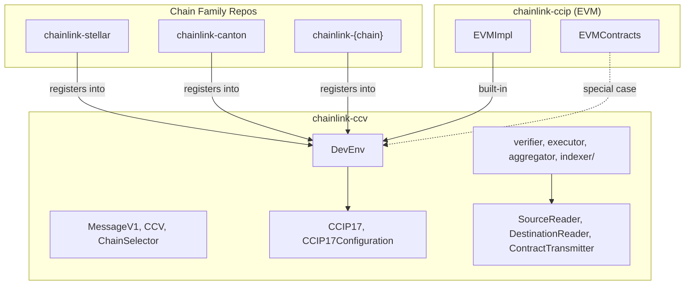
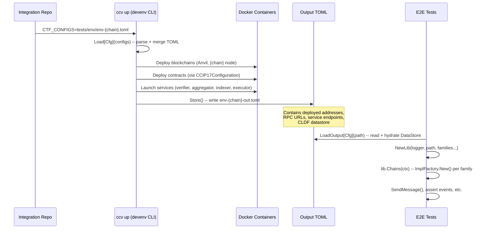
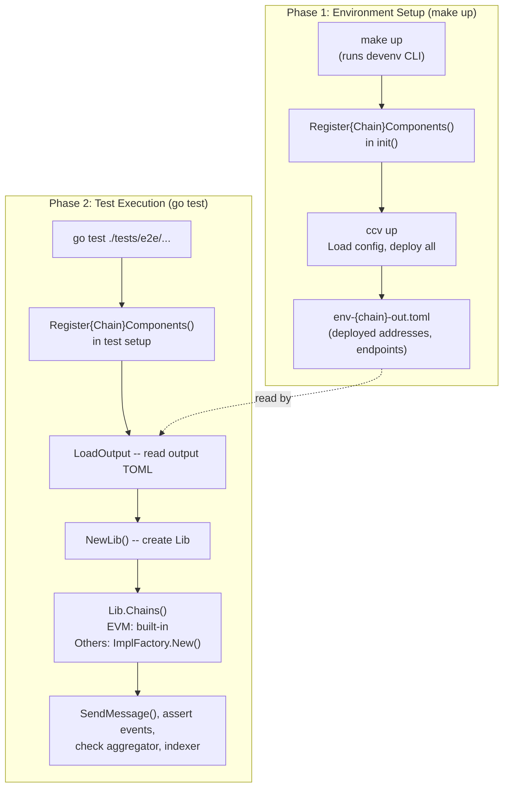

# CCV Chain Family Integration Guide

This guide walks through bootstrapping a new chain family integration for CCIP 1.7 using the CCV (Cross-Chain Validator) developer environment. It is aimed at internal Chainlink teams adding support for a new blockchain (e.g., Aptos, Sui, Solana) alongside the existing EVM infrastructure.

Two chain integrations already follow this pattern and serve as reference implementations:

- **Stellar**: `chainlink-stellar/ccv/devenv/register.go`
- **Canton**: `chainlink-canton/ccip/devenv/cmd/ccv/main.go`

---

## Table of Contents

1. [Architecture Overview](#1-architecture-overview)
2. [Why Chain-Specific Code Lives Outside chainlink-ccv](#2-why-chain-specific-code-lives-outside-chainlink-ccv)
3. [Scaffolding a New Chain Repo](#3-scaffolding-a-new-chain-repo)
4. [Registration Points](#4-registration-points)
5. [Implementing the CCIP17 Interfaces](#5-implementing-the-ccip17-interfaces)
6. [Wiring It All Together](#6-wiring-it-all-together)
7. [Configuration Flow](#7-configuration-flow)
8. [E2E Test Architecture](#8-e2e-test-architecture)
9. [Integration Checklist](#9-integration-checklist)
10. [Reference Implementations](#10-reference-implementations)

---

## 1. Architecture Overview

The CCV ecosystem is split across three layers of repositories. The core framework (`chainlink-ccv`) owns all chain-agnostic protocol logic, the `devenv` framework, E2E test harnesses, and service orchestration. EVM-specific code lives in `chainlink-ccip` as a special case for now. Every other chain family lives in its own dedicated repo.



When `Lib.Chains()` is called at runtime, EVM is handled by a built-in code path. Every other chain family is resolved through the `ImplFactory` registry

The same approach of attaching chain-specific configs and logic into `devenv` registries is followed for various helpers to ensure that it remains outside `chainlink-ccv`. 

#### DevEnv Setup & E2E Flow



---

## 2. Why Chain-Specific Code Lives Outside chainlink-ccv

TODO: add blurb

---

## 3. Scaffolding a New Chain Repo

### Proposed Directory Structure

> **Note**: that each chain integration can define its own structure, the structure below is proposed primarily to simplify this guide and serve as a reference point.

```
chainlink-{chain}/
  ccv/
    chain/
      chain.go                 # CCIP17 + CCIP17Configuration implementation
      adapter.go               # ChainFamilyAdapter (wraps EVM adapter base)
      impl_factory.go          # ImplFactory: NewEmpty() and New()
      cldf_provider_factory.go # Implements CLDFProviderFactory from devenv
    devenv/
      register.go            # Register{Chain}Components() entry point
      modifier/
        committeeverifier.go # Committee verifier config modifier
        executor.go          # Executor config modifier
      chain_config_loader.go # ChainConfigLoader for service job specs
    source_reader/          # chainaccess.SourceReader implementation
    destination_reader/     # chainaccess.DestinationReader implementation
    contract_transmitter/   # chainaccess.ContractTransmitter implementation
    client/                 # Optional: SDK client wrapper
    common/                 # Shared config types (e.g., TOML struct)
  contracts/                # On-chain smart contracts
  bindings/                 # Generated Go bindings from contracts
  deployment/               # Contract deployment utilities
  tests/
    env/                    # TOML config files (input configs)
    e2e/                    # E2E test files
    testutils/
      cmd/devenv/main.go    # Devenv CLI entry point
      ...
```

---

## 4. Registration Points

Every chain family must populate global registries in `chainlink-ccv` to be able to use the `devenv` library.

> In Stellar, the registration is done in `/ccv/devenv/register.go`. 

### 4a. ImplFactory

The `ImplFactory` is the most important registration. It tells the `devenv` how to create your chain's `CCIP17` implementation.

**Interface** (defined in `chainlink-ccv/build/devenv/chain_impl_factory.go`):

```go
type ImplFactory interface {
    NewEmpty() cciptestinterfaces.CCIP17Configuration
    New(
        ctx context.Context,
        cfg *Cfg,
        lggr zerolog.Logger,
        env *deployment.Environment,
        bc *blockchain.Input,
    ) (cciptestinterfaces.CCIP17, error)
}
```

- `NewEmpty()` returns a bare `CCIP17Configuration` used during initial environment creation. The `devenv` calls `DeployLocalNetwork()` and `DeployContractsForSelector()` on it.
- `New()` returns a fully initialized `CCIP17` for test interactions. It reconstructs state (RPC clients, deployer keys, contract bindings) from the `blockchain.Input` output and the CLDF datastore.

**Registration:**

```go
ccv.RegisterImplFactory(chainsel.Family{Chain}, mychain.NewImplFactory())
```

This interface also includes other important methods for deploying and configuring contracts for the chain.

> **Note**: To simplify getting the environment up and running. Those implementations can be barebones (or use mock addresses) initially.

##### DeployContractsForSelector

```go
func (c *Chain) DeployContractsForSelector(
  ctx context.Context, 
  env *deployment.Environment, 
  selector uint64, 
  committees *deployments.EnvironmentTopology
) (datastore.DataStore, error)
```

It is responsible for deploying the contracts to the specified selector. Access to `deployment.Environment` and `deployments.EnvironmentTopology` enables deployment based on the environment (e.g., other blockchains and their configs).

Once a contract is deployed / initialized, its address is added as a ref within the datastore. For example:

```go
ds.AddressRefStore.Add(datastore.AddressRef{
    Address: onrampHex,
    ChainSelector: selector,
    Type: datastore.ContractType(onrampoperations.ContractType),
    Version: semver.MustParse(onrampoperations.Deploy.Version()),
})
```

> Note: it's simpler to just mock those addresses initially or possibly have this method return a new datastore without actually doing deployments. 

##### ConnectContractsWithSelectors

Connects this chain's OnRamp to OffRamps on remote chains and configures CommitteeVerifiers.

```go
func (c *Chain) ConnectContractsWithSelectors(
    ctx context.Context, 
    e *deployment.Environment, 
    selector uint64, 
    remoteSelectors []uint64, 
    committees *deployments.EnvironmentTopology
) error
```

.... TODO: add usage examples

### 4b. ChainFamilyAdapter

The adapter handles chain-specific address encoding for deployment changesets. Most non-EVM chains wrap the EVM adapter and override `AddressRefToBytes()`.

**Registration:**

```go
evmAdapter, _ := registry.GetGlobalChainFamilyAdapterRegistry().GetChainFamily(chainsel.FamilyEVM)
registry.RegisterChainFamilyAdapter(chainsel.Family{Chain}, myadapter.NewChainFamilyAdapter(evmAdapter))
```

The EVM adapter is always available because `chainlink-ccv` registers it in its `init()`. Your adapter wraps it and adds chain-specific address decoding (e.g., converting Stellar `strkeys` or Canton party IDs to bytes).

### 4c. ChainConfigLoader

The chain config loader converts `blockchain.Output` entries into a `map[string]any` that the verifier service uses for job spec configuration.

**Signature** (defined in `chainlink-ccv/build/devenv/services/chainconfig/registry.go`):

```go
type ChainConfigLoader func(outputs []*blockchain.Output) (map[string]any, error)
```

The map is keyed by chain selector (as a string). Values are chain-specific config structs. It is acceptable to return placeholder values here if the real config is populated later by the modifier.

**Registration:**

```go
chainconfig.RegisterChainConfigLoader(chainsel.Family{Chain}, MyChainConfigLoader)
```

### 4d. Committee Verifier Modifier

The modifier customizes the Docker container request for the chain's committee verifier service. This is where you swap the Docker image, build chain-specific config files from deployed contract addresses, and bind-mount them into the container.

**Signature** (defined in `chainlink-ccv/build/devenv/services/committeeverifier/modifier.go`):

```go
type ReqModifier func(
    req testcontainers.ContainerRequest,
    verifierInput *Input,
    outputs []*blockchain.Output,
) (testcontainers.ContainerRequest, error)
```

Typical responsibilities:
1. Replace `req.Image` with the chain-specific verifier image (e.g., `{chain}committee-verifier:dev`)
2. Extract deployed contract addresses from `verifierInput.GeneratedConfig`
3. Build a config file (often TOML) with RPC URLs, contract addresses, network info
4. Bind-mount the config file into the container

**Registration:**

```go
committeeverifier.RegisterModifier(chainsel.Family{Chain}, MyChainModifier)
```


### 4e. Executor Modifier

.... TODO: add writeup


---

## 5. Implementing the CCIP17 Interfaces

Your chain's `ccv/chain/chain.go` must implement two composite interfaces defined in `chainlink-ccv/build/devenv/cciptestinterfaces/interface.go`.

### CCIP17Configuration (environment setup)

Used by the `devenv` during `ccv up` to stand up the chain and deploy contracts.

| Method | Purpose |
|--------|---------|
| `ChainFamily()` | Returns the chain family string (e.g., `"stellar"`) |
| `DeployLocalNetwork(ctx, input)` | Starts the chain's local node as a Docker container. Returns `blockchain.Output` with RPC URLs, network info |
| `DeployContractsForSelector(ctx, env, selector, topology)` | Deploys all CCIP contracts (OnRamp, RMN, FeeQuoter, CCV contracts). Returns a `datastore.DataStore` with deployed addresses |
| `ConnectContractsWithSelectors(ctx, env, selector, remotes, topology)` | Configures OnRamp destinations and committee verifier signers |
| `ConfigureNodes(ctx, blockchain)` | Returns TOML config snippet for Chainlink nodes |
| `FundNodes(ctx, nodeSets, blockchain, linkAmt, nativeAmt)` | Funds CL node accounts |
| `FundAddresses(ctx, blockchain, addrs, nativeAmt)` | Funds arbitrary addresses |

### CCIP17 (test interactions)

Used by E2E tests to send messages and observe execution.

| Method | Purpose |
|--------|---------|
| `SendMessage(ctx, dest, fields, opts)` | Sends a CCIP message via the OnRamp |
| `WaitOneSentEventBySeqNo(ctx, to, seq, timeout)` | Waits for a `CCIPMessageSent` event |
| `WaitOneExecEventBySeqNo(ctx, from, seq, timeout)` | Waits for an execution state change event |
| `GetExpectedNextSequenceNumber(ctx, to)` | Returns the next expected sequence number |
| `ChainSelector()` | Returns this chain's selector |
| `GetTokenBalance(ctx, addr, token)` | Queries token balance |
| `ExposeMetrics(ctx, source, dest)` | Exposes Prometheus metrics for SLA assertions |

---

## 6. Wiring It All Together

### The Registration Entry Point

Your registration function is a single function that populates all four registries. It must be called before any devenv operation that touches your chain.

```go
package devenv

import (
    chainsel "github.com/smartcontractkit/chain-selectors"
    ccv "github.com/smartcontractkit/chainlink-ccv/build/devenv"
    "github.com/smartcontractkit/chainlink-ccv/build/devenv/registry"
    "github.com/smartcontractkit/chainlink-ccv/build/devenv/services/chainconfig"
    "github.com/smartcontractkit/chainlink-ccv/build/devenv/services/committeeverifier"

    mychainImpl "github.com/smartcontractkit/chainlink-{chain}/ccv/chain"
)

func RegisterMyChainComponents() {
    evmAdapter, ok := registry.GetGlobalChainFamilyAdapterRegistry().GetChainFamily(chainsel.FamilyEVM)
    if !ok {
        panic("EVM chain family adapter not registered")
    }

    chainconfig.RegisterChainConfigLoader(chainsel.FamilyMyChain, MyChainConfigLoader)
    registry.RegisterChainFamilyAdapter(chainsel.FamilyMyChain, mychainImpl.NewChainFamilyAdapter(evmAdapter))
    ccv.RegisterImplFactory(chainsel.FamilyMyChain, mychainImpl.NewImplFactory())
    //... service (modifier) registrations added here
}
```

### Where To Call It

The registration function must be called from two places in your repo:

**1. Devenv CLI entry point** (`tests/testutils/cmd/devenv/main.go`):

```go
package main

import (
    "github.com/smartcontractkit/chainlink-ccv/build/devenv/cli"
    mychaindevenv "github.com/smartcontractkit/chainlink-{chain}/ccv/devenv"
)

func init() {
    mychaindevenv.RegisterMyChainComponents()
}

func main() {
    cli.RunCLI()
}
```

This is the binary that `make up` / `ccv up` runs. The `init()` ensures your chain is registered before the CLI parses configs and deploys environments.

**2. E2E test setup** (`tests/testutils/setup_testutils.go`):

Your `NewE2ETestEnv()` helper calls the registration function, then loads the output config and constructs the `Lib`:

```go
func NewE2ETestEnv(t *testing.T, ctx context.Context, ...) *E2ETestEnv {
    mychaindevenv.RegisterMyChainComponents()

    cfg, err := ccv.LoadOutput[ccv.Cfg](configOutputPath)
    // ...
    lib, err := ccv.NewLib(l, configOutputPath, chainsel.FamilyEVM, chainsel.FamilyMyChain)
    // ...
    chains, err := lib.ChainsMap(ctx)
    // ...
}
```

### Input TOML

The input TOML file lives in `tests/env/` and defines the environment topology. Key sections for a new chain:

```toml
# Blockchain entry for your chain
[[blockchains]]
  chain_id = "{your-chain-id}"
  type = "{chain-type}"
  # ... chain-specific fields (image, ports, cmd params)

# Committee verifier entry for your chain
[[verifier]]
  chain_family = "{chain-family}"
  # ... verifier config (committee name, node count, etc.)

# Environment topology
[environment_topology]
  # NOPs, committees, chain configs, aggregator addresses, etc.
```

The `CTF_CONFIGS` environment variable points to one or more TOML files (comma-separated). Multiple files are merged left-to-right, allowing overrides.

### Output TOML

After `ccv up` completes, it writes an output TOML file with the same structure plus:

- `[blockchains.out]` blocks with RPC URLs, container info, and chain-specific network data
- `[cldf]` section with serialized `addresses` (deployed contract addresses as JSON)
- `aggregator_endpoints` and `indexer_endpoints` maps

### Test Consumption

Tests call `ccv.LoadOutput[ccv.Cfg](path)` which:
1. Reads the output TOML
2. Deserializes the `cldf.addresses` JSON into a `datastore.DataStore`
3. Returns the hydrated `Cfg` struct

Then `ccv.NewLib()` creates chain implementations by calling each family's `ImplFactory.New()`.

---

## 8. E2E Test Architecture

### Environment Lifecycle

The E2E test lifecycle has two distinct phases: environment creation (via the devenv CLI) and test execution (via Go test).



### Chain Resolution in Lib.Chains()

When `Lib.Chains()` iterates over the blockchains in the config:

- **EVM chains** are handled by a built-in code path (`evm.NewCCIP17EVM()`)
- **All other families** are resolved via `GetImplFactory(family)` which looks up the factory you registered, then calls `factory.New(ctx, cfg, logger, env, blockchainInput)`

This is the key dispatch mechanism. If your `ImplFactory` is not registered before `Chains()` is called, it will fail with `"implementation factory for family {X} not found"`.

### Writing E2E Tests

E2E tests follow this general pattern:

1. Call your `NewE2ETestEnv()` helper to get chain implementations, datastore, and service clients
2. Use `chain.SendMessage()` to send a CCIP message from your chain to a destination
3. Assert the message was sent using `WaitOneSentEventBySeqNo()`
4. Assert the message was verified via aggregator clients
5. Assert the message was indexed via the indexer monitor
6. Assert execution on the destination chain via `WaitOneExecEventBySeqNo()`

The `ccv.Lib` provides access to `Indexer()` and `AllIndexers()` for indexer clients. Aggregator clients are constructed from `cfg.AggregatorEndpoints`.

### Test Configuration

Your `Makefile` should wire together the two phases:

```makefile
up:
    CTF_CONFIGS=tests/env/env-{chain}-evm.toml \
        go run ./tests/testutils/cmd/devenv up

down:
    CTF_CONFIGS=tests/env/env-{chain}-evm.toml \
        go run ./tests/testutils/cmd/devenv down

test-e2e:
    go test -v -timeout 15m ./tests/e2e/...
```

---

## 9. Integration Checklist

Use this checklist as a tracking tool when integrating a new chain family.

### Repository Setup

- [ ] Create `chainlink-{chain}` repository
- [ ] Set up Go module with `go.mod` importing `chainlink-ccv` and `chain-selectors`
- [ ] Create the recommended directory structure (see [Section 3](#3-scaffolding-a-new-chain-repo))

### Core Implementation

- [ ] Implement `CCIP17Configuration` (chain impl factory):
  - [ ] `DeployLocalNetwork()` -- start chain node in Docker
  - [ ] `DeployContractsForSelector()` -- deploy CCIP contracts, return datastore
  - [ ] `ConnectContractsWithSelectors()` -- wire OnRamp to remote chains
  - [ ] `ConfigureNodes()` -- return CL node TOML config
  - [ ] `FundNodes()` and `FundAddresses()` -- fund accounts
- [ ] Implement `CCIP17` in `ccv/chain/chain.go`:
  - [ ] `SendMessage()` -- send CCIP message via OnRamp
  - [ ] `WaitOneSentEventBySeqNo()` -- wait for sent event
  - [ ] `WaitOneExecEventBySeqNo()` -- wait for execution event
  - [ ] `ChainSelector()`, `GetExpectedNextSequenceNumber()`, etc.
  - [ ] `ExposeMetrics()` -- Prometheus metrics

### Registration Points

- [ ] Implement `ImplFactory` in `ccv/chain/impl_factory.go` with `NewEmpty()` and `New()`
- [ ] Implement `ChainFamilyAdapter` in `ccv/chain/adapter.go` (wrap EVM adapter)
- [ ] Implement `ChainConfigLoader` in `ccv/devenv/chain_config_loader.go`
- [ ] Implement `CommitteeVerifierModifier` in `ccv/devenv/modifier.go`
- [ ] Create `Register{Chain}Components()` in `ccv/devenv/register.go`

### DevEnv Wiring

- [ ] Create CLI entry point at `tests/testutils/cmd/devenv/main.go` that calls `Register{Chain}Components()` in `init()` and `cli.RunCLI()` in `main()`
- [ ] Create E2E test helper at `tests/testutils/setup_testutils.go` with `NewE2ETestEnv()`
- [ ] Write input TOML config at `tests/env/env-{chain}-evm.toml`
- [ ] Add `Makefile` targets for `up`, `down`, and `test-e2e`
- [ ] Build chain-specific verifier Docker image

### Testing

- [ ] Write at least one E2E test (e.g., `{chain}_to_evm_test.go`)
- [ ] Verify `make up` successfully deploys the full environment
- [ ] Verify `make test-e2e` passes end-to-end message flow

---

## 10. Reference Implementations

### Stellar (`chainlink-stellar`)

| Component | Path |
|-----------|------|
| Registration entry point | `ccv/devenv/register.go` -- `RegisterStellarComponents()` |
| ImplFactory | `ccv/chain/impl_factory.go` |
| Chain implementation (CCIP17) | `ccv/chain/chain.go` |
| ChainFamilyAdapter | `ccv/chain/adapter.go` |
| Verifier modifier | `ccv/devenv/modifier.go` |
| Chain config loader | `ccv/devenv/chain_config_loader.go` |
| CLI entry point | `tests/testutils/cmd/devenv/main.go` |
| E2E test helper | `tests/testutils/setup_testutils.go` |
| Input TOML config | `tests/env/env-stellar-evm.toml` |
| E2E tests | `tests/e2e/stellar_to_evm_test.go` |

### Canton (`chainlink-canton`)

| Component | Path |
|-----------|------|
| Registration (inline in CLI) | `ccip/devenv/cmd/ccv/main.go` -- `init()` |
| ImplFactory | `ccip/devenv/impl.go` |
| ChainFamilyAdapter | `ccip/devenv/adapters/adapters.go` |
| Verifier modifier | `ccip/devenv/modifier.go` |
| E2E tests | `ccip/devenv/tests/e2e/` |

> **Note:** Canton registers components directly in the CLI `init()` rather than using a separate `Register*Components()` function. Both patterns work -- the Stellar approach with a dedicated registration function is preferred for reuse across CLI and test entry points.

### CCV Core Registries (`chainlink-ccv`)

| Registry | Path |
|----------|------|
| `ImplFactory` | `build/devenv/chain_impl_factory.go` |
| `ChainFamilyAdapterRegistry` | `build/devenv/registry/chain_family_adapter.go` |
| `ChainConfigLoader` | `build/devenv/services/chainconfig/registry.go` |
| `CommitteeVerifierModifier` | `build/devenv/services/committeeverifier/modifier.go` |
| `CCIP17` / `CCIP17Configuration` | `build/devenv/cciptestinterfaces/interface.go` |
| `Lib` / `Chains()` dispatch | `build/devenv/lib.go` |
| `GenericServiceLauncher` | `build/devenv/generic.go` |
