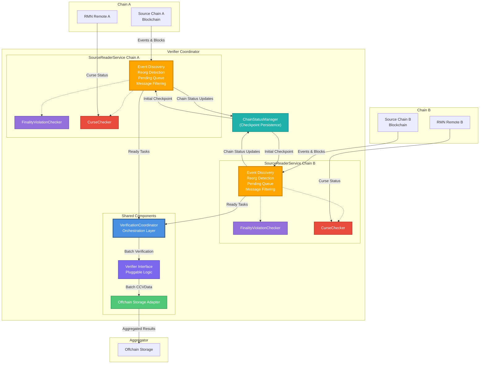
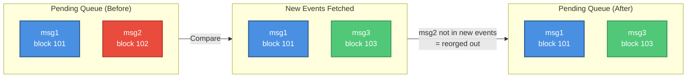

# Verifier Design

This document describes the Verifier component in CCIP 1.7. The Verifier is responsible for reading cross-chain messages from source blockchains, performing verification logic, and publishing verification results to offchain storage for downstream consumption by executors.

# Overview

The Verifier architecture separates **orchestration** from **verification logic**:

* **VerificationCoordinator**: Chain-agnostic orchestration layer that coordinates verification and storage writes across multiple source chains
* **SourceReaderService**: Per-chain component that handles event discovery, reorg detection, finality checking, curse filtering, and message readiness
* **Verifier Interface**: Pluggable verification logic that implements verifier-specific validation and signing

This separation enables:

* **Chain Independence**: Each source chain has its own isolated `SourceReaderService` instance that encapsulates all chain-specific logic
* **Verification Flexibility**: Different verification strategies (committee-based, attestations,...etc) can plug into the same coordinator
* **Resource Sharing**: Multiple source chains share the same coordinator instance with isolated per-chain state (**note**: future design allows multiple verifiers to share one coordinator, but current implementation is one coordinator per verifier)

Each verifier is a security-critical component in the CCIP system. Multiple independent verifiers can operate on the same messages.

# Architecture

The Verifier consists of the following components:




## Component Responsibilities

* **VerificationCoordinator**: Orchestrates verification across all source chains, coordinates storage writes, manages verifier instances
* **SourceReaderService**: Per-chain service that handles event discovery, reorg detection, finality checking, pending queue management, curse filtering, and emits ready-to-verify messages
* **FinalityViolationChecker**: Per-chain component that validates finalized block headers never change, detecting violations of blockchain finality guarantees
* **CurseChecker**: Per-chain component that polls RMN Remote contract for curse status
* **Verifier Interface**: Implements verification logic (validation, signing, CCV data creation) \- pluggable
* **ChainStatusManager**: Persists chain state (enabled/disabled, lastProcessedFinalizedBlock) for checkpoint recovery locally on each verifier node.

# Data Flow

This section describes the complete lifecycle of a message through the verification system, from initial detection on the source chain to publication in offchain storage.

```mermaid
sequenceDiagram
    autonumber
    participant SC as Source Chain
    participant SRS as SourceReaderService
    participant FVC as FinalityViolationChecker
    participant CC as CurseChecker
    participant VC as VerificationCoordinator
    participant V as Verifier
    participant SB as Storage Batcher
    participant OS as Offchain Storage
    rect rgb(40, 60, 80)
    Note over SC,SRS: Event Discovery & Pending Queue
    SC->>SRS: Poll: FetchMessageSentEvents(fromBlock, toBlock)
    SRS->>SRS: Convert events to VerificationTask<br/>Add to pending queue<br/>Handle reorgs (remove invalid tasks)
    end
    rect rgb(60, 40, 80)
    Note over SRS,CC: Message Readiness Checking
    loop Every pollInterval
        SRS->>SC: LatestAndFinalizedBlock()
        SC-->>SRS: (latest, finalized) BlockHeader
        SRS->>FVC: UpdateFinalized(finalized)
        alt Finality Violation Detected
            FVC-->>SRS: Error (hash mismatch)
            SRS->>SRS: Disable chain<br/>Flush all tasks
        end
        loop Each pending task
            SRS->>SRS: Check finality criteria<br/>(capped at finalization)
            SRS->>CC: IsRemoteChainCursed(destChain)?
            alt Ready and not cursed
                CC-->>SRS: false
                SRS->>VC: Emit ready task via readyTasksCh
            end
        end
    end
    end
    rect rgb(40, 80, 60)
    Note over VC,V: Verification
    VC->>V: VerifyMessages(readyTasks, ccvDataBatcher)
    loop Each task (concurrent)
        V->>V: ValidateMessage + Sign
        V->>SB: Add CCVData to batcher
    end
    V-->>VC: BatchResult[VerificationError]
    end
    rect rgb(80, 60, 40)
    Note over SB,OS: Storage Write
    SB->>SB: Batch accumulates<br/>(max 50 items or 100ms timeout)
    SB->>OS: Write batch to aggregator
    OS-->>SB: Success
    end
```




## Lifecycle Stages

* **Event Discovery & Pending Queue Management**
    * SourceReaderService polls the source chain at configured intervals
    * Fetches CCIPMessageSent events from lastProcessedFinalizedBlock to latest
    * Converts each event to a VerificationTask
    * **Inline reorg detection**: Compares new events against pending queue, removes tasks that were reorged out
    * Adds new tasks to per-chain pending queue
    * Updates lastProcessedFinalizedBlock checkpoint to finalized.Number
* **Message Readiness Checking**
    * SourceReaderService runs a continuous loop checking pending tasks
    * Queries current blockchain head state via LatestAndFinalizedBlock()
    * **Finality validation**: Updates FinalityViolationChecker with latest finalized block
        * If finalized block hash changes: Disables chain, flushes all tasks
    * For each pending task, applies readiness criteria:
        * **Default finality**: task.block \<= finalized
        * **Custom finality (FTF)**: task.block \+ finality \<= latest OR task.block \<= finalized (capped to prevent DoS)
        * **Curse check**: Queries CurseChecker.IsRemoteChainCursed(destChain)
    * Only ready tasks (passed finality \+ curse checks) are emitted via readyTasksCh
* **Verification**
    * Coordinator receives ready tasks from SourceReaderService.readyTasksCh
    * Passes ready batch to Verifier.VerifyMessages()
    * Verifier processes tasks concurrently:
        * Validates message format and receipts
        * Signs message
        * Creates CCVData structure with signature and metadata
    * Adds successful CCVData to storage batcher
    * Returns errors for failed verifications
* **Storage Write**
    * Storage batcher accumulates CCVData items
    * Flushes when batch reaches size limit (default: 50\) or timeout (default: 100ms)
    * Writes batch to offchain storage (Aggregator) via gRPC
*

# Core Components

## VerificationCoordinator

The coordinator is the orchestration layer that coordinates verification and storage writes across multiple source chains.

### **Responsibilities**

* Manages per-chain sourceState instances (each containing a SourceReaderService)
* Receives ready-to-verify tasks from each SourceReaderService
* Coordinates verification batching via Verifier interface
* Manages storage writes via batching
* Handles verification errors
* Tracks E2E latency and queue health metrics

### Error Handling

TODO

## SourceReaderService

The source reader service is a **self-contained per-chain component** that handles all chain-specific logic for message discovery, validation, and readiness checking.

### Responsibilities

* **Event Discovery**: Poll source chain for CCIPMessageSent events at configured intervals
* **Event Conversion**: Convert events to VerificationTask structures with computed MessageID validation
* **Message Filtering**: Apply ReceiptIssuerFilter to include only messages with receipts from configured issuers
* **Pending Queue Management**: Maintain per-chain queue of unverified tasks
* **Inline Reorg Detection**: Detect reorgs by comparing new events against pending queue, removing invalidated tasks
* **Finality Validation**: Integrate with FinalityViolationChecker to ensure finalized blocks never change
* **Curse Filtering**: Check curse status via per-chain CurseChecker before emitting tasks
* **Message Readiness**: Apply finality criteria and emit only ready tasks
* **Checkpoint Persistence**: Maintain lastProcessedFinalizedBlock and persist chain status via ChainStatusManager

### Core Loops

* **Event Monitoring Loop**
    * Polls source chain at pollInterval
    * Fetches CCIPMessageSent events from lastProcessedFinalizedBlock to latest
    * Validates MessageID computation
    * Applies message filter
    * Adds tasks to pending queue with inline reorg handling
    * Updates lastProcessedFinalizedBlock checkpoint
* **Message Readiness Loop**
    * Updates FinalityViolationChecker with latest finalized block
    * Checks for finality violations
    * For each pending task:
        * Applies finality criteria (with DoS protection cap)
        * Checks curse status via CurseChecker
        * Emits ready tasks via readyTasksCh

### Message Readiness Logic

Messages become ready based on their finality setting:

* **Default Finality (finality \= 0\)**
    * Ready when: messageBlock \<= finalizedBlock
* **Custom Finality (Faster-than-Finality)**
    * Ready when: (messageBlock \+ finality \<= latestBlock) OR (messageBlock \<= finalizedBlock)
    * The OR condition **caps custom finality at finalization** \- this prevents DoS attacks where malicious actors set unreasonably high finality values. Even if someone sets finality to 10,000 blocks, the message becomes ready once it reaches normal finalization.

### Initialization

On startup, SourceReaderService:

1. Reads chain status from ChainStatusManager to get lastProcessedFinalizedBlock
2. If no checkpoint exists: Uses fallbackBlockEstimate (finalized \- 500 blocks lookback)
3. Starts event monitoring and readiness loops

## FinalityViolationChecker

The finality violation checker is a per-chain safety component that validates finalized blocks never change.Responsibilities

* Store finalized block headers with their hashes
* Detect hash mismatches at same block height (finality violation)
* Detect backward movement of finalized block number (finality rewind)
* Return errors when violations are detected
* Limit stored blocks to prevent unbounded memory growth

### Violation Conditions

A finality violation is detected when:

1. Hash mismatch at same height: A previously seen finalized block now has a different hash

When violations occur:

* `SourceReaderService` disables the chain
* All pending and sent tasks are flushed
* Chain is marked as disabled in ChainStatusManager
* Critical alert is logged for manual intervention

## CurseChecker

The curse checker is a per-chain component that monitors the RMN Remote contract for curse status.Responsibilities

* Poll RMN Remote contract at configured intervals
* Maintain in-memory curse state

### Curse Types

* Lane-Specific Curse: Only affects source→dest pair (e.g., Chain A→B blocked, A→C allowed)
* Global Curse: Affects all lanes involving the chain (constant: 0x0100000000000000000000000000000001)

### Curse Behavior

When a lane is cursed:

* Tasks are dropped during readiness checking

### Recovery

1. Shutdown verifier
2. Reset checkpoint on aggregator on that chain to before curse period
3. Start verifier

* When the verifier starts, it will start reading from the reset checkpoint and reprocess messages that were dropped.
* Even without resetting, once curse is lifted, any new messages will be processed with no issues.

## ChainStatusManager

The chain status manager handles persistent state for source chains.Responsibilities

* Read chain status (enabled/disabled, lastProcessedFinalizedBlock) on startup
* Persist chain status updates
* Track enabled/disabled state per chain
* Track lastProcessedFinalizedBlock checkpoint per chain

Used by

* **SourceReaderService**: Reads initial checkpoint on startup, persists updates after each event processing cycle, marks chain as disabled on finality violation
* **Coordinator**: Reads status for all chains on startup, skips disabled chains when initializing source readers
*

## Verifier Interface

The `Verifier` interface provides pluggable verification logic that is independent of the coordinator's orchestration.

```go
type Verifier interface {
    // VerifyMessages performs verification of a batch of messages, adding successful results to the batcher.
    // Returns a BatchResult containing any verification errors that occurred.
    VerifyMessages(
        ctx context.Context,
        tasks []VerificationTask,
        ccvDataBatcher *batcher.Batcher[CCVDataWithIdempotencyKey],
    ) batcher.BatchResult[VerificationError]
}

```

### Responsibilities

* Business logic specific to verification type (committee signatures, attestation, etc.)
* Verifier picks up messages when receipts have either the commit verifier address or the default executor address
* Signs messageID and version as part of verification process
* VerifierNodeResult structure creation
* Direct batcher integration for successful verifications

The verifier operates independently of blockchain concerns (finality, reorgs, curses) \- the coordinator handles those.

### Committee Verifier Implementation:

The committee verifier is a concrete implementation of the \`Verifier\` interface that performs committee-based verification. It validates messages, signs them with a committee member's key, and creates VerifierNodeResult for offchain storage.

#### Struct Definition

```go
// chainlink-ccv/verifier/commit/verifier.go
type Verifier struct {
	signerAddress protocol.UnknownAddress
	signer        verifier.MessageSigner
	lggr          logger.Logger
	monitoring    verifier.Monitoring
	config        verifier.CoordinatorConfig
}

```

#### Verification Logic

The core logic resides in the \`verifyMessage\` function, which executes the following steps for each message:

1. **Configuration Check**: Ensures the message's source chain is configured in the verifier.
2. **Message Validation**: Performs basic format validation on the message. It also validates the message against the configured verifier and default executor addresses from the source chain config.
3. **Receipt Extraction**: Finds the verifier-specific receipt blob from the `VerificationTask`'s `ReceiptBlobs`. This blob is issued by the onchain verifier contract.
4. **Hash and Sign**: Creates a signable hash from the `messageID` and the extracted `verifierBlob`, then signs it using the configured signer.
5. **VerifierNodeResult Creation**: Constructs the `VerifierNodeResult` payload, including the message, signature, and other metadata.
6. **Batching**: Adds the created `VerifierNodeResult` to the `ccvDataBatcher` for it to be written to the aggregator.

The following code is for **illustration purposes**. It’s trimmed from logs, error checking and some non core parts as well as embedding implementations directly for some functions.

```go
func (cv *Verifier) verifyMessage(ctx context.Context, verificationTask verifier.VerificationTask, ccvDataBatcher *batcher.Batcher[protocol.CCVData]) error {
	messageID := verificationTask.Message.MessageID()
	
	// Validate that the message comes from a configured source chain
	// ommitted
	// Validate message format and check verifier receipts
	// ommitted
	
	// Pikcing up the verifierBlob for that verifier by cross checking the config verifier address against all the blobs
	var verifierBlob []byte
	for _, receipt := range verificationTask.ReceiptBlobs {
		if bytes.Equal(receipt.Issuer.Bytes(), sourceConfig.VerifierAddress.Bytes()) {
			verifierBlob = receipt.Blob
			break
		}
	}

	// hash, _ := committee.NewSignableHash(messageID, verifierBlob)
       // Implementing simply inline here 
	var preImage []byte
	preImage = append(preImage, verifierBlob[:VerifierVersionLength]...)
	preImage = append(preImage, messageID[:]...)
	hash = protocol.Keccak256(preImage)

	encodedSignature, _ := cv.signer.Sign(hash[:])
	
	// Create CCV data with all required fields
	ccvData = protocol.CCVData{
			MessageID:     messageID,
			CCVData:  encodedSignature, // Attestation from batch response
			// ... other fields
		}

	ccvDataBatcher.Add(*ccvData);

	return nil
}
```

# Safety Components

## Reorg Handling

Reorgs are handled **inline within** SourceReaderService during event processing.

### Inline Reorg Detection

When new events are fetched, the service compares them against existing pending tasks:



**How it works:**
1. Build set of message IDs from newly fetched events
2. For each task in pending queue at or after fromBlock
    * If not in new events → remove (reorged out)
    * Add new tasks (deduplication handled by map key)

**Why this works**

* lastProcessedFinalizedBlock is set to finalized.Number, ensuring we re-query blocks that could have been reorged (whether added or removed)
* If a task exists in the pending queue but is NOT in the new event batch, it was reorged out
* Next polling cycle fetches the canonical chain's events

## Finality Violation Handling

FinalityViolationChecker is a synchronous, pull-based service that validates finalized blocks never change. It is called by SourceReaderService on each readiness loop iteration.


**Storage**: In memory rolling window of finalized block headers (max 1000 blocks), keyed by block number.

**Algorithm**

**On each** UpdateFinalized(newFinalizedBlock) **call:**

1. **Forward progress** (newFinalizedBlock \>= lastFinalized):
    * Fetch headers from lastFinalized to newFinalizedBlock
    * For each block: if already stored, verify hash matches; otherwise store it
    * Hash mismatch → **violation**
2. **Backward movement** (newFinalizedBlock \< lastFinalized):
    * Fetch header for newFinalizedBlock
    * Check if stored hash matches
    * Hash mismatch → **violation** (actual finality rewind)
    * Hash matches → RPC lagging, ignore

```mermaid
sequenceDiagram
    autonumber
    participant SRS as SourceReaderService
    participant FVC as FinalityViolationChecker
    participant CSM as ChainStatusManager

    rect rgb(40, 60, 80)
        Note over SRS,FVC: Normal Operation
        SRS->>FVC: UpdateFinalized(block 105, hash=0xabc)
        FVC->>FVC: Store header
        FVC-->>SRS: OK
    end

    rect rgb(80, 40, 40)
        Note over SRS,FVC: Violation Detected
        SRS->>FVC: UpdateFinalized(block 105, hash=0xdef)
        FVC->>FVC: Hash mismatch!<br/>stored=0xabc, new=0xdef
        FVC-->>SRS: Error: finality violation
    end

    rect rgb(60, 40, 60)
        Note over SRS,CSM: Chain Shutdown
        SRS->>SRS: disabled = true
        SRS->>SRS: Flush pendingTasks
        SRS->>SRS: Flush sentTasks
        SRS->>CSM: WriteChainStatus(disabled=true)
        SRS->>SRS: Log CRITICAL alert
    end
```



#### Manual Recovery Steps

1. Investigate root cause of finality violation
2. Determine safe restart block
3. Reset checkpoint in persistent storage (verifier admin)
4. Enable chain in the persistent storage
5. Restart verifier service

# Configuration

The verifier uses TOML configuration with per-chain source configs and global coordinator settings.

## Verifier TOML

The [toml](https://github.com/smartcontractkit/chainlink-ccv/blob/54ec0ad0fdbca1ee07c7df42c71012e6317c2e89/cmd/verifier/testconfig/default/verifier-1.toml) file is an example for the verifier configuration. This feeds into the Verfier [Config](https://github.com/smartcontractkit/chainlink-ccv/blob/54ec0ad0fdbca1ee07c7df42c71012e6317c2e89/verifier/config.go#L9-L30) from which we extract the data and create different configs per chain as shown below.

## SourceConfig

```go
type SourceConfig struct {
    VerifierAddress        protocol.UnknownAddress // Onchain verifier contract address
    DefaultExecutorAddress protocol.UnknownAddress // Onchain default executor contract
    ChainSelector          protocol.ChainSelector  // Numeric chain identifier
    PollInterval           time.Duration           // How often to poll for events
    RMNRemoteAddress       protocol.UnknownAddress // RMN Remote contract for curse detection
}
```

**Field Descriptions**:

* `VerifierAddress`: The onchain verifier contract that issues receipts for this verifier \- In our case we’re using a **proxy** in front of a [VersionedVerifierResolver](https://github.com/smartcontractkit/chainlink-ccip/blob/00e44d9be8bbab51b45468ce2dda037c27483334/chains/evm/contracts/ccvs/VersionedVerifierResolver.sol#L14-L14). That allows us to have a static address allowing us for upgradability without address changes.
* `DefaultExecutorAddress`: CLL Executor contract address

## CoordinatorConfig

```go
type CoordinatorConfig struct {
    SourceConfigs       map[protocol.ChainSelector]SourceConfig
    VerifierID          string        // Unique identifier for this verifier instance
    StorageBatchSize    int           // Max CCVData items per storage write (default: 50)
    StorageBatchTimeout time.Duration // Max wait before flushing batch (default: 100ms)
    CursePollInterval   time.Duration // RMN Remote polling frequency
}
```

# Integration Guide

## Adding a New Chain Family

Adding a new source chain to the verifier requires implementing the `SourceReader` interface and configuring the verifier.

### SourceReader Interface

The `SourceReader` interface abstracts blockchain-specific details and provides chain-agnostic access to blockchain data. For a concrete example, check [`EVMSourceReader`](https://github.com/smartcontractkit/chainlink-ccv/blob/54ec0ad0fdbca1ee07c7df42c71012e6317c2e89/integration/pkg/sourcereader/evm_source_reader.go#L28-L28) implementation.

```go
type SourceReader interface {
    // FetchMessageSentEvents returns MessageSentEvents in the given block range.
    FetchMessageSentEvents(ctx context.Context, fromBlock, toBlock *big.Int) ([]protocol.MessageSentEvent, error)
      
      
    // GetBlocksHeaders returns the full block headers for a batch of block numbers.
    GetBlocksHeaders(ctx context.Context, blockNumber []*big.Int) (map[*big.Int]protocol.BlockHeader, error)
      
      
    // HeadTracker: Embed HeadTracker for blockchain head tracking functionality.
    HeadTracker
      
    // RMNCurseReader: Embed RMNCurseReader for curse detection functionality.
    RMNCurseReader
}
```

### HeadTracker: The Finality Abstraction

**Critical**: The `HeadTracker` interface abstracts different blockchain finality models, enabling the coordinator to work with any chain without understanding chain-specific finality mechanisms.

```go
type HeadTracker interface {
    // LatestAndFinalizedBlock returns the latest and finalized block headers in a single call.
    // This is more efficient than separate RPC calls and provides complete block information
    // including hashes, parent hashes, and timestamps needed for reorg detection.
    LatestAndFinalizedBlock(ctx context.Context) (latest, finalized *protocol.BlockHeader, err error)
}
```

**Why HeadTracker Matters**:

Different blockchains expose finality differently:

* **Tag-based finality**
* **Depth-based finality**
* **Instant finality**

The `HeadTracker` implementation **hides these differences** from the coordinator:

The coordinator doesn't need to know about tags, confirmations, or consensus mechanisms, it just calls `LatestAndFinalizedBlock()` and gets consistent results.

### RMNCurseReader

```go
// RMNCurseReader provides read-only access to RMN Remote curse state.
// Both SourceReader and DestinationReader implement this interface.
type RMNCurseReader interface {
	// GetRMNCursedSubjects queries the configured RMN Remote contract.
	// Returns cursed subjects as bytes16, which can be:
	// * Global curse constant (0x0100000000000000000000000000000001)
	// * Chain selectors as bytes16s
	GetRMNCursedSubjects(ctx context.Context) ([]protocol.Bytes16, error)
}
```

## Custom Verifier Examples

**USDC Verifier** (attestation-based):

Note: This code is for illustration purposes only

```go
type USDCVerifier struct {
	usdcEndpoint string
	config       CoordinatorConfig
}

func (uv *USDCVerifier) VerifyMessages(
	ctx context.Context,
	tasks []VerificationTask,
	ccvDataBatcher *batcher.Batcher[CCVDataWithIdempotencyKey],
) batcher.BatchResult[VerificationError] {
	// Batch fetch attestations for all messages at once
	attestations, err := uv.fetchUSDCAttestations(ctx, tasks)
	if err != nil {
		return batcher.BatchResult[VerificationError]{Items: []VerificationError{{Error: err}}}
	}

	// Create CCVData for each task with its attestation
	for i, task := range tasks {
		ccvData := protocol.CCVData{
			MessageID:     task.Message.MessageID(),
			CCVData:  attestations[i], // Attestation from batch response
			// ... other fields
		}

		ccvDataBatcher.Add(CCVDataWithIdempotencyKey{
			CCVData:        ccvData,
			IdempotencyKey: task.IdempotencyKey,
		})
	}

	return batcher.BatchResult[VerificationError]{Items: nil}
}
```

Then you inject that verifier into the coordinator.

# Failure handling

Note: This is not implemented yet. It’s part of M3

## circuit breaking

We need to stop once we detect that the aggregator is down. This can be a gradual stop where we continue processing and keeping in memory for some time before deciding to stop completely.

## Retries

# Availability

[https://docs.google.com/document/d/1FEjgmP3blQmWu1S2zl\_frEF5KDzsu7-bfNYKcmizNJc/edit?disco=AAABtcDi-04](https://docs.google.com/document/d/1FEjgmP3blQmWu1S2zl_frEF5KDzsu7-bfNYKcmizNJc/edit?disco=AAABtcDi-04)

# Risks

* Using multiNode clients for getting logs instead of log\_poller. They’re not as battle tested. (It is very easy though to create a ChainAccessLayer implementation using log\_poller)