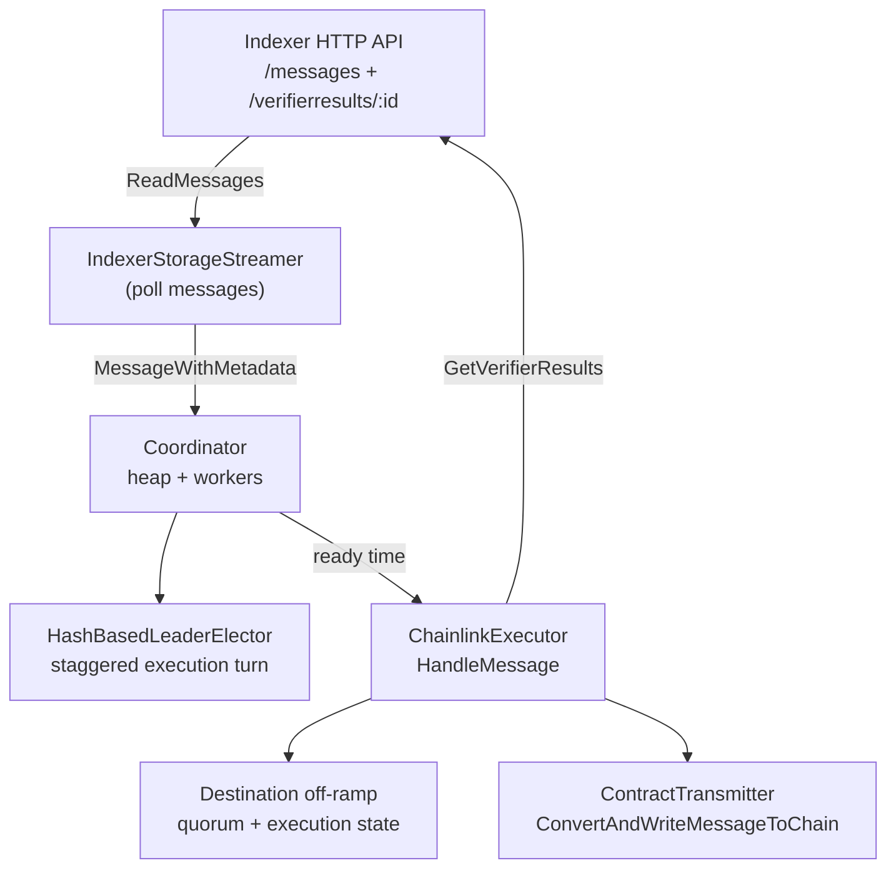

# Executor Debugging Guide

This guide helps you trace a single CCIP message through the executor using structured logs. The executor is the **final stage**: it learns about messages from the **indexer**, fetches all required verifier results from the indexer HTTP API, validates quorum against the **destination off-ramp**, and transmits an aggregated report on-chain.

Upstream context:

- [Indexer debugging guide](../../indexer/docs/debugging.md) — Populates messages and verifier results the executor reads
- [Aggregator debugging guide](../../aggregator/docs/debugging.md) — Committee quorum path into indexer
- [Verifier debugging guide](../../verifier/docs/debugging.md) — Token / committee verification before indexer

## Pipeline overview



**Stages:**

1. **Message stream** — `IndexerStorageStreamer` polls indexer `GET /v1/messages` for newly ingested messages (by destination chain filter).
2. **Coordinator intake** — Validates message, computes executor-pool ready time, pushes to **delayed heap**.
3. **Processing loop** — Every second, pops messages whose `ReadyTime` has passed and dispatches to worker pool.
4. **ChainlinkExecutor** — Curse check, on-chain execution state, **indexer** verifier results + off-ramp CCV quorum, honest-attempt check, transmit.
5. **Retry** — Transient failures re-push to heap with `RetryInterval`; expiry drops message after `max_retry_duration`.

Execution success from the executor’s perspective is **`transmitting aggregated report to chain`** with no subsequent retry log for that attempt.

---

## Data sources

| Source | Interface | API / call | Purpose |
|--------|-----------|------------|---------|
| **Indexer** | `MessageReader` | `GET /v1/messages` | Discover messages ready to execute |
| **Indexer** | `VerifierResultReader` | `GET /verifierresults/:messageID` | All CCV attestations for one message |
| **Destination chain** | `DestinationReader` | `GetMessageSuccess`, `HasHonestAttempt`, `GetCCVSForMessage`, `IsReady` | On-chain execution state and receiver quorum |
| **RMN** | `CurseChecker` | `IsRemoteChainCursed` | Delay if lane cursed |

The **`IndexerReaderAdapter`** wraps one or more indexer base URLs with health-check failover (logs when switching).

---

## Filtering logs for one message

### Logger scope

| Component | Logger naming / fields |
|-----------|-------------------------|
| Service bootstrap | `executor` (named in `cmd/executor/service.go`) |
| Coordinator | Root `executor` logger passed to `NewCoordinator` |
| ChainlinkExecutor | Root logger (often same tree) |
| Indexer adapter | `Created indexer adapter with multiple clients` at startup |
| Indexer streamer | `IndexerStorageStreamer` logs |
| Leader elector | `messageID` on **Debug** `calculated ready timestamp` |
| Task-style | N/A — executor uses coordinator logs with `messageID` field |

### Grep examples

```bash
# Stream discovery
grep 'Found net new message from Indexer' | grep 'messageID=0xYOUR_MESSAGE_ID'

# Coordinator lifecycle
grep 'messageID=0xYOUR_MESSAGE_ID' | grep -E 'pushing message|processing message|transmitting'

# Indexer fetch (may not include messageID in adapter debug lines — use coordinator lines)
grep 'got ccv info and verifier results' | grep '0xYOUR_MESSAGE_ID'

# Successful on-chain submit
grep 'transmitting aggregated report to chain' | grep '0xYOUR_MESSAGE_ID'
```

---

## Happy-path checklist

| Step | What to look for | Component |
|------|------------------|-----------|
| 1. Seen in stream | `Found net new message from Indexer` | `IndexerStorageStreamer` |
| 2. Scheduled | `pushing message to delayed heap` | `Coordinator` |
| 3. Due | `found messages ready for processing` (Debug, may list payload) | `Coordinator` |
| 4. Executing | `processing message with ID` | `Coordinator` |
| 5. CCV data | `got ccv info and verifier results` | `ChainlinkExecutor` |
| 6. Transmit | `transmitting aggregated report to chain` | `ChainlinkExecutor` |
| 7. Done | No `message should be retried` / `will retry execution` for same ID | `Coordinator` |

Confirm indexer has rows: see [Indexer debugging guide](../../indexer/docs/debugging.md) database section.

---

## Stage 1: Indexer message stream

**Source:** `integration/pkg/ccvstreamer/indexer_storage_streamer.go`

Polls indexer for messages with `IngestionTimestamp` after `lastQueryTime`, dedupes via `ExpirableMessageSet`.

| Level | Message | `messageID` | Notes |
|-------|---------|-------------|-------|
| Debug | `IndexerStorageStreamer query results` | no | `start`, `count`, `error` |
| Error | `dropping message with invalid ID` | no | Bad payload |
| **Info** | **`Found net new message from Indexer`** | **yes** | Emitted to coordinator stream |
| Error | `IndexerStorageStreamer read error` | no | Backoff retry |
| Info | `IndexerStorageStreamer hit query limit, there may be more results` | no | Pagination |

Coordinator stream errors:

| Level | Message |
|-------|---------|
| Error | `failed to start ccv result streamer, shutting down coordinator` |
| Error | `error in coordinator component` |
| Warn | `streamerResults closed` |

---

## Stage 2: Coordinator (heap, elector, workers)

**Source:** `executor/executor_coordinator.go`, `executor/pkg/message_heap/message_heap.go`, `executor/pkg/leaderelector/hash_based_elector.go`

### Intake from stream

| Level | Message | `messageID` | Meaning |
|-------|---------|-------------|---------|
| Error | `invalid message, skipping` | no | `CheckValidMessage` failed |
| Info | `message already in delayed heap, skipping` | yes | Dedup |
| Info | `message already in flight, skipping` | yes | Worker processing |
| Info | `skipping message, executor not in pool for destination chain` | yes | This node not in `executor_pool` for dest chain |
| Error | `leader elector failed for message, skipping` | yes | Config / elector error |
| **Info** | **`pushing message to delayed heap`** | **yes** | `ingestionTimestamp`, `readyTimestamp` |
| Info | `duplicate message rejected by heap` | yes | Second push same ID |

### Leader elector (timing)

**Debug** only (per message):

| Message | Fields |
|---------|--------|
| `calculated ready timestamp` | `messageID`, `queueSize`, `executionInterval`, `delay`, `readyTime` |

Ready time = ingestion time + (position in per-message executor rotation × `execution_interval` for that dest chain). Multi-executor deployments stagger who transmits first.

### Processing loop and workers

| Level | Message | `messageID` |
|-------|---------|-------------|
| Debug | `found messages ready for processing` | in `readyMessages` dump |
| Info | `processing message with ID` | yes |
| Info | `message has expired` | yes | Past `max_retry_duration` window |
| Info | `message should be retried, putting back in heap` | yes |
| Warn | `retry push rejected, message already in heap` | yes |
| Error | `failed to handle message` | yes | `error`, `shouldRetry` |

### Heap integrity (rare)

| Level | Message |
|-------|---------|
| Error | `heap corrupted: popped entry is not MessageHeapEntry` |
| Error | `orphaned heap entry: messageID present in heap but missing from dataMap` |

---

## Stage 3: Indexer verifier results (HTTP)

**Source:** `executor/pkg/adapter/adapter.go`  
**Endpoint:** `GET /verifierresults/{messageID}` (indexer v1 API)

Called from `ChainlinkExecutor.getVerifierResultsAndQuorum` for each execution attempt.

| Level | Message | `messageID` in fields |
|-------|---------|----------------------|
| Infow | `Created indexer adapter with multiple clients` | no (startup) |
| Debug | `Active indexer returned result` | no (`activeIdx`, `status`) |
| Warn | `Active indexer returned non-success status, checking health and querying alternates` | no |
| Infow | `Active indexer health check passed, retrying query` | no |
| Warn | `Retry on active indexer also failed after health check passed` | no |
| Warn | `Active indexer unavailable, selecting alternate` | no |
| Infow | `Selected healthy alternate indexer` | no |
| Infow | `Switching active indexer` | no |
| Error | `No healthy alternates found, returning active client result` | no |

**Semantics:**

- HTTP **404** from indexer → empty verifier list → `delaying execution due to no verifier results` (retry until indexer has data).
- HTTP **200** with results → filtered by `default_executor_address` for source chain (warnings if mismatch).

Per-result warnings in executor (no `messageID` on line; correlate via surrounding `processing message`):

| Level | Message |
|-------|---------|
| Warn | `Verifier Result did not specify our executor` |
| Warn | `Verifier Result fields are inconsistent` |

---

## Stage 4: ChainlinkExecutor execution

**Source:** `executor/pkg/executor/cl_executor.go`

### Preconditions (`CheckValidMessage`)

Failures log as `invalid message, skipping` on coordinator (no dest reader / transmitter / reader unhealthy).

| Level | Message | `messageID` |
|-------|---------|-------------|
| Warn | `delaying execution - curse state unknown` | yes |
| Info | `delaying execution due to curse` | yes |
| Warn | `delaying execution due to failed check GetMessageExecutionState` | yes | RPC / read errors |
| Info | `skipping execution due to already being successfully executed` | yes | On-chain SUCCESS |
| Warn | `delaying execution due to failed request for verifier results and quorum` | yes | Indexer or `GetCCVSForMessage` failed |

### Quorum and ordering

| Level | Message | `messageID` | Notes |
|-------|---------|-------------|-------|
| **Info** | **`got ccv info and verifier results`** | **yes** | `verifierResultsLen`, quorum fields, verifier address lists |
| Info | `skipping execution and not retrying due to impossible receiver verifier quorum` | yes | Permanent — required CCVs > message CCV addresses |
| Warn | `message did not meet verifier quorum, will retry` | yes | Missing required/optional CCV data from indexer |
| Info | `execution attempt poller not ready, will retry` | yes | Destination reader not ready |
| Error | `unable to call execution checker, will retry message` | yes | `HasHonestAttempt` error |
| Info | `skipping execution due to existing honest attempt` | yes | Another executor already tried same data |

### On-chain transmit

| Level | Message | `messageID` |
|-------|---------|-------------|
| **Info** | **`transmitting aggregated report to chain`** | **yes** | `destinationChain`, `latestCCVTimestamp`, `aggregatedReport` |
| Warn | `skipping retry due to message encoding error` | yes | Non-retryable (`ErrMessageEncoding`) |
| Warn | `will retry execution due to failed ConvertAndWriteMessageToChain` | yes | Transient tx / RPC failure |

Service lifecycle:

| Level | Message |
|-------|---------|
| Infow | `new chainlink executor` |
| Info | `Starting Chainlink Executor` / `Stopping Chainlink Executor` |

---

## Retry vs terminal outcomes

| Outcome | `shouldRetry` | Typical logs |
|---------|---------------|--------------|
| Transient (curse, RPC, indexer 404, quorum not met, tx fail) | `true` | `message should be retried, putting back in heap` |
| Already executed / honest attempt / impossible quorum / encoding error | `false` | `skipping execution…` |
| Expired | n/a (never calls executor) | `message has expired` |

---

## Suggested debug workflows

### Message never reaches executor

1. Indexer: message exists and status not stuck? See [Indexer debugging guide](../../indexer/docs/debugging.md).
2. Stream: `Found net new message from Indexer`?
3. Dest chain filter: `enabled_dest_chains` in streamer config vs message `dest_chain_selector`.
4. Executor pool: `skipping message, executor not in pool for destination chain` — this node’s `executor_id` not in pool for that chain.

### Stuck in heap (long delay before `processing message`)

1. `pushing message to delayed heap` — note `readyTimestamp`.
2. Debug: `calculated ready timestamp` — `queueSize` and `execution_interval` explain stagger.
3. Compare `readyTimestamp` to current time — multi-executor rotation is intentional.

### Processing but never transmits

1. `got ccv info and verifier results` — is `verifierResultsLen` > 0?
2. If 0: indexer 404 or all results filtered (`Verifier Result did not specify our executor`).
3. `message did not meet verifier quorum` — indexer missing USDC/Lombard/committee attestations; trace [Indexer](../../indexer/docs/debugging.md) then [Verifier](../../verifier/docs/debugging.md).
4. `delaying execution due to no verifier results` — indexer empty for ID.
5. `skipping execution due to existing honest attempt` — another node already executed.
6. `skipping execution due to already being successfully executed` — on-chain done.

### Transmit fails repeatedly

1. `will retry execution due to failed ConvertAndWriteMessageToChain` — RPC, gas, nonce, contract revert (check chain logs).
2. `skipping retry due to message encoding error` — permanent payload issue.

### Indexer connectivity

1. `IndexerStorageStreamer read error` — stream backoff.
2. `Active indexer returned non-success status` / `No healthy alternates found` — all indexer replicas unhealthy.
3. `Switching active indexer` — failover (check which URI is active).

---

## End-to-end trace (full CCIP path)

```text
Verifier: Added message to pending → Successfully published → Write succeeded for message
    ↓
Aggregator: Triggered aggregation check → Report submitted successfully
    ↓
Indexer: Found Message → Enqueueing new Message → Collected N new verifications
    ↓
Executor stream: Found net new message from Indexer
    ↓
Executor: pushing message to delayed heap → processing message with ID
    ↓
Executor: got ccv info and verifier results → transmitting aggregated report to chain
```

Token-only lanes still use aggregator discovery for the message shell; token attestations appear in `got ccv info` via indexer REST fetches.

---

## Configuration knobs (logging context)

| Config | Effect on logs |
|--------|----------------|
| `this_executor_id` / `executor_pool` | `not in pool`, elector `queueSize` |
| `execution_interval` | `calculated ready timestamp` delay |
| `max_retry_duration` | `message has expired` |
| `indexer_addresses` | Indexer adapter failover |
| `worker_count` | Parallel `processing message` lines |
| `enabled_dest_chains` | Which messages appear in stream |

---

## Quick reference: logs with explicit `messageID`

| Package | Logs |
|---------|------|
| `ccvstreamer` | `Found net new message from Indexer` |
| `executor_coordinator` | Heap push, in-flight skip, processing, retry, expire, handle errors |
| `leaderelector` | `calculated ready timestamp` (Debug) |
| `cl_executor` | Curse, execution state, CCV info, transmit, skip paths |
| `message_heap` | Orphaned entry errors |

---

## Related documentation

- [End-to-end message debugging](../../docs/end-to-end-debugging.md) — Full pipeline happy path and fallbacks
- [Debugging guides (all pipeline stages)](../../README.md#debugging-guides) — Per-service deep dives
- [Executor README](../README.md)
