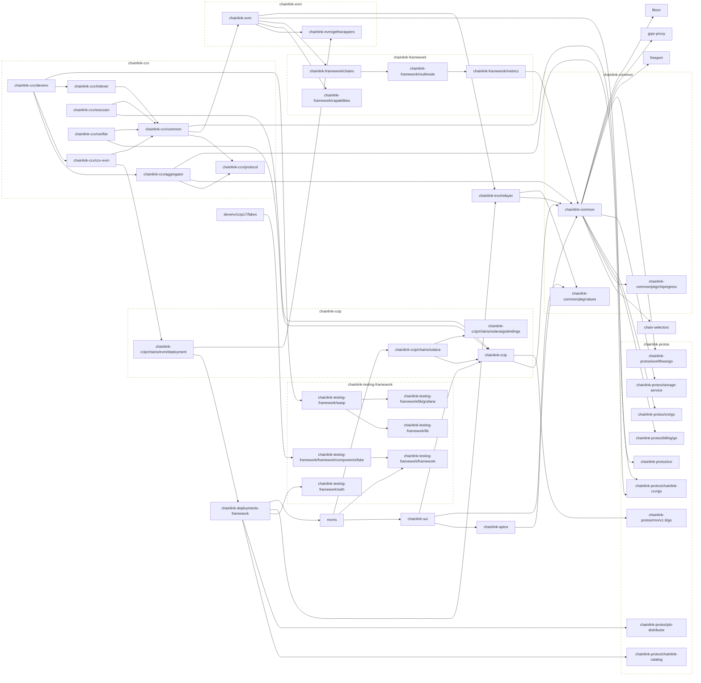

## Modules and org dependencies

```mermaid
flowchart LR

	chain-selectors
	click chain-selectors href "https://github.com/smartcontractkit/chain-selectors"
	chainlink-aptos --> chainlink-common
	click chainlink-aptos href "https://github.com/smartcontractkit/chainlink-aptos"
	chainlink-ccip --> chainlink-common
	chainlink-ccip --> chainlink-protos/rmn/v1.6/go
	click chainlink-ccip href "https://github.com/smartcontractkit/chainlink-ccip"
	chainlink-ccip/chains/evm/deployment --> chainlink-deployments-framework
	chainlink-ccip/chains/evm/deployment --> chainlink-evm/gethwrappers
	click chainlink-ccip/chains/evm/deployment href "https://github.com/smartcontractkit/chainlink-ccip"
	chainlink-ccip/chains/solana --> chainlink-ccip
	chainlink-ccip/chains/solana --> chainlink-ccip/chains/solana/gobindings
	click chainlink-ccip/chains/solana href "https://github.com/smartcontractkit/chainlink-ccip"
	chainlink-ccip/chains/solana/gobindings
	click chainlink-ccip/chains/solana/gobindings href "https://github.com/smartcontractkit/chainlink-ccip"
	chainlink-ccv/aggregator --> chainlink-ccv/protocol
	chainlink-ccv/aggregator --> chainlink-common
	chainlink-ccv/aggregator --> chainlink-protos/chainlink-ccv/go
	click chainlink-ccv/aggregator href "https://github.com/smartcontractkit/chainlink-ccv"
	chainlink-ccv/ccv-evm --> chainlink-ccip/chains/evm/deployment
	chainlink-ccv/ccv-evm --> chainlink-ccv/common
	click chainlink-ccv/ccv-evm href "https://github.com/smartcontractkit/chainlink-ccv"
	chainlink-ccv/common --> chainlink-ccv/protocol
	chainlink-ccv/common --> chainlink-evm
	chainlink-ccv/common --> chainlink-protos/chainlink-ccv/go
	click chainlink-ccv/common href "https://github.com/smartcontractkit/chainlink-ccv"
	chainlink-ccv/devenv --> chainlink-ccv/aggregator
	chainlink-ccv/devenv --> chainlink-ccv/ccv-evm
	chainlink-ccv/devenv --> chainlink-ccv/indexer
	chainlink-ccv/devenv --> chainlink-testing-framework/wasp
	click chainlink-ccv/devenv href "https://github.com/smartcontractkit/chainlink-ccv"
	chainlink-ccv/executor --> chainlink-ccip
	chainlink-ccv/executor --> chainlink-ccv/common
	click chainlink-ccv/executor href "https://github.com/smartcontractkit/chainlink-ccv"
	chainlink-ccv/indexer --> chainlink-ccv/common
	click chainlink-ccv/indexer href "https://github.com/smartcontractkit/chainlink-ccv"
	chainlink-ccv/protocol
	click chainlink-ccv/protocol href "https://github.com/smartcontractkit/chainlink-ccv"
	chainlink-ccv/verifier --> chainlink-ccip
	chainlink-ccv/verifier --> chainlink-ccv/common
	click chainlink-ccv/verifier href "https://github.com/smartcontractkit/chainlink-ccv"
	chainlink-common --> chain-selectors
	chainlink-common --> chainlink-common/pkg/chipingress
	chainlink-common --> chainlink-protos/billing/go
	chainlink-common --> chainlink-protos/cre/go
	chainlink-common --> chainlink-protos/storage-service
	chainlink-common --> chainlink-protos/workflows/go
	chainlink-common --> freeport
	chainlink-common --> grpc-proxy
	chainlink-common --> libocr
	click chainlink-common href "https://github.com/smartcontractkit/chainlink-common"
	chainlink-common/pkg/chipingress
	click chainlink-common/pkg/chipingress href "https://github.com/smartcontractkit/chainlink-common"
	chainlink-common/pkg/values
	click chainlink-common/pkg/values href "https://github.com/smartcontractkit/chainlink-common"
	chainlink-deployments-framework --> chainlink-protos/chainlink-catalog
	chainlink-deployments-framework --> chainlink-protos/job-distributor
	chainlink-deployments-framework --> chainlink-testing-framework/seth
	chainlink-deployments-framework --> chainlink-tron/relayer
	chainlink-deployments-framework --> mcms
	click chainlink-deployments-framework href "https://github.com/smartcontractkit/chainlink-deployments-framework"
	chainlink-evm --> chainlink-evm/gethwrappers
	chainlink-evm --> chainlink-framework/capabilities
	chainlink-evm --> chainlink-framework/chains
	chainlink-evm --> chainlink-protos/svr
	chainlink-evm --> chainlink-tron/relayer
	click chainlink-evm href "https://github.com/smartcontractkit/chainlink-evm"
	chainlink-evm/gethwrappers
	click chainlink-evm/gethwrappers href "https://github.com/smartcontractkit/chainlink-evm"
	chainlink-framework/capabilities
	click chainlink-framework/capabilities href "https://github.com/smartcontractkit/chainlink-framework"
	chainlink-framework/chains --> chainlink-framework/multinode
	click chainlink-framework/chains href "https://github.com/smartcontractkit/chainlink-framework"
	chainlink-framework/metrics --> chainlink-common
	click chainlink-framework/metrics href "https://github.com/smartcontractkit/chainlink-framework"
	chainlink-framework/multinode --> chainlink-framework/metrics
	click chainlink-framework/multinode href "https://github.com/smartcontractkit/chainlink-framework"
	chainlink-protos/billing/go
	click chainlink-protos/billing/go href "https://github.com/smartcontractkit/chainlink-protos"
	chainlink-protos/chainlink-catalog
	click chainlink-protos/chainlink-catalog href "https://github.com/smartcontractkit/chainlink-protos"
	chainlink-protos/chainlink-ccv/go
	click chainlink-protos/chainlink-ccv/go href "https://github.com/smartcontractkit/chainlink-protos"
	chainlink-protos/cre/go
	click chainlink-protos/cre/go href "https://github.com/smartcontractkit/chainlink-protos"
	chainlink-protos/job-distributor
	click chainlink-protos/job-distributor href "https://github.com/smartcontractkit/chainlink-protos"
	chainlink-protos/rmn/v1.6/go
	click chainlink-protos/rmn/v1.6/go href "https://github.com/smartcontractkit/chainlink-protos"
	chainlink-protos/storage-service
	click chainlink-protos/storage-service href "https://github.com/smartcontractkit/chainlink-protos"
	chainlink-protos/svr
	click chainlink-protos/svr href "https://github.com/smartcontractkit/chainlink-protos"
	chainlink-protos/workflows/go
	click chainlink-protos/workflows/go href "https://github.com/smartcontractkit/chainlink-protos"
	chainlink-sui --> chainlink-aptos
	chainlink-sui --> chainlink-ccip
	chainlink-sui --> chainlink-common/pkg/values
	click chainlink-sui href "https://github.com/smartcontractkit/chainlink-sui"
	chainlink-testing-framework/framework
	click chainlink-testing-framework/framework href "https://github.com/smartcontractkit/chainlink-testing-framework"
	chainlink-testing-framework/framework/components/fake --> chainlink-testing-framework/framework
	click chainlink-testing-framework/framework/components/fake href "https://github.com/smartcontractkit/chainlink-testing-framework"
	chainlink-testing-framework/lib
	click chainlink-testing-framework/lib href "https://github.com/smartcontractkit/chainlink-testing-framework"
	chainlink-testing-framework/lib/grafana
	click chainlink-testing-framework/lib/grafana href "https://github.com/smartcontractkit/chainlink-testing-framework"
	chainlink-testing-framework/seth
	click chainlink-testing-framework/seth href "https://github.com/smartcontractkit/chainlink-testing-framework"
	chainlink-testing-framework/wasp --> chainlink-testing-framework/lib
	chainlink-testing-framework/wasp --> chainlink-testing-framework/lib/grafana
	click chainlink-testing-framework/wasp href "https://github.com/smartcontractkit/chainlink-testing-framework"
	chainlink-tron/relayer --> chainlink-common
	chainlink-tron/relayer --> chainlink-common/pkg/values
	click chainlink-tron/relayer href "https://github.com/smartcontractkit/chainlink-tron"
	devenv/ccip17/fakes --> chainlink-testing-framework/framework/components/fake
	click devenv/ccip17/fakes href "https://github.com/smartcontractkit/devenv"
	freeport
	click freeport href "https://github.com/smartcontractkit/freeport"
	grpc-proxy
	click grpc-proxy href "https://github.com/smartcontractkit/grpc-proxy"
	libocr
	click libocr href "https://github.com/smartcontractkit/libocr"
	mcms --> chainlink-ccip/chains/solana
	mcms --> chainlink-sui
	mcms --> chainlink-testing-framework/framework
	click mcms href "https://github.com/smartcontractkit/mcms"

	subgraph chainlink-ccip-repo[chainlink-ccip]
		 chainlink-ccip
		 chainlink-ccip/chains/evm/deployment
		 chainlink-ccip/chains/solana
		 chainlink-ccip/chains/solana/gobindings
	end
	click chainlink-ccip-repo href "https://github.com/smartcontractkit/chainlink-ccip"

	subgraph chainlink-ccv-repo[chainlink-ccv]
		 chainlink-ccv/aggregator
		 chainlink-ccv/ccv-evm
		 chainlink-ccv/common
		 chainlink-ccv/devenv
		 chainlink-ccv/executor
		 chainlink-ccv/indexer
		 chainlink-ccv/protocol
		 chainlink-ccv/verifier
	end
	click chainlink-ccv-repo href "https://github.com/smartcontractkit/chainlink-ccv"

	subgraph chainlink-common-repo[chainlink-common]
		 chainlink-common
		 chainlink-common/pkg/chipingress
		 chainlink-common/pkg/values
	end
	click chainlink-common-repo href "https://github.com/smartcontractkit/chainlink-common"

	subgraph chainlink-evm-repo[chainlink-evm]
		 chainlink-evm
		 chainlink-evm/gethwrappers
	end
	click chainlink-evm-repo href "https://github.com/smartcontractkit/chainlink-evm"

	subgraph chainlink-framework-repo[chainlink-framework]
		 chainlink-framework/capabilities
		 chainlink-framework/chains
		 chainlink-framework/metrics
		 chainlink-framework/multinode
	end
	click chainlink-framework-repo href "https://github.com/smartcontractkit/chainlink-framework"

	subgraph chainlink-protos-repo[chainlink-protos]
		 chainlink-protos/billing/go
		 chainlink-protos/chainlink-catalog
		 chainlink-protos/chainlink-ccv/go
		 chainlink-protos/cre/go
		 chainlink-protos/job-distributor
		 chainlink-protos/rmn/v1.6/go
		 chainlink-protos/storage-service
		 chainlink-protos/svr
		 chainlink-protos/workflows/go
	end
	click chainlink-protos-repo href "https://github.com/smartcontractkit/chainlink-protos"

	subgraph chainlink-testing-framework-repo[chainlink-testing-framework]
		 chainlink-testing-framework/framework
		 chainlink-testing-framework/framework/components/fake
		 chainlink-testing-framework/lib
		 chainlink-testing-framework/lib/grafana
		 chainlink-testing-framework/seth
		 chainlink-testing-framework/wasp
	end
	click chainlink-testing-framework-repo href "https://github.com/smartcontractkit/chainlink-testing-framework"

	classDef outline stroke-dasharray:6,fill:none;
	class chainlink-ccip-repo,chainlink-ccv-repo,chainlink-common-repo,chainlink-evm-repo,chainlink-framework-repo,chainlink-protos-repo,chainlink-testing-framework-repo outline
```
