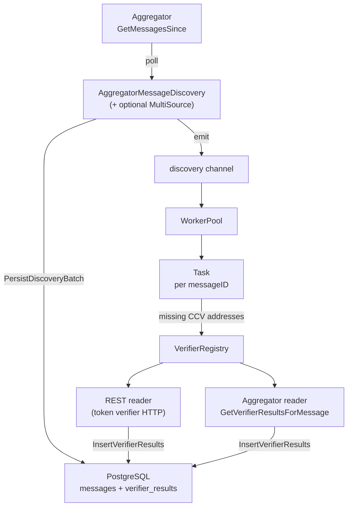

# Indexer Debugging Guide

This guide helps you trace a single CCIP message through the indexer using structured logs. The indexer has two main upstream dependencies:

1. **Aggregator (message discovery)** — Polls `GetMessagesSince` to discover new messages and committee-side verification markers.
2. **Token verifiers (USDC / Lombard, etc.)** — REST `GET /verifications?messageID=…` on configured verifier HTTP APIs to fetch attestations for CCV addresses listed on the message.

For upstream context, see the [Verifier debugging guide](../../verifier/docs/debugging.md) and [Aggregator debugging guide](../../aggregator/docs/debugging.md).

## Pipeline overview



**Stages:**

1. **Discovery** — Poll aggregator for new aggregated reports since a persisted sequence number; persist messages and non–discovery-only verifications; emit every verification to the worker channel.
2. **Enqueue** — Worker pool creates a `Task` per discovered message (logger scoped with `messageID`).
3. **Verification gather** — Task loads existing verifications from DB, determines missing CCV addresses, calls each registered `VerifierReader` (batched REST or aggregator gRPC).
4. **Completion** — Inserts new verifier results; marks message `successful` when all configured verifiers responded; otherwise retries via scheduler or DLQ on timeout.

A message is **fully indexed** when status is successful and `verifier_results` contains rows for all expected CCV addresses on the message.

---

## How discovery differs from token fetches

| Path | API | What it provides |
|------|-----|------------------|
| **Discovery** | Aggregator `GetMessagesSince` | New messages + committee discovery markers / aggregated committee data |
| **Token verifier** | Verifier HTTP `GET /verifications?messageID=…` | USDC (CCTP), Lombard, etc. attestations |
| **Aggregator as verifier** | Aggregator `GetVerifierResultsForMessage` | Batch read of stored aggregated results (when verifier `type = aggregator` in config) |

Discovery-only CCV data (4-byte `MessageDiscoveryVersion` prefix) is **not** persisted as verifier results but still flows on the discovery channel so the worker can fetch token verifications.

---

## Filtering logs for one message

### Logger names and fields

| Scope | Fields |
|-------|--------|
| Root | `indexer` (from `cmd/main.go`) |
| Discovery | Shared discovery logger (no per-message context until log line) |
| **Task** | `messageID` on logger + component name `Task` |
| Aggregator gRPC client | `aggregatorAddress` |
| REST reader | `url` on HTTP calls |

### Grep examples

```bash
# Discovery found the message
grep 'Found Message' | grep 'messageID=0xYOUR_MESSAGE_ID'

# Worker pipeline (Task logger)
grep 'messageID=0xYOUR_MESSAGE_ID'

# Enqueue from discovery
grep 'Enqueueing new Message' | grep '0xYOUR_MESSAGE_ID'

# Token verifier HTTP (batch may include multiple IDs in URL)
grep 'REST reader' | grep '0xYOUR_MESSAGE_ID'

# Storage
grep 'messageID=0xYOUR_MESSAGE_ID'
```

---

## Happy-path checklist

| Step | What to look for | Component |
|------|------------------|-----------|
| 1. Discovered | `Found Message` with `messageID`, `verifierSourceAddress` | `AggregatorMessageDiscovery` |
| 2. Persisted | `Discovery batch persisted` (Debug) | `PostgresStorage` |
| 3. Queued | `Enqueueing new Message` | `WorkerPool` |
| 4. Worker run | `Starting Worker for 0x…` | `WorkerPool` |
| 5. Fetch plan | `Attempting to retrieve N verifications` | `Task` |
| 6. Token hit | `Received result from … for MessageID` (Debug) | `Task` |
| 7. Stored | `Collected N new verifications` | `Task` |
| 8. Done | Message status `successful` (no DLQ warn) | `WorkerPool` / DB |

---

## Stage 1: Aggregator message discovery

**Source:** `indexer/pkg/discovery/message_discovery.go`  
**Upstream:** `integration/storageaccess/aggregator_reader.go` → aggregator `GetMessagesSince`

### Lifecycle

| Level | Message | `messageID` | Notes |
|-------|---------|-------------|-------|
| Info | `MessageDiscovery Started` | no | Service up |
| Info | `MessageDiscovery Stopped` | no | Shutdown |
| Info | `MessageDiscovery stopped due to context cancellation` | no | |
| Info | `Aggregator timed out, cancelling consumeReader` | no | Per-tick timeout |
| Error | `Error calling Aggregator` | no | Non-deadline error |
| Error | `Circuit breaker is open, skipping MessageDiscovery this tick` | no | Resilient reader open |
| Error | `Error reading VerificationResult from aggregator` | no | gRPC / resilience failure |
| Debug | `Called Aggregator` | no | Tick completed read |
| **Info** | **`Found Message`** | **yes** | **`verifierSourceAddress`** — primary discovery marker |
| Warn | `Unable to persist discovery batch, will retry` | no | Rolls back `since` sequence |
| Warn | `Skipping message, cannot encode for insert` | no | `index`, `reason` |

### Aggregator reader (gRPC client)

**Source:** `integration/storageaccess/aggregator_reader.go` (logger: `aggregatorAddress`)

| Level | Message | Notes |
|-------|---------|-------|
| Debug | `Got messages since` | `count`, `since` |
| Warn | `Dropping invalid verifier result from aggregator response` | `index`, `sequence`, `reason` |
| Error | `Aggregator returned result with sequence less than requested since` | Sequence regression |

### Multi-source discovery

**Source:** `indexer/pkg/discovery/multi_source.go`  
Used when multiple `[[discovery]]` entries exist in config.

| Level | Message | `messageID` |
|-------|---------|-------------|
| Info | `MultiSourceMessageDiscovery started` | no |
| Debug | `messageID already discovered from different source, skipping` | yes |
| Warn | `one source message discovery channel closed` | no |
| Info | `MultiSourceMessageDiscovery stopped` | no |

First source to emit a `messageID` wins; duplicates from other aggregators are dropped.

### Resilient reader (discovery + verifier calls)

**Source:** `indexer/pkg/readers/resilient_reader.go`

| Level | Message | Applies to |
|-------|---------|------------|
| Warn | `ReadCCVData circuit breaker opened` | Discovery (`GetMessagesSince` path) |
| Info | `ReadCCVData circuit breaker closed` | Discovery recovered |
| Warn | `GetVerifications circuit breaker opened` | Token / aggregator verifier reads |
| Warn | `Max consecutive read errors reached` | `consecutive_errors` |
| Warn | `ReadCCVData request timeout exceeded` | Discovery timeout |
| Warn | `GetVerifications request timeout exceeded` | Verifier batch timeout |

(Log names use `ReadCCVData` / `GetVerifications` as the policy name.)

---

## Stage 2: Worker pool and Task

**Sources:** `indexer/pkg/worker/worker_pool.go`, `task.go`, `worker.go`

### Worker pool

| Level | Message | `messageID` |
|-------|---------|-------------|
| **Info** | **`Enqueueing new Message`** | **yes** (in log fields) |
| Info | `Starting Worker for %s` | yes (in message string) |
| Info | `Exiting WorkerPool` / `Exiting EnqueueMessages` | no |
| Error | `Unable to create Task` | no |
| Error | `Unable to update Message Status for MessageID %s` | yes (string) |
| **Warn** | **`Message %s entered DLQ`** | **yes** — visibility window expired |
| Error | `Discovery channel closed` | no |

### Task logger (`messageID` + `Task`)

Created in `NewTask`:

```go
logger.Named(logger.With(lggr, "messageID", message.MessageID), "Task")
```

| Level | Message | Meaning |
|-------|---------|---------|
| Info | `Attempting to retrieve N verifications for the message. Total Verifiers: M` | Missing vs total CCV addresses |
| Info | `Detected N unknown verifiers within the message, ignoring them` | Address not in registry |
| Info | `Source Specified CCVs …` | Expected addresses on message |
| Info | `Exisiting Verifications …` | Already in DB |
| Info | `Attempting to Retrieve …` | Addresses being queried this run |
| Info | `Unknown CCVs …` | Not registered |
| **Info** | **`Collected N new verifications for the message`** | **Success** |
| **Debug** | **`Received result from %s for MessageID %s`** | Per verifier success |

Task does **not** log on storage insert failure beyond returning error to pool (pool retries).

### Completion rules

- **Success:** `UnavailableCCVs == 0` and no error → `UpdateMessageStatus(..., successful)`.
- **Retry:** storage error or any verifier reader did not return a result → re-enqueued on scheduler.
- **DLQ:** max attempts / visibility window → `MessageTimeout` + `Message … entered DLQ`.

---

## Stage 3: Token verifier (REST) and aggregator verifier reads

**Source:** `indexer/pkg/readers/verifier_reader.go` (batching, no per-message logs)

### REST reader (USDC / Lombard)

**Source:** `indexer/pkg/readers/rest_reader.go`  
**URL pattern:** `{baseURL}/verifications?messageID=0x…&messageID=0x…`

| Level | Message | `messageID` in fields |
|-------|---------|----------------------|
| Debug | `REST reader calling token verifier` | no (`url` contains IDs) |
| Debug | `REST reader 404 (no results), returning empty map` | no |
| Error | `REST reader HTTP request failed` | no |
| Error | `REST reader unexpected status` | no |
| Warn | `REST reader response exceeded size limit` | no |
| Error | `REST reader parse failed` | no (`body` may be large) |

A 404 yields an empty map → `UnavailableCCVs` increments → task retries until DLQ.

### Aggregator as verifier reader

When a verifier is configured with `type = "aggregator"`, `GetVerifications` calls aggregator `GetVerifierResultsForMessage` (no extra logs in indexer beyond resilient reader policies). See [Aggregator debugging guide](../../aggregator/docs/debugging.md) for aggregator-side `GetVerifierResultsForMessage` handler logs.

### Verifier registry

**Source:** `indexer/pkg/registry/verifier_registry.go`  
No logging — misconfigured addresses show up as `Unknown CCVs` on the Task.

---

## Stage 4: Storage (PostgreSQL)

**Source:** `indexer/pkg/storage/postgres.go`

### Per-message

| Level | Message | `messageID` |
|-------|---------|-------------|
| Error | `Failed to query CCV data` | yes |
| Error | `Failed to query message` | yes |
| Error | `Failed to update message status` | yes |
| Error | `Failed to persist discovery batch` | no |
| Debug | `Discovery batch persisted` | no (`messages`, `verifications`, `sequenceNumber`) |
| Debug | `Batch insert completed` | no |

### HTTP API (debugging indexed data)

**Source:** `indexer/pkg/api/handlers/v1/`

| Handler | Log | `messageID` |
|---------|-----|-------------|
| `VerifierResultsByMessageID` | `CCV data not found for MessageID` | yes |
| `VerifierResultsByMessageID` | `failed storage call GetCCVData for MessageID` | yes |
| `messages` | `skipping message with invalid ID` | no |

---

## Replay tooling (CLI)

**Source:** `indexer/pkg/replay/`, `indexer/cmd/replay/main.go`

Separate from the main indexer process; useful for backfill.

| Level | Message | `messageID` |
|-------|---------|-------------|
| Info | `Discovery replay starting` | no (`jobID`, `sinceSequenceNumber`) |
| Info | `Discovery replay batch` | no |
| Info | `Replaying message` | **yes** |
| Warn | `Failed to enqueue message for verifier` | yes |
| Warn | `Failed to persist verifier result` | yes |
| Warn | `Message not found in local storage` | yes |
| Info | `Message replay finished` | no |

---

## Suggested debug workflows

### Message never appears in indexer

1. Aggregator discovery: any `Found Message` for this ID? If not, check aggregator [GetMessagesSince](../../aggregator/docs/debugging.md) and indexer discovery errors (`Error reading VerificationResult from aggregator`, circuit breaker).
2. Multi-source: `messageID already discovered from different source, skipping` — may have been deduped (first source wins).
3. `Skipping message, cannot encode for insert` — message failed encoding.
4. `Unable to persist discovery batch` — DB issue; discovery will retry same sequence.

### Discovered but no token (USDC / Lombard) verification

1. `Enqueueing new Message` — reached worker?
2. Task: `Unknown CCVs` — verifier address not in `[[verifiers]]` or wrong `issuer_addresses`.
3. `Attempting to Retrieve` empty — all verifications already in DB?
4. REST: `REST reader 404` — verifier has no result yet (verifier still processing; see [Verifier debugging guide](../../verifier/docs/debugging.md)).
5. REST: `HTTP request failed` / circuit breaker — verifier down or network.
6. `Collected 0 new verifications` with retries — check `UnavailableCCVs` path until DLQ.

### Discovered but missing committee verification

1. Discovery persists non–discovery-only results from aggregator in `PersistDiscoveryBatch`.
2. If only discovery marker arrived, committee aggregated data may not be on aggregator yet — see [Aggregator debugging guide](../../aggregator/docs/debugging.md) (`Report submitted successfully`).
3. Verifier-type `aggregator` in indexer config can backfill via `GetVerifierResultsForMessage`.

### Stuck in retry / DLQ

1. `Starting Worker for 0x…` repeating — scheduler retries.
2. `UnavailableCCVs > 0` — some verifiers not returning.
3. **`Message … entered DLQ`** — gave up after visibility window; check `messages.status` and `last_error` in DB.

### End-to-end (committee + token)

```text
Verifier: Message verification completed → Write succeeded for message
    ↓
Aggregator: Triggered aggregation check → Report submitted successfully
    ↓
Indexer: Found Message → Enqueueing new Message → Collected N new verifications
```

Token path skips aggregator quorum; discovery still comes from aggregator `GetMessagesSince`, then Task hits token verifier REST.

---

## Database checks

```sql
-- Message row
SELECT message_id, status, last_error, ingestion_timestamp
FROM indexer.messages
WHERE message_id = '0xYOUR_MESSAGE_ID';

-- All verifier results for message
SELECT message_id, source_verifier_address, verifier_name, ingestion_timestamp
FROM indexer.verifier_results
WHERE message_id = '0xYOUR_MESSAGE_ID';

-- Discovery cursor for an aggregator endpoint
SELECT discovery_location, last_sequence_number
FROM indexer.discovery_state;
```

---

## Quick reference: logs with `messageID`

| Package | Logs |
|---------|------|
| `discovery/message_discovery` | `Found Message` |
| `discovery/multi_source` | Duplicate skip |
| `worker/worker_pool` | Enqueue, DLQ |
| `worker/task` | All Task Info/Debug lines (context field) |
| `storage/postgres` | Query/update errors |
| `api/handlers/v1` | Get by message ID |
| `replay` | Message replay |

---

## Related documentation

- [End-to-end message debugging](../../docs/end-to-end-debugging.md) — Full pipeline happy path and fallbacks
- [Debugging guides (all pipeline stages)](../../README.md#debugging-guides) — Per-service deep dives
- [Discovery module README](../pkg/discovery/README.md)
- [Storage README](../pkg/storage/README.md)
- [Indexer README](../README.md)
