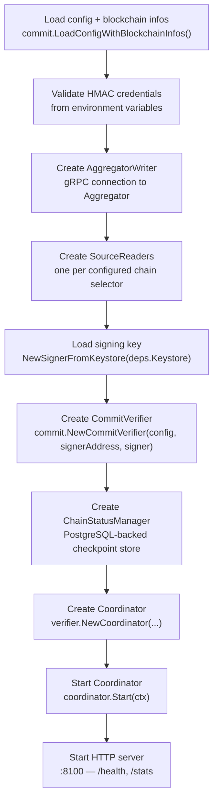

# Committee Verifier

This document describes the committee verifier — the concrete `Verifier` implementation that signs CCV messages using an ECDSA key and writes results to the Aggregator. It is the verifier type used by Chainlink Node operators running a CCIP 2.0 committee.

For the underlying pipeline architecture (Coordinator, SourceReaderService, job queues) see [verifier.md](verifier.md).

# Overview

The committee verifier implements the `Verifier` interface by:

1. Looking up the receipt blob issued by the configured onchain verifier contract (the `VersionedVerifierResolver` proxy)
2. Constructing a signable hash from the `messageID` and the verifier blob
3. Signing the hash with an ECDSA key managed by the Chainlink Node keystore
4. Packaging the signature into a `VerifierNodeResult` for the Aggregator

Multiple independent committee verifier nodes can operate on the same messages. The Aggregator collects results from all of them and assembles the final committee signature.

# Chainlink Node Integration

The committee verifier is deployed as a Chainlink Node job. The entry point is `NewCommitteeVerifierServiceFactory`, which implements `bootstrap.ServiceFactory[commit.JobSpec]`:

```go
factory := verifier.NewCommitteeVerifierServiceFactory(
    chainFamily, // e.g. "evm"
    createAccessorFactoryFunc,
)
```

When the node starts the job, `factory.Start(ctx, spec, deps)` is called with:

* `spec` — the parsed TOML job spec (`commit.JobSpec`)
* `deps` — node-provided dependencies including `deps.Logger` and `deps.Keystore`

`Start` performs the following initialisation sequence:



# Signing Pipeline

## Key Management

The committee verifier uses the Chainlink Node keystore exclusively — the raw private key bytes are never exposed to the verifier code.

```go
signer, pubKey, signerAddress, err := commit.NewSignerFromKeystore(
    ctx,
    deps.Keystore,
    keys.DefaultECDSASigningKeyName, // "ccip-verifier-signing-key"
)
```

`NewSignerFromKeystore` loads the key metadata from the keystore, derives the Ethereum address from the public key, and returns a `MessageSigner` that delegates all signing operations back to the keystore:

```
KeystoreSignerAdapter
  └── keystore.Signer.Sign(SignRequest{KeyName, Data})
        └── returns raw ECDSA signature bytes
ECDSASignerWithKeystoreSigner
  └── wraps KeystoreSignerAdapter
  └── calls protocol.SignV27WithKeystoreSigner(data, adapter)
  └── returns protocol.EncodeSingleECDSASignature(R, S, Signer)
```

The final encoded signature is a packed struct of `(R [32]byte, S [32]byte, Signer [20]byte)` — 84 bytes total.

For non-node deployments (tests, standalone binaries) `commit.NewECDSAMessageSignerFromString` accepts a raw hex private key and produces the same encoded signature format.

## Receipt Blob Selection

Each `VerificationTask` carries a `ReceiptBlobs` slice — blobs issued by various onchain contracts (the verifier proxy, the default executor, etc.). The committee verifier selects which blob to sign over using this priority:

1. **Primary**: Find the blob whose `Issuer` matches the configured `VerifierAddress` for the source chain. This blob is the receipt emitted by the `VersionedVerifierResolver` proxy.
2. **Fallback**: If no verifier blob is found but a blob whose `Issuer` matches `DefaultExecutorAddress` exists, use `protocol.MessageDiscoveryVersion` as the blob. This handles messages that are only being discovered (not verified by a specific verifier contract).
3. **Error**: If neither issuer is present in `ReceiptBlobs`, the message fails verification with a permanent (non-retryable) error.

## Hash Construction and Signing

Once the blob is selected:

```go
// Constructs: Keccak256([verifierVersion (4 bytes)][messageID (32 bytes)])
hash, err := committee.NewSignableHash(messageID, verifierBlob)

encodedSignature, err := cv.signer.Sign(hash[:])
```

The `verifierBlob` contributes its leading 4 bytes (the verifier version tag) to the pre-image. The full blob is not hashed — only the version prefix and the message ID. This ensures that the signature is bound to both the specific verifier version and the message identity.

## VerifierNodeResult Assembly

`commit.CreateVerifierNodeResult` assembles the final payload:

```go
result := &protocol.VerifierNodeResult{
    MessageID:      messageID,
    Message:        verificationTask.Message,
    Signature:      encodedSignature,   // 84-byte packed ECDSA (R, S, Signer)
    CCVAddresses:   ...,                // from VerificationTask
    ExecutorAddress: ...,
}
```

This result is returned to the `TaskVerifier Processor`, which publishes it to `ccv_storage_writer_jobs` for writing to the Aggregator.

# Aggregator Integration

## Connection

The committee verifier writes `VerifierNodeResult` items to the Aggregator via gRPC. The connection is established in `servicefactory.go`:

```go
aggregatorWriter, err := storageaccess.NewAggregatorWriter(
    config.AggregatorAddress,
    lggr,
    hmacConfig,
    config.InsecureAggregatorConnection,
    config.AggregatorMaxSendMsgSizeBytes,
    config.AggregatorMaxRecvMsgSizeBytes,
)
```

The writer is wrapped with `storageaccess.NewDefaultResilientStorageWriter` (retry + circuit-breaker logic) and then with `storageaccess.NewObservedStorageWriter` (metrics).

## Authentication

All gRPC calls to the Aggregator are authenticated with HMAC. The credentials are read from environment variables at startup:

| Variable | Description |
|---|---|
| `VERIFIER_AGGREGATOR_API_KEY` | Public API key identifying this verifier node |
| `VERIFIER_AGGREGATOR_SECRET_KEY` | Secret used to compute the HMAC signature |

Both are validated at startup (`hmac.ValidateAPIKey`, `hmac.ValidateSecret`). The service will not start if either is missing or malformed.

## Heartbeat

The `HeartbeatReporter` sends periodic heartbeats to the Aggregator (default interval: 10 s). Each heartbeat includes:

* The verifier ID
* Per-chain latest and finalized block heights (read from `ChainStatusManager`)

The Aggregator uses heartbeats to track node liveliness and to calculate a health score per verifier. Heartbeat metrics are recorded via `MetricLabeler` (`IncrementHeartbeatsSent`, `SetVerifierHeartbeatScore`, etc.).

# Concurrent Message Processing

`CommitVerifier.VerifyMessages` processes all tasks in the batch concurrently using one goroutine per task:

```go
for i, task := range tasks {
    go func(index int, t VerificationTask) {
        result, err := cv.verifyMessage(ctx, t)
        results[index] = toVerificationResult(result, err, t)
    }(i, task)
}
```

Each goroutine is independent — a failure on one message does not affect others in the same batch. The coordinator controls overall batch size via `StorageBatchSize` (default: 50).

# Configuration

The committee verifier is configured through the job spec TOML. Key fields from `commit.Config`:

| Field | Description |
|---|---|
| `VerifierID` | Unique identifier for this verifier instance; scopes all PostgreSQL state |
| `CommitteeVerifierAddresses` | Map of chain selector → onchain verifier proxy address |
| `DefaultExecutorOnRampAddresses` | Map of chain selector → default executor contract address |
| `RMNRemoteAddresses` | Map of chain selector → RMN Remote contract address |
| `AggregatorAddress` | gRPC endpoint of the Aggregator (e.g. `aggregator.internal:8080`) |
| `InsecureAggregatorConnection` | Set `true` for plaintext gRPC (dev/test only) |
| `AggregatorMaxSendMsgSizeBytes` | gRPC send message size limit |
| `AggregatorMaxRecvMsgSizeBytes` | gRPC receive message size limit |
| `DisableFinalityCheckers` | List of chain selectors for which `FinalityViolationChecker` is disabled |
| `PyroscopeURL` | Optional Pyroscope profiling endpoint |

Blockchain-specific details (RPC URLs, chain IDs, etc.) are supplied via `BlockchainInfos` in the job spec and are consumed by the `AccessorFactory` to create `SourceReader` instances.
