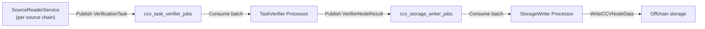

# Verifier Debugging Guide

This guide helps you trace a single CCIP message through the verifier’s durable processing pipeline using structured logs. For architecture and component responsibilities, see [verifier.md](./verifier.md).

## Pipeline overview

The coordinator runs a three-stage pipeline connected by PostgreSQL job queues:



**Stages:**

1. **SourceReaderService** — Discovers on-chain events, applies filters/finality/curse/rules, holds tasks in memory until ready, publishes to `ccv_task_verifier_jobs`.
2. **TaskVerifier Processor** — Consumes tasks, calls the pluggable `Verifier` (committee, CCTP, Lombard, etc.), publishes results to `ccv_storage_writer_jobs`.
3. **StorageWriter Processor** — Consumes results, writes `VerifierNodeResult` to offchain storage.

A message is fully processed from the verifier’s perspective when storage reports **write success** and the storage-writer job is completed.

---

## Filtering logs for one message

Most message-scoped logs use the structured field **`messageID`** (hex string, typically `0x…`).

### Grep examples

```bash
# Direct field (most stages)
grep 'messageID=0xYOUR_MESSAGE_ID'

# CCTP / Lombard: messageID is on logger context for the whole task
grep 'messageID.*0xYOUR_MESSAGE_ID'

# Commit verifier also logs the ID in several Infow calls
grep '0xYOUR_MESSAGE_ID'
```

In log aggregators (Datadog, etc.), filter on the JSON field `messageID` (or nested context fields when using `logger.With`).

### Logger context tags

These fields appear on many lines and help narrow by component:

| Component | Structured fields |
|-----------|-------------------|
| Coordinator | `verifierID` |
| Source reader (runtime) | `component=Service`, `chain=<selector>` |
| Source reader (creation) | `component=SourceReaderDB`, `chainID=<selector>` |
| Finality checker | `component=FinalityChecker`, `chainID=<selector>` |
| Reorg tracker | `component=ReorgTracker` |
| Task queue | `component=task_queue` |
| Result queue | `component=result_queue` |
| Task queue observer | `component=task_queue_observer` |
| Result queue observer | `component=result_queue_observer` |
| TaskVerifier / StorageWriter processors | `verifierID` (no `component` tag) |
| Heartbeat | `component=HeartbeatReporter` |

**CCTP and Lombard** scope each task with:

```go
lggr := logger.With(v.lggr, "messageID", task.MessageID, "txHash", task.TxHash)
```

Every log for that task should carry **`messageID`** and **`txHash`** without repeating them in the log message string.

---

## Happy-path checklist

Use this sequence when confirming a message completed successfully:

| Step | What to look for | Package |
|------|------------------|---------|
| 1. Discovered | `Added message to pending queue` | `sourcereader` |
| 2. Finality OK | `Finality check` with `meetsRequirement=true` | `sourcereader` |
| 3. Enqueued | `Successfully published and tracked tasks` | `sourcereader` |
| 4. Verified | See [Verifier implementations](#verifier-implementations) below | `commit` / `token/*` |
| 5. No TVP failure | No `Message verification failed` for this ID | `taskverifier` |
| 6. Persisted | `Write succeeded for message` | `storagewriter` |

Optional confirmation: query `ccv_task_verifier_jobs` / `ccv_storage_writer_jobs` (and archive tables) by `message_id` if logs are inconclusive.

---

## Stage 1: SourceReaderService

**Logger:** `component=Service`, `chain=<chainSelector>`

**Source:** `verifier/pkg/sourcereader/service.go`

### Discovery and pending queue

| Level | Message | `messageID` | Other useful fields |
|-------|---------|-------------|---------------------|
| Info | `Message filtered out by filter` | yes | `destChain` |
| Error | `Failed to compute message ID` | no | `error` |
| Error | `Message ID mismatch` | no | `computed`, `onchain` |
| Info | `Added message to pending queue` | yes | `blockNumber`, `seqNum`, `pendingCount` |
| Debug | `Skipping already-sent message` | yes | `blockNumber` |

### Reorg handling

| Level | Message | `messageID` | Other useful fields |
|-------|---------|-------------|---------------------|
| Warn | `Removing task from pending queue due to reorg` | yes | `blockNumber`, `seqNum`, `destChain`, `fromBlock` |
| Warn | `Removing task from sentTasks due to reorg` | yes | `seqNum`, `destChain` |

### Finality and readiness

| Level | Message | `messageID` | Other useful fields |
|-------|---------|-------------|---------------------|
| Info | `Checking for ready messages to send` | no | `latestBlock`, `safeBlock`, `finalizedBlock` |
| Info | `Reorg-affected message finality check` | yes | `meetsRequirement`, `messageBlock`, `finalizedBlock` |
| Info | `Finality check` | yes | `finality`, `meetsRequirement`, `messageBlock`, `safeBlock`, `finalizedBlock` |
| Error | `Finality check failed due to nil block argument` | yes | `error` |

### Curse, message rules, publish

| Level | Message | `messageID` | Notes |
|-------|---------|-------------|-------|
| Warn | `Blocking lane - curse state unknown` | yes | Transient; retried next poll |
| Warn | `Dropping task - lane is cursed` | yes | Permanent drop |
| Warn | `Blocking message - message rules state unknown` | yes | Transient |
| Warn | `Dropping task - message matched a disablement rule` | yes | Permanent drop |
| Warn | `Curse or message rules state unknown, keeping checkpoint unchanged` | no | Batch may stall checkpoint |
| Info | `Publishing ready tasks to job queue` | no | `ready`, `pending`, `sentTasks` |
| Error | `Failed to publish tasks to job queue` | no | Tasks stay in `pendingTasks` for retry |
| Info | `Successfully published and tracked tasks` | no | `published`, `remainingPending`, `totalSent` |
| Info | `Checkpoint advanced` | no | Chain-level `finalizedBlock` |

### Chain-wide failures (no per-message ID)

| Level | Message | Impact |
|-------|---------|--------|
| Error | `FINALITY VIOLATION - disabling chain` | Chain disabled; pending/sent maps flushed |
| Error | `Flushed all tasks due to finality violation` | `pendingFlushed`, `sentFlushed` |
| Error | `Finality violation detected` | Triggers disable path |
| Warn | `Error when querying logs` | Event cycle may not advance |
| Error | `Failed to get latest block` | Poll skipped for this cycle |

### Cycle-level logs (no `messageID`)

Useful for “why is nothing moving on this chain?”:

- `processEventCycle starting`
- `Querying from block`
- `Processed block range`
- `No events found in range`

---

## Stage 2: TaskVerifier Processor

**Logger:** top-level `verifierID` (service name `verifier.Processor[<verifierID>]`)

**Source:** `verifier/pkg/taskverifier/processor.go`

### Batch processing (usually no per-message ID)

| Level | Message | Key fields |
|-------|---------|------------|
| Debug | `Processing verification tasks batch` | `batchSize` |
| Debug | `Published verification results to queue` | `count` |
| Debug | `Verification batch completed` | `successCount`, `errorCount`, `retryCount`, `failedCount` |

### Per-message failures

| Level | Message | `messageID` | Key fields |
|-------|---------|-------------|------------|
| Error | `Message verification failed` | yes | `error`, `retryable`, `nonce`, `sourceChain`, `destChain` |
| Error | `Job ID not found for message` | yes | Internal mapping bug / mismatch |

**`retryable`:**

- `true` — Job scheduled for retry in `ccv_task_verifier_jobs` (delay set by verifier implementation).
- `false` — Permanent failure; job archived as failed.

### Queue operation failures (batch-level)

Jobs may remain in `processing` until stale-lock reclaim:

- `Failed to publish verification results to queue`
- `Failed to complete jobs`
- `Failed to retry jobs`
- `Failed to mark jobs as failed`

---

## Verifier implementations

The TaskVerifier delegates to a pluggable `Verifier`. Log patterns differ by type.

### Committee / commit verifier

**Source:** `verifier/pkg/commit/verifier.go`

Per-message **Info** logs (all include `messageID`):

| Message | Typical fields |
|---------|----------------|
| `Starting message verification` | `nonce`, `sourceChain`, `destChain` |
| `Message validation passed` | `verifierAddress`, `defaultExecutorAddress` |
| `Using message discovery version for message` | `version` |
| `Message signed successfully` | `signer`, `signatureLength` |
| `Message verification completed successfully` | `nonce`, `sourceChain`, `destChain` |

Batch-level:

- `Starting batch verification` / `Batch verification completed` — `batchSize`, `successCount`, `errorCount` (no per-message ID).

Errors are returned to TaskVerifier as `Message verification failed` (commit verifier does not log every error path at Info/Error level before return).

### CCTP verifier

**Source:** `verifier/pkg/token/cctp/verifier.go`

Logger context: `messageID`, `txHash` on every task.

| Level | Message |
|-------|---------|
| Info | `Verifying CCTP task` |
| Warn | `Failed to fetch attestation` |
| Debug | `Attestation not ready for message` |
| Error | `Failed to decode attestation data` |
| Info | `Attestation fetched and decoded successfully` |
| Error | `CreateVerifierNodeResult: Failed to create VerifierNodeResult` |
| Info | `VerifierResults: Successfully verified message` |

Attestation fetch helper (`token/cctp/attestation.go`) may log `skipping CCTP message as it doesn't match CCIP message` without `messageID` on the context (Circle API response parsing).

### Lombard verifier

**Source:** `verifier/pkg/token/lombard/verifier.go`, `token/lombard/attestation.go`

Logger context: `messageID`, `txHash` on each task in the verifier loop.

**Verifier loop** — same pattern as CCTP (`Verifying Lombard task`, attestation ready/not found, success/failure).

**Attestation service** — explicit `messageID` on mapping failures:

| Level | Message |
|-------|---------|
| Warn | `No verifier resolver configured for source chain, skipping task` |
| Warn | `No matching blob found for task in ReceiptBlobs` |
| Error | `No verifier resolver configured for source chain; marking attestation as missing` |
| Error | `No matching blob found for task; marking attestation as missing` |
| Error | `Failed to find attestation for task in the response` |

---

## Stage 3: StorageWriter Processor

**Logger:** top-level `verifierID` (service name `verifier.Processor[<verifierID>]`)

**Source:** `verifier/pkg/storagewriter/processor.go`

### Per-message

| Level | Message | `messageID` | Key fields |
|-------|---------|-------------|------------|
| Debug | `Write succeeded for message` | yes | `jobID` |
| Error | `Write failed for message (retryable)` | yes | `jobID`, `error` |
| Error | `Write failed for message (non-retryable)` | yes | `jobID`, `error` |

### Batch summary

| Level | Message | Key fields |
|-------|---------|------------|
| Debug | `Processing verification results batch` | `batchSize` |
| Info | `CCV data batch write completed` | `totalRequests`, `successful`, `retriableFailed`, `nonRetriableFailed` |
| Info | `Scheduling retry for failed writes` | `retriableFailedCount`, `retryDelay` |
| Warn | `Marking non-retryable failed jobs as failed` | `nonRetriableFailedCount` |
| Debug | `No successful writes in this batch, skipping completion` | — |

### Batch / queue failures

- `Failed to write CCV data batch to storage with no results, scheduling retry`
- `Failed to schedule retry for CCV data batch` / `Failed to schedule retry for failed writes`
- `Failed to complete jobs in queue`
- `Failed to mark jobs as failed`

---

## E2E latency tracking

**Source:** `verifier/pkg/monitoring/message_latency.go`

| Level | Message | `messageID` | When |
|-------|---------|-------------|------|
| Warn | `Negative E2E latency detected due to clock drift` | yes | After successful write; block time vs node clock |
| Error | `Invalid timestamp type in cache for message` | no | Cache corruption / bug |

Timestamps are recorded when TaskVerifier calls `MarkMessageAsSeen` (at consume time), using `ReadyForVerificationAt` when set.

---

## Job queue logs (no per-message ID)

**Source:** `verifier/pkg/jobqueue/postgres_queue.go`

**Components:** `task_queue` (`ccv_task_verifier_jobs`), `result_queue` (`ccv_storage_writer_jobs`)

These logs are **batch counts only**. To inspect a specific message in the queue, query the database:

```sql
-- Example: task queue (adjust table/schema as deployed)
SELECT job_id, status, message_id, attempt_count, last_error, available_at, started_at
FROM ccv_task_verifier_jobs
WHERE message_id = decode(replace('0xYOUR_MESSAGE_ID', '0x', ''), 'hex');
```

| Level | Message | Key fields |
|-------|---------|------------|
| Debug | `Published jobs to queue` | `queue`, `count`, `delay` |
| Debug | `Consumed jobs from queue` | `queue`, `count` |
| Debug | `Completed jobs` | `queue`, `count` |
| Info | `Retried jobs` | `queue`, `retried`, `failed`, `delay` |
| Info | `Failed and archived jobs` | `queue`, `count` |
| Info | `Archived jobs that exceeded retry deadline` | `queue`, `count` |

**Observers** (`task_queue_observer`, `result_queue_observer`):

- `JobQueue size` — periodic backlog depth

---

## Suggested debug workflow

### Message never appears in verifier logs

1. Confirm the source chain SourceReader is running (`Service started`, no `Chain is disabled, skipping`).
2. Check filter: `Message filtered out by filter`.
3. Check event cycle: `Processed block range`, `No events found in range`.
4. Check ID integrity: `Message ID mismatch`.

### Stuck after discovery

1. `Finality check` with `meetsRequirement=false` — wait for finality or check `finality` mode on message.
2. `Reorg-affected message finality check` — stricter path after reorg.
3. Curse/rules: `Blocking … state unknown` vs `Dropping …`.
4. Publish: `Failed to publish tasks to job queue`.

### Stuck in verification

1. `Message verification failed` — read `error`, `retryable`.
2. Token verifiers: `Attestation not ready` / `not found`, fetch errors.
3. Commit: errors often only in TVP line; enable debug or trace batch with `successCount=0`.
4. Queue: `Retried jobs`, `Failed and archived jobs` on `task_queue`.

### Stuck after verification

1. `Failed to publish verification results to queue` — TVP could not enqueue to storage writer.
2. `Write failed for message` — storage backend issue.
3. `Failed to write CCV data batch` — whole batch retry.

### Entire chain stopped

1. `FINALITY VIOLATION` (checker or SRS disable path).
2. `Finality violation detected` in sendReadyMessages.
3. Coordinator: `Chain is disabled, skipping`.

---

## Quick reference: logs with explicit `messageID`

| Package | Log messages |
|---------|----------------|
| `sourcereader` | Filter, reorg removal, skip sent, add pending, curse/rules, finality checks |
| `taskverifier` | `Message verification failed`, `Job ID not found for message` |
| `storagewriter` | Write succeeded / failed (retryable and non-retryable) |
| `commit` | Full per-message verification trail (Infow) |
| `token/cctp`, `token/lombard` | All task logs via `logger.With(..., "messageID", ...)` |
| `token/lombard/attestation` | Resolver, blob, attestation mapping errors |
| `monitoring` | Clock drift warning on E2E latency |

---

## Related documentation

- [End-to-end message debugging](../../docs/end-to-end-debugging.md) — Full pipeline happy path and fallbacks
- [Debugging guides (all pipeline stages)](../../README.md#debugging-guides) — Per-service deep dives
- [Verifier design](./verifier.md) — Architecture and configuration
- [Committee verifier](./committee_verifier.md)
- [Token verifier](./token_verifier.md)
