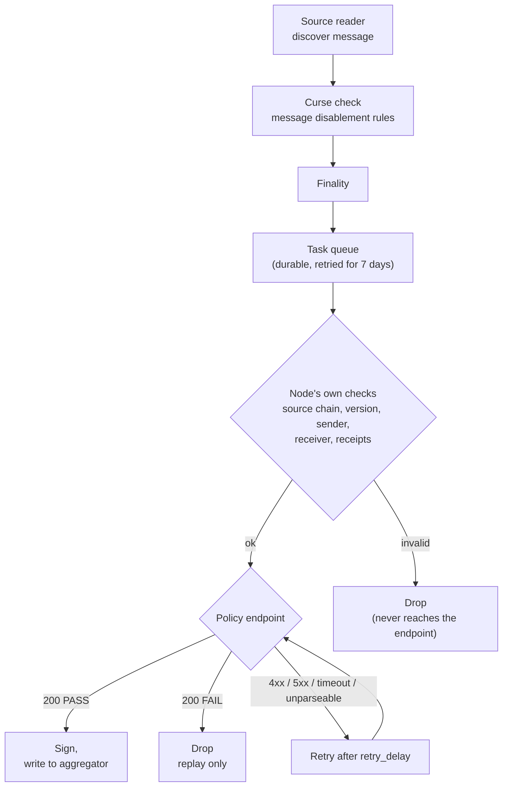

# Policy hook

The policy hook is an operator-configurable gate on the committee verifier. Before a node signs a
message it asks one HTTPS endpoint the operator runs, and the endpoint answers PASS or FAIL. A PASS
signs the message exactly as an ungated node would; a FAIL drops it. The point is to let an operator
plug in their own verification logic (compliance, AML, sanctions or risk screening) without changing
verifier code.

The endpoint contract is published as [policy_hook_openapi_v1.yaml](../policy_hook_openapi_v1.yaml),
an OpenAPI 3.0.3 document. Operators build against that; the Go types in `verifier/pkg/policy` are
kept in step with it by `TestOpenAPISpecMatchesContract`.

## Where it runs

The hook is the last check before signing. A message reaches the endpoint only after it has
cleared finality, the curse and message-disablement checks, and the node's own checks on the
message: known source chain, supported message version, non-zero sender, non-empty receiver, and a
receipt this verifier can sign over.



The ordering matters for what an endpoint gets asked about. A message the node was never going to
sign, because it names an unconfigured source chain or is malformed, is dropped before the call, so
the endpoint is not billed for it and its logs are not filled with messages the node rejected
anyway. It also means a verdict the endpoint returns is always about a message that would otherwise
have been signed, which is what makes a PASS rate meaningful.

Every message that reaches the policy stage is counted there. A message dropped by the node's own
checks is recorded as `policy_skipped` and then fails with the node's own error, exactly as it would
on a verifier with no hook configured. The hook changes nothing about how those messages are
handled.

Each committee node calls its own endpoint independently and signals nothing to the others, so the
committee's normal quorum and signing apply on top of the verdict. A node that gets FAIL simply does
not attest. Nothing about the hook reaches the aggregator: no aggregator change is needed to run one.

## Semantics

| Endpoint answer | What the verifier does |
| --- | --- |
| HTTP 200, `{"decision":"PASS"}` | Signs and attests, byte-identical to a run with no hook. |
| HTTP 200, `{"decision":"FAIL"}` | This node drops the message permanently and never attests it. Whether the message itself stops depends on quorum, below. |
| Anything else | Retries the message. Never drops it. |

"Anything else" covers a 4xx, a 5xx, a timeout, an unreachable host, a redirect, a body that is not
valid JSON, and a decision that is neither PASS nor FAIL. An endpoint outage must never look like a
rejection, so an endpoint that cannot reach its own dependencies has to return an error status rather
than FAIL.

## What a FAIL stops

A FAIL withholds one node's signature. On its own it does not stop the message.

The committee's quorum config sets a threshold per source chain, and the aggregator builds a report
as soon as that many of the committee's nodes have signed. A message is stopped only when enough
nodes withhold signatures to put the rest below the threshold, which takes `N - threshold + 1` of
the committee's `N` nodes. In a 2-of-2 committee one FAIL is decisive. In a 3-of-5, two operators
can reject a message and it still executes on the other three signatures.

This is by design rather than a gap: the committee is the unit of decision, and quorum is what a
message clears or does not. The hook gives one node a reason to withhold, and the threshold decides
what that is worth.

It is still the thing to work out before treating the hook as a compliance control. If your node's
signature is spare at the committee's threshold, your endpoint answering FAIL does not prevent the
transfer. It means you did not attest it. Sizing the committee so the gated nodes can actually block
is a topology decision the hook cannot make for you.

Nothing signals a FAIL to the other nodes and nothing about it reaches the aggregator, so a node
cannot tell from its own logs whether a message it rejected went through anyway. Answering that
today means looking the message ID up at the aggregator or the indexer.

A drop is permanent from the node's point of view, like an RMN curse. Clearing whatever made the
endpoint answer FAIL does not by itself bring the message back: the checkpoint has moved past it and
the job is out of the active queue. Recovery is an operator action, and every member of the committee
needs it, since each one dropped the message on its own verdict.

The drop happens inside the task queue, so the failed job sits in the verifier's archive table with
the endpoint's reason as its error. For a single message, moving that job back to the active queue is
enough: the node picks it up on its next poll and asks the endpoint again. This works on a running
node.

```
docker exec <verifier-container> /bin/verifier ccv job-queue reschedule \
  --queue task-verifier --verifier-id <verifier-id> --message-id <message-id>
```

To replay a range of messages, rewind the verifier's checkpoint for that source chain instead and let
the messages be read again. Stop the node first; the new checkpoint takes effect on the next start.

```
docker exec <verifier-container> /bin/verifier ccv chain-statuses set-finalized-height \
  --chain-selector <selector> --verifier-id <verifier-id> --block-height <block>
```

### Holding a message for review

Screening produces three outcomes, not two, and the middle one is common: a name match a human
clears shortly afterwards. v1 has no verdict for it. The supported way to hold a message is to
answer FAIL while the review is open and replay the message once it clears — rescheduling the
archived job asks the endpoint again, and the second call can answer PASS.

Do not hold a message by stalling the call or by returning a 5xx. A slow call is bounded by
`request_timeout` and a 5xx is metered as an endpoint outage, so a hold expressed that way is
indistinguishable from the verifier's own dependency being down, and it dies at the task queue's
7-day retry deadline rather than at a decision.

`HOLD` is published in the response enum and is not implemented. It is reserved so that adding it
later is an additive change for an endpoint that validates strictly against the spec, rather than a
breaking one. An endpoint that returns it today has its message retried, with an error saying the
value is reserved. Whether to implement it is a question of how often real operators need it: if a
hold is a daily event then carrying it in the protocol beats a manual replay, and if it is rare the
replay path is the better trade. Improving the replay UX is tracked separately in CCIP-13332.

## Configuring it

The hook is off unless the `[policy_hook]` section is present in the committee verifier's config. A
verifier without it behaves exactly as it did before the hook existed, down to the bytes of its job
spec.

```toml
[policy_hook]
  endpoint_url = "https://policy.internal.example.com/v1/evaluate"
  request_timeout = "5s"
  retry_delay = "10s"
  insecure_connection = false
  require_auth = false
```

`endpoint_url` is required and must be `https` unless `insecure_connection` is set, which exists for
local development against a plain-HTTP fake and should never be set in production.

`request_timeout` bounds one call, defaults to 5s, and is rejected above 15s. A node evaluates a
batch of up to 50 messages 8 at a time, so a batch is up to seven waves of calls, and the whole
batch has to finish inside the two-minute lock the task queue holds on those jobs. A batch that runs
past the lock is reclaimed and evaluated again: a second call the operator pays for, and a second
trip through the drop path. An endpoint that needs longer than 15s should take the call, queue the
work itself, and answer with an error until it has a verdict.

`retry_delay` is how long a message waits before the endpoint is asked again after an error, and
defaults to 10s. The actual delay is jittered per message across half to one and a half times that
value: an outage stalls every message the node is holding at once, and a fixed delay would send the
whole backlog at the endpoint together on each retry. The delay does not grow with the attempt
count.

Retries are bounded by the task queue's own retry window, currently 7 days from when the message was
queued. An outage shorter than that delays messages rather than losing them. A message still without
a verdict when its deadline passes is failed the same way a rejected one is, and needs the same
checkpoint rewind to recover, so an outage approaching a week is an operational incident, not
something the retry loop rides out.

In a JD deployment the section is emitted into the job spec from the NOP's entry in the environment
topology, which is where an operator sets their own endpoint:

```toml
[[environment_topology.nop_topology.nops]]
alias = "acme-verifier-1"
name = "acme-verifier-1"
  [environment_topology.nop_topology.nops.policy_hook]
  endpoint_url = "https://policy.internal.acme.example/v1/evaluate"
```

Two NOPs in the same committee can run different policies, or one can run none.

## Implementing the endpoint

The verifier POSTs JSON to the configured URL verbatim, appending nothing to it, with
`Content-Type: application/json`. The request carries the decoded CCIP message and its source-chain
provenance so the endpoint does not have to fetch or decode anything:

```json
{
  "schema_version": "v1",
  "verifier_id": "acme-verifier-1",
  "message_id": "0x9f2b...3e4",
  "source_tx_hash": "0x4c0f...4e3",
  "source_block_number": 1837421,
  "finalized_block_number": 1837436,
  "block_depth": 15,
  "message": {
    "version": 1,
    "source_chain_selector": 3379446385462418246,
    "dest_chain_selector": 12922642891491394802,
    "sequence_number": 42,
    "sender": "0x...",
    "receiver": "0x...",
    "data": "0x...",
    "token_transfer": { "amount": "1000000000000000000", "...": "..." }
  }
}
```

A verdict is a small JSON object:

```json
{"decision": "FAIL", "message_id": "0x9f2b...3e4", "reason": "sender matched sanctions list entry OFAC-12345"}
```

`reason` is optional and is logged by the verifier. It is never signed: v1 deliberately keeps policy
output out of the signed payload, since signing it would force aggregator and wire-format changes.
It does travel, though. The string goes into the node's logs, ships wherever those logs ship, and is
stored as the archived job's error for the 30-day retention period. Put a case reference in it
rather than the customer data behind the decision. Anything past 256 characters is truncated.

Things worth knowing when building the endpoint:

* Calls are idempotent from the verifier's side. A retried message arrives again with the same
  `message_id` and the same verdict is expected.
* `message_id` in the response echoes the request. Recommended, not required: nothing else in a
  response ties a verdict to the message it answers, so if a cache or a proxy in front of your
  endpoint ever crosses two responses, the echo is what stops the verifier signing on the wrong
  verdict. A mismatch is treated as an error and retries. Endpoints that omit the field are
  unaffected, which is why the contract does not require it.
* `source_tx_hash` is the raw source-chain transaction identifier hex-encoded with an `0x` prefix,
  whatever the chain family's own rendering is. An EVM transaction hash and a Solana signature both
  arrive as hex; re-encode them yourself if you need the native form, using `source_chain_selector`
  to tell which family you are looking at.
* `decision` must be spelled `PASS` exactly. `FAIL` is accepted in any case, because reading a
  verdict as unusable only costs a retry while reading one as PASS costs a signature.
* `HOLD` is reserved and must not be returned. See [holding a message for
  review](#holding-a-message-for-review).
* A node evaluates a batch concurrently, up to 8 in-flight calls.
* The verifier reads at most 64 KiB of response body and does not follow redirects.

## Authenticating the verifier

The endpoint should not be reachable from outside the operator's own network in the first place.
Running it in the same cluster as the verifier and not exposing it is the recommended setup, and it
is the one that needs no credential at all.

Where that is not possible, the verifier can present an HMAC-SHA256 credential. It is optional and
off unless a credential is configured. There is exactly one scheme, and it is the one the aggregator
already uses (`protocol/common/hmac`), so an operator implements one thing and this repo has one
implementation to review.

When configured, every request carries three headers:

| Header | Value |
| --- | --- |
| `authorization` | The API key, a UUID. |
| `x-authorization-timestamp` | Milliseconds since the Unix epoch, as a decimal string. |
| `x-authorization-signature-sha256` | Hex-encoded HMAC-SHA256 of the string below. |

The signed string is five space-separated fields:

```
POST <request-target> <sha256-hex-of-body> <api-key> <timestamp-ms>
```

`<request-target>` is the path the request arrived on including any query string, and `/` when the
configured `endpoint_url` has no path. `<sha256-hex-of-body>` is the hex SHA-256 of the exact request
body, taken before parsing. The secret is hex-encoded on both sides and decoded to raw bytes before
use as the HMAC key. The signing itself is `hmac.SignHTTPRequest`, the HTTP counterpart of the gRPC
interceptor the aggregator clients use.

To verify a request: recompute the string, recompute the HMAC, compare in constant time, and reject
a timestamp more than 15 seconds from your own clock. The timestamp is what makes a captured request
unreplayable; skipping it leaves you with caller identification only. Answer a request that fails
any of this with `401`, which the verifier reads as "verdict unknown" and retries.

The credential is not part of the `[policy_hook]` section, because that section is marshaled into the
verifier's job spec and stored in Job Distributor. It comes from the verifier secrets file:

```toml
[policy_hook]
  api_key = "3f2b7c58-6d41-4a9e-8b0c-1d2e3f405162"
  secret_key = "<64 hex characters>"
```

The secrets file is the only source. The aggregator and database credentials also read environment
variables, but only for deployments that predate the file; this credential is newer than the file
and has no such history, so there is one place to put it. The API key must be a UUID and the secret
at least 32 bytes hex-encoded, which is what the shared scheme requires; generate a pair with
`hmac.GenerateCredentials`. Setting one of the two and not the other is a startup error rather than
a silent downgrade to no authentication.

A verifier running inside a Chainlink node has no secrets file, so its credential is a parameter to
`constructors.NewVerificationCoordinator` and the node supplies it, the same way it supplies the
aggregator credentials.

Set `require_auth = true` on any verifier whose endpoint checks the signature. Without it a
credential that failed to reach the container leaves the verifier calling unauthenticated, the
endpoint answering 401, and every message on the lane retrying until the queue's 7-day deadline. With
it the node refuses to start. The boot log line carries `authenticated=true|false` either way.

## Observing it

Per-message logs on the verifier:

* `Dropping task - policy hook returned FAIL`: terminal, carries `messageID` and the endpoint's
  reason.
* `Policy hook verdict unavailable, scheduling retry`: non-terminal, carries the underlying error.

Failed and dropped messages are archived rather than deleted. `ccv job-queue` on the verifier lists
them with the error that ended them, which for a rejection is the endpoint's own reason string.

Metrics use the existing bounded message-transition counter with `stage="policy"` and `outcome` of
`policy_passed`, `policy_rejected`, `policy_unavailable`, or `policy_skipped`. The four add up to
the messages that entered the stage. `policy_skipped` is a message the node's own checks rejected
before the endpoint was called, and it carries `reason="task_invalid"`; the message then fails with
the node's own error, so it lands on the message-failure counter under whatever class that error
maps to, not under a policy class. Failures from the endpoint itself are classified as
`policy_rejected` or `policy_endpoint_error`.

A rising `policy_skipped` says something upstream is feeding the verifier messages it cannot sign.
It is not a policy problem and paging on it as one would be wrong.

## Trying it in devenv

`standard.policy-hook.profile` brings up the standard environment with the hook enabled on both
NOPs of the default committee, pointed at a fake policy endpoint served by the `ccv-fakes`
container (`build/devenv/fakes/pkg/policy`). The fake passes every message until a test tells it
otherwise, so an environment on this profile behaves like one without the hook until something
changes the fake's state.

The fake has a control surface, reachable from the host on the fake's port (9111 by default):

| Route | What it does |
| --- | --- |
| `POST /policy/v1/control` | Sets the fake's behavior. Fields: `default_decision` (`PASS` or `FAIL`), `reason`, `reject` (message IDs to answer FAIL for), `force_status` (HTTP status to answer every call with; zero clears it), `reset`. |
| `GET /policy/v1/control/calls` | Returns how many times the endpoint was asked, in total and per message ID. |

```bash
# Reject one message, then look at what the verifiers asked.
curl -s -X POST localhost:9111/policy/v1/control \
  -d '{"reject":["0x9f2b...3e4"],"reason":"sanctioned sender"}'
curl -s localhost:9111/policy/v1/control/calls
```

`TestE2ESmoke_PolicyHook` in `build/devenv/tests/e2e/smoke_policy_hook_test.go` walks messages
through all three outcomes against a real committee: a PASS lands at the aggregator and the endpoint
was consulted; an outage (`force_status` 503) holds the message, is logged as a retry, and the
message lands on its own once the endpoint recovers; a FAIL drops the message, clearing the rejection
does not bring it back, and a checkpoint rewind replays it. CI runs it from
`.github/workflows/test-smoke.yaml`. Locally:

```bash
cd build/devenv
ccv test --profile standard.policy-hook.profile --pattern TestE2ESmoke_PolicyHook --log /tmp/policy-hook.log
```

The profile stacks `env-policy-hook.toml` on `env-src-auto-mine.toml` because the replay half of the
test rewinds the committee checkpoint and has to control when a message reaches finality.

## Not in v1

Signing arbitrary policy output, or attaching a verdict or reason to the signed payload: that would
force aggregator and wire-format changes. Multiple or weighted endpoints: the API is versioned so a
later version can add them if there is real demand. Until then, one endpoint that aggregates the
operator's own checks keeps one call to one verdict, and keeps the retry and drop rules unambiguous.

A `HOLD` verdict on the retry path: the enum value is reserved, the behavior is not built, and the
replay path covers the case in the meantime. Authentication schemes beyond the one above: an
endpoint that needs something else should sit behind a proxy that terminates it, rather than have
the verifier learn every operator's setup.

A batched request carrying several messages: the verifier does evaluate a batch, so this would cut
the request count by up to the batch size. It is not in v1 because a batch endpoint has to answer
partially — some verdicts ready, some not — and every partial answer needs its own rule for what the
verifier does with the rest. One message per call keeps a verdict, a retry, and a drop attached to
exactly one message. The call count is bounded meanwhile: 8 in flight per node, HTTP keep-alive on a
pooled connection, and no call at all for a message the node was not going to sign.
