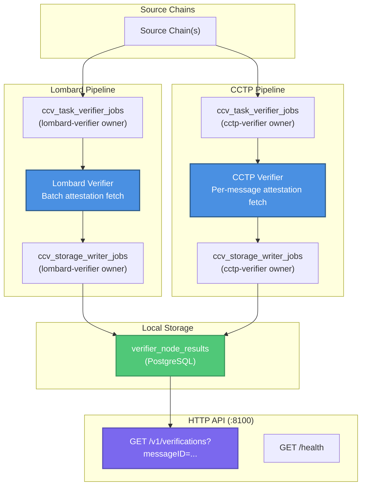

# Token Verifier

This document describes the token verifier — the set of `Verifier` implementations that attest token-transfer messages (Lombard LBTC and CCTP USDC) by calling external attestation APIs. Unlike the committee verifier, the token verifier stores results in a **local PostgreSQL database** and exposes them via an **HTTP API** consumed by the Indexer.

For the underlying pipeline architecture (Coordinator, SourceReaderService, job queues) see [verifier.md](verifier.md).

# Overview

Token transfers in CCIP require off-chain attestations from the token protocol's own authority before execution. The token verifier:

1. Discovers `CCIPMessageSent` events on source chains (via `SourceReaderService`)
2. Fetches the appropriate attestation from the token protocol's API (Lombard or Circle/CCTP)
3. Packages the attestation into a `VerifierNodeResult` stored locally in PostgreSQL
4. Exposes the results via a REST API that the Indexer queries to enrich CCV records

Key differences from the committee verifier:

| | Committee Verifier | Token Verifier |
|---|---|---|
| Verification method | ECDSA signing | External attestation API |
| Result destination | Aggregator (gRPC) | Local PostgreSQL |
| Consumer | Downstream executors via Aggregator | Indexer via HTTP API |
| Heartbeat to Aggregator | Yes | No (noop client) |
| Multiple verifier instances | One per deployment | One per token type (CCTP, Lombard) from a single binary |

# Architecture



The binary (`verifier/cmd/token/main.go`) starts one `Coordinator` per configured `TokenVerifier` entry. All coordinators share the same `SourceReader` instances and the same PostgreSQL database but use separate job queue owners (their `VerifierID`) so their state is fully isolated.

# Lombard Attestation

Lombard's attestation API covers multiple Bitcoin-backed tokens that are **minted** on the destination chain (e.g. LBTC, BTC.b). Each token has its own verifier resolver address configured per chain, but they all share the same attestation API and flow. The API provides cryptographic proofs that a specific lock event occurred on the source chain, authorising the mint on the destination.

## How Messages Are Identified for the Lombard API

Each `VerificationTask.ReceiptBlobs` contains blobs issued by various onchain contracts. For Lombard, the relevant blob is issued by the **verifier resolver** for the source chain, configured via `verifier_resolver_addresses`.

```
VerificationTask.ReceiptBlobs = [
    { Issuer: <verifierResolver for chainA>, Blob: <lombard_message_hash> },
    { Issuer: <other contract>,              Blob: <...> },
]
```

The blob for the expected issuer is used directly as the **message hash** sent to the Lombard attestation API. It is not computed by the verifier — it is issued onchain by the `VersionedVerifierResolver` contract and carried in the message receipt.

## Batch API Call

The Lombard verifier batches all tasks in the current processing batch into a single API call:

```
AttestationService.Fetch(ctx, []VerificationTask) → map[messageID]Attestation
```

Internally, `HTTPAttestationService.Fetch` collects one blob per task, splits them into batches of `AttestationAPIBatchSize` (default: 20), and calls:

```
POST <attestation_api>/bridge/v1/deposits/getByHash
Body: {"messageHash": ["0xblob1...", "0xblob2...", ...]}
```

The response is a list of `AttestationResponse` entries, each with a `MessageHash` (hex-encoded blob), `Status`, and `Data` (the ABI-encoded attestation).

## Response Matching

Attestations are matched back to tasks by comparing `AttestationResponse.MessageHash` against the task's blob string. If multiple entries exist for the same hash, `APPROVED` status is preferred over others.

Possible outcomes per task:

| Condition | Result |
|---|---|
| No verifier resolver configured for source chain | Task skipped; attestation marked as missing |
| No matching blob in `ReceiptBlobs` | Task skipped; attestation marked as missing |
| Matching attestation found with `APPROVED` status | Attestation ready for processing |
| Matching attestation found but status ≠ `APPROVED` | Attestation not ready → retry after 30 s |
| No matching entry in API response | Attestation missing → retry after 30 s |

## Attestation Payload Format

The Lombard API returns the attestation ABI-encoded as `abi.encode(bytes, bytes)`:
- First `bytes`: `rawPayload` — the canonical Lombard message content
- Second `bytes`: `proof` — the cryptographic proof

The verifier decodes these and constructs the verifier payload in the following binary format:

```
[4 bytes: versionTag][2 bytes: rawPayloadLength (big-endian)][rawPayload][2 bytes: proofLength (big-endian)][proof]
```

The `versionTag` is `bytes4(keccak256("LombardVerifier 2.0.0"))` = `0xeba55588` (default, overridable via config).

This binary payload is stored as `Signature` in `VerifierNodeResult` and returned to the Indexer via the API.

# CCTP Attestation

CCTP (Cross-Chain Transfer Protocol) is Circle's native bridging mechanism for **USDC**. Unlike Lombard, CCTP does not mint tokens on the destination — it burns USDC on the source chain and releases natively-issued USDC on the destination. Circle's Attestation API signs CCTP messages, authorising that release.

## How Messages Are Identified for the Circle API

Unlike Lombard, CCTP uses the source **transaction hash** to look up attestations. The API is keyed on `(sourceDomain, txHash)`:

```
AttestationService.Fetch(ctx, txHash, message) → Attestation
```

`sourceDomain` is derived from the message's `SourceChainSelector` using Circle's domain mapping:

| Chain | Domain |
|---|---|
| Ethereum | 0 |
| Avalanche | 1 |
| Optimism | 2 |
| Arbitrum | 3 |
| Base | 6 |
| Polygon | 7 |
| ... | ... |

The full domain table is defined in `verifier/pkg/token/cctp/consts.go`.

## Per-Message API Call

Unlike Lombard, CCTP fetches attestations per message (not batched):

```
GET <attestation_api>/<sourceDomain>?transactionHash=<txHash>
# e.g. https://iris-api-sandbox.circle.com/v2/messages/1?transactionHash=0xabc123...
```

The response contains potentially multiple CCTP messages from the same transaction. The verifier iterates through them and applies matching criteria to find the correct one.

## Message Matching Criteria

The CCTP response can contain multiple messages per transaction. The verifier matches the correct one by checking all of the following:

1. **CCTP version**: Message must be V2 (`DecodedMessage.Version == 2`)
2. **Sender address**: `DecodedMessage.DecodedMessageBody.MessageSender` must equal the configured `verifier_addresses[sourceChainSelector]` — the address of the CCV verifier contract on the source chain
3. **Hook data**: `DecodedMessage.DecodedMessageBody.HookData` must equal `[4-byte verifierVersion][32-byte messageID]`
   - The verifier version (`0x35a25838` = `bytes4(keccak256("CCTPVerifier 2.0.0"))` by default) binds the attestation to the specific verifier contract
   - The `messageID` is computed from the CCIP message — this uniquely ties the CCTP attestation to a specific CCIP transfer

If no message in the response matches all criteria, the verification fails with a retryable error (retry after 5 s).

## Attestation Payload Format

The CCTP verifier payload format is:

```
[4 bytes: verifierVersion][encodedCCTPMessage][attestation]
```

Where:
- `verifierVersion` = `0x35a25838` (default)
- `encodedCCTPMessage` = the raw ABI-encoded CCTP message bytes from the API response
- `attestation` = Circle's ECDSA attestation bytes from the API response

This binary payload is stored as `Signature` in `VerifierNodeResult`.

## Attestation Readiness

The Circle API uses `status` field values:
- `complete` → attestation is ready
- Any other value → attestation is pending; retry after 30 s

# Retry Behaviour

Both Lombard and CCTP verifiers classify errors into two categories:

| Error type | Retry delay | Condition |
|---|---|---|
| Attestation not ready | 30 s | Status ≠ approved/complete; attestation missing from response |
| Any other error | 5 s | API call failed; ABI decode failed; format error |

All errors from token verifiers are marked `Retryable = true`. The `TaskVerifier Processor` handles rescheduling. Jobs are retried for up to **7 days** before being archived as permanently failed.

If the entire batch API call fails (e.g. network error for Lombard), all tasks in the current batch are marked with retryable errors.

# CCV Record Storage

Token verifier results are stored in a **local PostgreSQL** table `verifier_node_results`, not forwarded to the Aggregator. This is a fundamental difference from the committee verifier.

## Write Path

`StorageWriter Processor` → `CCVWriter.WriteCCVNodeData([]VerifierNodeResult)` → `PostgresCCVStorage.Set([]Entry)`

Each write is wrapped in a transaction. The `INSERT ... ON CONFLICT (message_id) DO UPDATE` pattern means re-verifying the same message is idempotent — the latest attestation overwrites the previous one.

### Entry Schema (`verifier_node_results` table)

| Column | Type | Description |
|---|---|---|
| `message_id` | `bytea` (32 bytes) | CCIP message ID — primary key |
| `message` | `jsonb` | Full serialised `protocol.Message` |
| `ccv_version` | `bytea` | CCV protocol version bytes |
| `ccv_addresses` | `jsonb` | Serialised CCVAddresses slice |
| `executor_address` | `bytea` | Executor contract address |
| `signature` | `bytea` | Verifier payload (attestation bytes in verifier format) |
| `verifier_source_address` | `bytea` | Verifier resolver address on the source chain |
| `verifier_dest_address` | `bytea` | Verifier resolver address on the destination chain |
| `timestamp` | `timestamptz` | Write time |

`verifier_source_address` and `verifier_dest_address` are looked up from the `verifierResolverAddresses` map (keyed by chain selector) at write time. These allow the Indexer to identify which verifier contract the result belongs to.

## Read Path

`CCVReader.GetVerifications(ctx, []messageID)` → `PostgresCCVStorage.Get(keys)` → `SELECT ... FROM verifier_node_results WHERE message_id IN (...)`

Returns a `map[Bytes32]VerifierResult` used by the HTTP API handler.

# HTTP API

The token verifier exposes a REST API on port `:8100` for the Indexer to query verification results.

## `GET /v1/verifications`

Query verification results by message ID.

**Query parameters**: `messageID` (repeatable) — hex-encoded 32-byte message IDs with or without `0x` prefix.

```
GET /v1/verifications?messageID=0xabc123...&messageID=0xdef456...
```

**Constraints**:
- At least one `messageID` is required
- Maximum **20** message IDs per request

**Response**:

```json
{
  "results": [
    {
      "messageID": "0xabc123...",
      "message": { ... },
      "ccvData": "0x...",
      "timestamp": "2024-01-15T10:30:00Z",
      "verifierSourceAddress": "0x...",
      "verifierDestAddress": "0x..."
    }
  ],
  "errors": []
}
```

**Status codes**:

| Condition | Status |
|---|---|
| At least one result found | `200 OK` with partial `errors` for not-found IDs |
| All requested IDs not found | `404 Not Found` |
| Invalid `messageID` format | `400 Bad Request` |
| Database error | `500 Internal Server Error` |

# Configuration

## Top-level `token.Config`

```toml
[monitoring]
# Beholder monitoring settings

[on_ramp_addresses]
# map of chain selector → OnRamp contract address

[rmn_remote_addresses]
# map of chain selector → RMN Remote contract address

[[token_verifiers]]
# One block per token verifier instance
```

## `VerifierConfig` dispatch

Each `[[token_verifiers]]` block requires `type`, `version`, and `verifier_id`. The type+version combination selects the concrete verifier implementation:

| `type` | `version` | Implementation |
|---|---|---|
| `"lombard"` | `"1.0"` | `lombard.Verifier` |
| `"cctp"` | `"2.0"` | `cctp.Verifier` |

`verifier_id` scopes all PostgreSQL state (job queues, chain statuses) for that verifier instance. It must be unique across instances in the same database.

## Lombard config fields (`type = "lombard"`, `version = "1.0"`)

| Field | Default | Description |
|---|---|---|
| `attestation_api` | required | Base URL of the Lombard attestation API |
| `attestation_api_timeout` | `1s` | HTTP request timeout |
| `attestation_api_interval` | `100ms` | Minimum interval between API calls (rate limiting) |
| `attestation_api_batch_size` | `20` | Max blobs per API call (0 = unlimited) |
| `verifier_version` | `0xeba55588` | 4-byte version tag included in the payload |
| `verifier_resolver_addresses` | required | Map of chain selector → verifier resolver contract address; used for receipt blob matching and result storage |

## CCTP config fields (`type = "cctp"`, `version = "2.0"`)

| Field | Default | Description |
|---|---|---|
| `attestation_api` | required | Base URL of Circle's Attestation API |
| `attestation_api_timeout` | `1s` | HTTP request timeout |
| `attestation_api_interval` | `100ms` | Minimum interval between API calls |
| `attestation_api_cooldown` | `5m` | Backoff duration when rate-limited by Circle's API |
| `verifier_version` | `0x35a25838` | 4-byte version tag; must match the deployed `CCTPVerifier` contract version |
| `verifier_addresses` | required | Map of chain selector → CCV verifier contract address on that chain; used for CCTP message sender matching |
| `verifier_resolver_addresses` | required | Map of chain selector → verifier resolver contract address; used for `SourceConfig` and result storage |

## Example TOML snippet

```toml
[[token_verifiers]]
verifier_id = "cctp-mainnet"
type        = "cctp"
version     = "2.0"
# Full API call: GET <attestation_api>/v2/messages/<sourceDomain>/<txHash>
attestation_api         = "https://iris-api-sandbox.circle.com"
attestation_api_timeout = "2s"
verifier_version        = "0x35a25838"

[token_verifiers.verifier_addresses]
"5009297550715157269" = "0xCCTPVerifierOnEthereum..."
"4949039107694359620" = "0xCCTPVerifierOnArbitrum..."

[token_verifiers.verifier_resolver_addresses]
"5009297550715157269" = "0xResolverOnEthereum..."
"4949039107694359620" = "0xResolverOnArbitrum..."

[[token_verifiers]]
verifier_id = "lombard-mainnet"
type        = "lombard"
version     = "1.0"
# Full API call: POST <attestation_api>/bridge/v1/deposits/getByHash
attestation_api          = "https://bft-dev.stage.lombard-fi.com/api/"
attestation_api_timeout  = "2s"
attestation_api_batch_size = 20
verifier_version         = "0xeba55588"

[token_verifiers.verifier_resolver_addresses]
"5009297550715157269" = "0xLombardResolverOnEthereum..."
```
