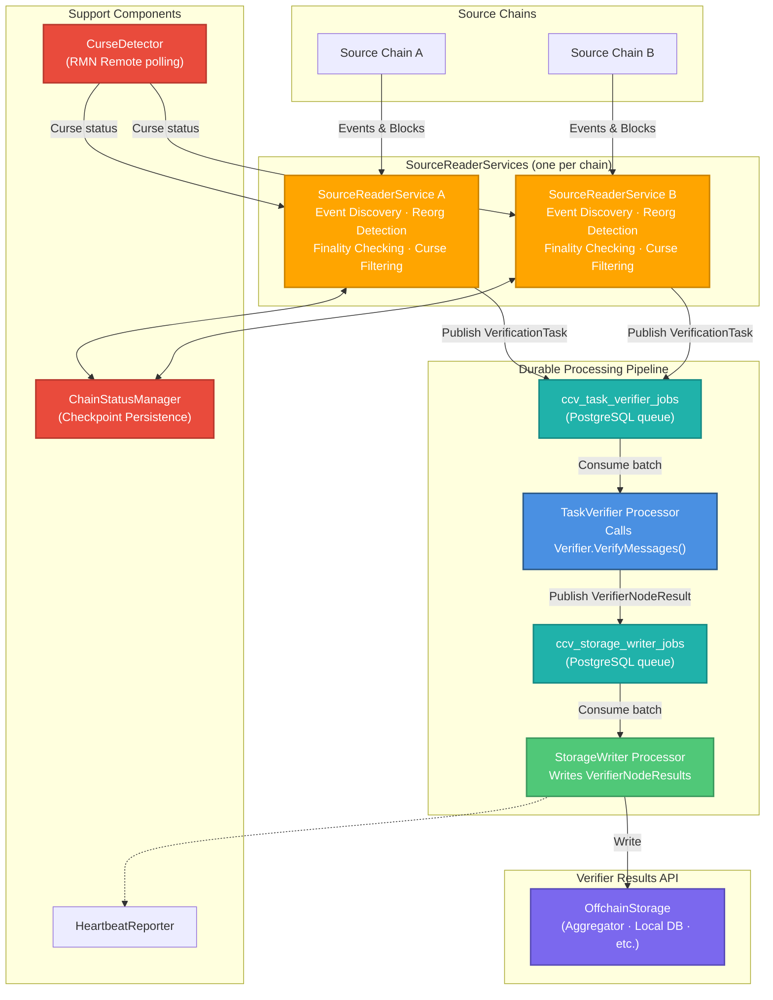
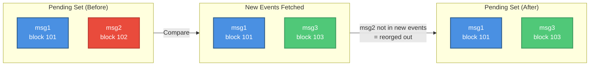

# Verifier Design

This document describes the Verifier component in CCIP 2.0. The Verifier is responsible for reading cross-chain messages from source blockchains, performing verification logic, and publishing verification results to offchain storage for downstream consumption.

# Overview

The Verifier architecture separates **orchestration** from **verification logic**:

* **Coordinator**: Chain-agnostic orchestration layer that manages a three-stage durable processing pipeline across multiple source chains
* **SourceReaderService**: Per-chain component that handles event discovery, reorg detection, finality checking, curse filtering, and message readiness
* **Verifier Interface**: Pluggable verification logic that implements verifier-specific validation and signing

This separation enables:

* **Chain Independence**: Each source chain has its own isolated `SourceReaderService` instance that encapsulates all chain-specific logic
* **Verification Flexibility**: Different verification strategies (committee-based, attestation-based, etc.) can plug into the same coordinator
* **Durability**: All pipeline stages communicate via PostgreSQL-backed job queues, so in-flight work survives process restarts

Each verifier is a security-critical component in the CCIP system. Multiple independent verifiers can operate on the same messages.

# Architecture

The Verifier consists of a three-stage pipeline connected by two PostgreSQL job queues:



## Component Responsibilities

* **Coordinator**: Creates and manages all pipeline components; initialises per-chain source readers and the two durable queues; requires a PostgreSQL data source
* **SourceReaderService**: Per-chain service that discovers events, tracks finality, detects reorgs and curses, and publishes ready `VerificationTask` items to `ccv_task_verifier_jobs`
* **TaskVerifier Processor**: Polls `ccv_task_verifier_jobs`, calls `Verifier.VerifyMessages()` in batches, and publishes successful `VerifierNodeResult` items to `ccv_storage_writer_jobs`; handles per-message retries and permanent failures
* **StorageWriter Processor**: Polls `ccv_storage_writer_jobs` and writes batches of `VerifierNodeResult` to the configured offchain storage implementation; retries transient write failures
* **FinalityViolationChecker**: Per-chain component that validates finalized block headers never change, detecting violations of blockchain finality guarantees
* **CurseDetector**: Polls RMN Remote contracts for all configured chains and maintains in-memory curse state; shared across all `SourceReaderService` instances
* **ChainStatusManager**: Persists chain state (enabled/disabled, `lastProcessedFinalizedBlock`) to PostgreSQL for checkpoint recovery
* **HeartbeatReporter**: Periodically sends heartbeats to the downstream storage endpoint, reporting node liveliness and per-chain block heights

# Data Flow

This section describes the complete lifecycle of a message through the verification system, from initial detection on the source chain to publication in offchain storage.

```mermaid
sequenceDiagram
    autonumber
    participant SC as Source Chain
    participant SRS as SourceReaderService
    participant TQ as ccv_task_verifier_jobs
    participant TVP as TaskVerifier Processor
    participant V as Verifier
    participant RQ as ccv_storage_writer_jobs
    participant SWP as StorageWriter Processor
    participant OS as OffchainStorage

    rect rgb(40, 60, 80)
    Note over SC,SRS: Event Discovery & Pending Queue
    SC->>SRS: Poll: FetchMessageSentEvents(fromBlock, toBlock)
    SRS->>SRS: Convert events to VerificationTask\nHandle reorgs · Check finality · Check curse
    SRS->>TQ: Publish(VerificationTask)
    end

    rect rgb(40, 80, 60)
    Note over TQ,V: Verification
    TVP->>TQ: Consume(batchSize) every 500ms
    TQ-->>TVP: []Job[VerificationTask]
    TVP->>V: VerifyMessages(tasks)
    V-->>TVP: []VerificationResult
    alt Success
        TVP->>RQ: Publish(VerifierNodeResult)
        TVP->>TQ: Complete(jobIDs)
    else Retryable error
        TVP->>TQ: Retry(jobID, delay)
    else Permanent error
        TVP->>TQ: Fail(jobID)
    end
    end

    rect rgb(80, 60, 40)
    Note over RQ,OS: Storage Write
    SWP->>RQ: Consume(batchSize) every 500ms
    RQ-->>SWP: []Job[VerifierNodeResult]
    SWP->>OS: WriteCCVNodeData(results)
    alt Success
        SWP->>RQ: Complete(jobIDs)
    else Retryable failure
        SWP->>RQ: Retry(jobID, retryDelay)
    else Permanent failure
        SWP->>RQ: Fail(jobID)
    end
    end
```



## Lifecycle Stages

* **Event Discovery & Pending Queue Management**
    * `SourceReaderService` polls the source chain at configured intervals
    * Fetches `CCIPMessageSent` events from `lastProcessedFinalizedBlock` to latest
    * Converts each event to a `VerificationTask`
    * **Inline reorg detection**: Compares new events against the in-memory pending set; removes tasks that no longer appear in the canonical chain
    * Applies finality criteria and curse checks; only ready tasks are published to `ccv_task_verifier_jobs`
    * Updates `lastProcessedFinalizedBlock` checkpoint via `ChainStatusManager`
* **Verification**
    * `TaskVerifier Processor` polls `ccv_task_verifier_jobs` every 500 ms
    * Calls `Verifier.VerifyMessages(ctx, tasks)` with a batch of up to `StorageBatchSize` tasks
    * Each `VerificationResult` carries either a `*protocol.VerifierNodeResult` (success) or a `*VerificationError`
    * Successful results are published to `ccv_storage_writer_jobs`; jobs are then marked `Complete`
    * Retryable errors schedule the job for retry after `VerificationError.Delay`; jobs that exceed their 7-day retry deadline are archived as `failed`
    * Permanent (non-retryable) errors archive the job immediately as `failed`
* **Storage Write**
    * `StorageWriter Processor` polls `ccv_storage_writer_jobs` every 500 ms
    * Calls `storage.WriteCCVNodeData(results)` with a batch of `VerifierNodeResult` items
    * Per-item `WriteResult` carries a `Retryable` flag; retriable failures are retried after `StorageRetryDelay` (default 2 s); non-retryable failures are archived as `failed`
    * Successful writes complete the job and record E2E latency via `MessageLatencyTracker`

# Core Components

## Coordinator

The coordinator is the orchestration layer that owns the entire pipeline. It is the entry point for callers building a verifier service.

### Responsibilities

* Reads chain statuses from `ChainStatusManager` on startup; skips chains marked `disabled`
* Creates the two PostgreSQL job queues and their observability decorators
* Instantiates one `SourceReaderService` per enabled chain
* Instantiates `TaskVerifier Processor` and `StorageWriter Processor`
* Starts/stops all components in the correct order
* Exposes a `HealthReport()` aggregating health from all sub-components

### Construction

```go
coordinator, err := verifier.NewCoordinator(
    lggr,
    myVerifier,         // implements Verifier interface
    sourceReaders,      // map[ChainSelector]chainaccess.SourceReader
    storage,            // protocol.CCVNodeDataWriter
    coordinatorConfig,
    messageTracker,
    monitoring,
    chainStatusManager,
    heartbeatClient,
    db,                 // sqlutil.DataSource — required; no in-memory fallback
)
```

## SourceReaderService

A **self-contained per-chain component** that handles all chain-specific logic for message discovery, validation, and readiness checking.

### Responsibilities

* **Event Discovery**: Poll source chain for `CCIPMessageSent` events at configured intervals
* **Event Conversion**: Convert events to `VerificationTask` structures with computed `MessageID` validation
* **Message Filtering**: Apply `ReceiptIssuerFilter` to include only messages with receipts from configured issuers
* **Pending Queue Management**: Maintain an in-memory set of unverified tasks between polling cycles
* **Inline Reorg Detection**: Detect reorgs by comparing new events against the pending set, removing invalidated tasks
* **Finality Validation**: Feed `FinalityViolationChecker` with each new finalized block header
* **Curse Filtering**: Query `CurseDetector` before emitting tasks; cursed lanes are dropped
* **Checkpoint Persistence**: Persist `lastProcessedFinalizedBlock` via `ChainStatusManager` after each cycle

### Message Readiness Logic

Messages become ready based on their finality setting:

* **Default Finality (finality = 0)**
    * Ready when: `messageBlock <= finalizedBlock`
* **Custom Finality (Faster-than-Finality)**
    * Ready when: `(messageBlock + finality <= latestBlock)` OR `(messageBlock <= finalizedBlock)`
    * The OR condition **caps custom finality at finalization** — this prevents DoS attacks where unreasonably high finality values are set. Even with `finality = 10,000`, the message becomes ready once it reaches normal finalization.

### Initialization

On startup, `SourceReaderService`:

1. Reads chain status from `ChainStatusManager` to get `lastProcessedFinalizedBlock`
2. If no checkpoint exists: uses `fallbackBlockEstimate` (finalized − 500 blocks lookback)
3. Starts event monitoring and readiness loops

## FinalityViolationChecker

A per-chain safety component that validates finalized blocks never change.

### Responsibilities

* Store finalized block headers (block number → hash) in a rolling in-memory window (max 1 000 blocks)
* Detect hash mismatches at the same block height (finality violation)
* Detect backward movement of finalized block number (finality rewind)
* Return errors when violations are detected

### Violation Conditions

A finality violation is detected when a previously seen finalized block now has a different hash.

When a violation occurs:

* `SourceReaderService` disables the chain
* All pending tasks are flushed
* Chain is marked `disabled` in `ChainStatusManager`
* A critical alert is logged for manual intervention

```mermaid
sequenceDiagram
    autonumber
    participant SRS as SourceReaderService
    participant FVC as FinalityViolationChecker
    participant CSM as ChainStatusManager

    rect rgb(40, 60, 80)
        Note over SRS,FVC: Normal Operation
        SRS->>FVC: UpdateFinalized(block 105, hash=0xabc)
        FVC->>FVC: Store header
        FVC-->>SRS: OK
    end

    rect rgb(80, 40, 40)
        Note over SRS,FVC: Violation Detected
        SRS->>FVC: UpdateFinalized(block 105, hash=0xdef)
        FVC->>FVC: Hash mismatch!\nstored=0xabc, new=0xdef
        FVC-->>SRS: Error: finality violation
    end

    rect rgb(60, 40, 60)
        Note over SRS,CSM: Chain Shutdown
        SRS->>SRS: disabled = true
        SRS->>SRS: Flush pendingTasks
        SRS->>CSM: WriteChainStatus(disabled=true)
        SRS->>SRS: Log CRITICAL alert
    end
```



#### Manual Recovery Steps

1. Investigate root cause of finality violation
2. Determine a safe restart block
3. Set checkpoint via the `chain-statuses` CLI: `set-finalized-height --block-height <N>`
4. Re-enable the chain: `chain-statuses enable --chain-selector <S> --verifier-id <ID>`
5. Restart verifier service

## CurseDetector

A shared component (one per `Coordinator`) that polls RMN Remote contracts for all configured chains and exposes curse state to every `SourceReaderService`.

### Curse Types

* **Lane-Specific Curse**: Only affects a specific source→dest pair (e.g. Chain A→B blocked, A→C allowed)
* **Global Curse**: Affects all lanes involving the chain (constant: `0x0100000000000000000000000000000001`)

### Curse Behavior

When a lane is cursed, tasks for that lane are dropped during readiness checking in `SourceReaderService`. They are not published to the task queue.

### Recovery

1. Shut down the verifier
2. Reset the checkpoint for the affected chain to a block before the curse period using `chain-statuses set-finalized-height`
3. Start the verifier — it will reprocess messages that were dropped during the curse window

Even without resetting the checkpoint, once the curse is lifted any new messages will be processed normally.

## ChainStatusManager

Handles persistent chain state stored in the `ccv_chain_statuses` PostgreSQL table.

### Responsibilities

* Read chain status (`enabled/disabled`, `lastProcessedFinalizedBlock`) on startup
* Persist updates after each event processing cycle
* Track enabled/disabled state per chain selector + verifier ID pair

### Used by

* **SourceReaderService**: Reads initial checkpoint on startup; persists updates after each cycle; marks chain as disabled on finality violation
* **Coordinator**: Reads status for all chains on startup; skips disabled chains when creating source readers
* **HeartbeatReporter**: Reads per-chain block heights to include in heartbeat payloads

## Verifier Interface

The `Verifier` interface provides pluggable verification logic that is independent of the coordinator's orchestration.

```go
type Verifier interface {
    // VerifyMessages performs verification of a batch of messages.
    // Returns a slice of VerificationResult containing both successful results and errors.
    // The caller is responsible for routing successful results and handling errors.
    VerifyMessages(ctx context.Context, tasks []VerificationTask) []VerificationResult
}
```

`VerificationResult` carries either a success or an error:

```go
type VerificationResult struct {
    Result *protocol.VerifierNodeResult
    Error  *VerificationError
}

type VerificationError struct {
    Timestamp time.Time
    Error     error
    Task      VerificationTask
    Retryable bool          // if true, TaskVerifier Processor will schedule a retry
    Delay     time.Duration // how long to wait before retrying
}
```

### Responsibilities

* Business logic specific to the verification type (committee signatures, external attestations, etc.)
* Decides per-message whether an error is retryable and what the retry delay should be
* Returns one `VerificationResult` per input task (length must match)

The verifier operates independently of blockchain concerns (finality, reorgs, curses) — the coordinator handles those.

### Implementing a Custom Verifier

```go
type MyVerifier struct {
    client MyAttestationClient
    config CoordinatorConfig
}

func (v *MyVerifier) VerifyMessages(
    ctx context.Context,
    tasks []verifier.VerificationTask,
) []verifier.VerificationResult {
    results := make([]verifier.VerificationResult, 0, len(tasks))
    for _, task := range tasks {
        attestation, err := v.client.Fetch(ctx, task.TxHash)
        if err != nil {
            // Mark as retryable — TaskVerifier Processor will reschedule after Delay
            results = append(results, verifier.VerificationResult{
                Error: &verifier.VerificationError{
                    Error:     err,
                    Task:      task,
                    Retryable: true,
                    Delay:     5 * time.Second,
                },
            })
            continue
        }

        result, err := buildVerifierNodeResult(task, attestation)
        if err != nil {
            results = append(results, verifier.VerificationResult{
                Error: &verifier.VerificationError{Error: err, Task: task, Retryable: false},
            })
            continue
        }
        results = append(results, verifier.VerificationResult{Result: result})
    }
    return results
}
```

Then inject the verifier into the coordinator:

```go
coordinator, err := verifier.NewCoordinator(lggr, &MyVerifier{...}, sourceReaders, storage, ...)
```

# PostgreSQL Job Queue

Both pipeline queues use the same generic `PostgresJobQueue[T]` implementation described in detail in [`pkg/jobqueue/README.md`](../pkg/jobqueue/README.md). Key properties:

| Property | `ccv_task_verifier_jobs` | `ccv_storage_writer_jobs` |
|---|---|---|
| Payload type | `VerificationTask` | `protocol.VerifierNodeResult` |
| Retry deadline | 7 days | 7 days |
| Lock duration | 2 minutes | 1 minute |
| Poll interval | 500 ms | 500 ms |
| Archive retention | 30 days | 30 days |

**Job states**: `pending` → `processing` → `completed` (archived) or `failed` (archived). Only `pending` and `processing` jobs live in the active table; completed and failed jobs are immediately moved to the archive table.

**Stale lock recovery**: If a processor crashes while a job is in `processing`, any subsequent `Consume` call after `LockDuration` has elapsed will reclaim the job and increment its attempt counter.

**Observability**: Both queues are wrapped with an `ObservabilityDecorator` that periodically records queue size metrics.

# Safety Components

## Reorg Handling

Reorgs are handled **inline within** `SourceReaderService` during event processing.

### Inline Reorg Detection

When new events are fetched, the service compares them against the existing in-memory pending set:



**How it works:**
1. Build a set of message IDs from newly fetched events
2. For each task in the pending set at or after `fromBlock`:
    * If not present in the new event set → remove (reorged out)
    * Add new tasks (deduplication handled by message ID key)

**Why this works**: `lastProcessedFinalizedBlock` is set to `finalized.Number`, ensuring we re-query blocks that could have been reorged. If a task exists in the pending set but not in the new batch, it was reorged out.

## Finality Violation Handling

`FinalityViolationChecker` is a synchronous, pull-based service called by `SourceReaderService` on each readiness loop iteration.

**Storage**: In-memory rolling window of finalized block headers (max 1 000 blocks), keyed by block number.

**Algorithm on each `UpdateFinalized(newFinalizedBlock)` call:**

1. **Forward progress** (`newFinalizedBlock >= lastFinalized`):
    * Fetch headers from `lastFinalized` to `newFinalizedBlock`
    * For each block: if already stored, verify hash matches; otherwise store it
    * Hash mismatch → **violation**
2. **Backward movement** (`newFinalizedBlock < lastFinalized`):
    * Fetch header for `newFinalizedBlock`
    * Check if stored hash matches
    * Hash mismatch → **violation** (actual finality rewind)
    * Hash matches → RPC lagging, ignore

# Operational CLI

## Job Queue: Inspecting and Rescheduling Failed Messages

The `cli/jobqueue` package provides CLI commands to inspect failed jobs and reschedule them. These commands are exposed in deployed binaries under `ccv job-queue`.

### List failed jobs

```bash
# List all failed jobs across both queues
node ccv job-queue list

# Filter by queue
node ccv job-queue list --queue task-verifier
node ccv job-queue list --queue storage-writer

# Filter by verifier ID
node ccv job-queue list --verifier-id my-verifier-1 --limit 100
```

Output columns: Queue, Job ID, Message ID, Owner ID, Chain Selector, Attempts, Last Error, Created At, Archived At.

### Reschedule a failed job

Failed jobs that have exceeded their 7-day retry deadline are archived and will not be retried automatically. They can be manually rescheduled:

```bash
# Reschedule by job UUID, giving it a fresh 1h retry window
node ccv job-queue reschedule \
  --queue task-verifier \
  --verifier-id my-verifier-1 \
  --job-id <uuid> \
  --retry-duration 1h

# Reschedule by message ID
node ccv job-queue reschedule \
  --queue storage-writer \
  --verifier-id my-verifier-1 \
  --message-id 0xabc123... \
  --retry-duration 30m
```

`--job-id` and `--message-id` are mutually exclusive. Rescheduling moves the job from the archive back to the active table with a fresh `retry_deadline`.

## Chain Statuses: Managing Chain State

The `cli/chainstatuses` package provides CLI commands to inspect and mutate the `ccv_chain_statuses` table. These are exposed under `ccv chain-statuses`.

**Important**: Shut down the verifier before running `enable`, `disable`, or `set-finalized-height`. Changes take effect on the next start.

### List all chain statuses

```bash
node ccv chain-statuses list
# or, for standalone verifier binary:
verifier ccv chain-statuses list
```

Output columns: Chain, Chain Selector, verifier_id, finalized_block_height, disabled, updated_at.

### Enable / disable a chain

```bash
# Disable (e.g. after a finality violation, before investigation)
node ccv chain-statuses disable \
  --chain-selector <selector> \
  --verifier-id <id>

# Re-enable after resolving the issue
node ccv chain-statuses enable \
  --chain-selector <selector> \
  --verifier-id <id>
```

### Set the processing checkpoint

Use `set-finalized-height` to roll back or advance the block height from which the verifier will start reading events on next startup. This is required after:

* Recovering from a finality violation (roll back to before the violation)
* Recovering from a curse period (roll back to before messages were dropped)

```bash
node ccv chain-statuses set-finalized-height \
  --chain-selector <selector> \
  --verifier-id <id> \
  --block-height <N>
```

# Risks

* Using multiNode clients for getting logs instead of `log_poller`. They are not as battle-tested. (It is easy to create a `ChainAccessLayer` implementation using `log_poller` if needed.)
